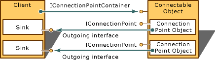

# ATL Connection Points
A connectable object is one that supports outgoing interfaces. An outgoing interface allows the object to communicate with a client. For each outgoing interface, the connectable object exposes a connection point. Each outgoing interface is implemented by a client on an object called a sink.  
  
   
  
 Each connection point supports the [IConnectionPoint](http://msdn.microsoft.com/library/windows/desktop/ms694318) interface. The connectable object exposes its connection points to the client through the [IConnectionPointContainer](http://msdn.microsoft.com/library/windows/desktop/ms683857) interface.  
  
## In This Section  
 [ATL Connection Point Classes](../vs140/ATL-Connection-Point-Classes.md)  
 Briefly describes the ATL classes that support connection points.  
  
 [Adding Connection Points to an Object](../vs140/Adding-Connection-Points-to-an-Object.md)  
 Outlines the steps used to add connection points to an object.  
  
 [ATL Connection Point Example](../vs140/ATL-Connection-Point-Example.md)  
 Provides an example of declaring a connection point.  
  
## Related Sections  
 [ATL](../vs140/Active-Template-Library--ATL--Concepts.md)  
 Provides links to conceptual topics on how to program using the Active Template Library.  
  
## See Also  
 [ATL](../vs140/Active-Template-Library--ATL--Concepts.md)