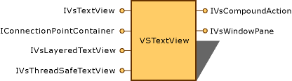

# Accessing theText View by Using the Legacy API
A text view is a presentation of the text that is stored in a text buffer. You can access the text view by using the legacy API as shown in the following section.  
  
## Text View Object  
 Each view is associated with its own text buffer, and the view is a window on the data in the buffer. The following diagram shows the key interfaces of the text view object, which is represented by <xref:Microsoft.VisualStudio.TextManager.Interop.VsTextView?qualifyHint=False>.  
  
   
Text view object  
  
 The view is a way of presenting the text in the buffer. It includes features such as word wrap, and outlining, so that what you see in the view is not an exact representation of the text in the buffer.  
  
 A view enables other services or processes to intercept incoming commands and act on them before the view acts on them. The most common service to do this is a language service. A language service might need, for example, to intercept the command for the ENTER key to provide custom indenting behavior or tool tips.  
  
## Adding Functionality to the Text View  
 You can customize text view behavior by handling specific keystrokes. To intercept the keystrokes, you implement <xref:Microsoft.VisualStudio.TextManager.Interop.IVsTextViewFilter?qualifyHint=False> on your object, and provide a command target (<xref:Microsoft.VisualStudio.OLE.Interop.IOleCommandTarget?qualifyHint=False>) to monitor and intercept commands.  
  
 The text view uses sequential architecture for command filters. New command filters (<xref:Microsoft.VisualStudio.OLE.Interop.IOleCommandTarget?qualifyHint=False> objects) are added to the sequence by calling the <xref:Microsoft.VisualStudio.TextManager.Interop.IVsTextView.AddCommandFilter?qualifyHint=False> method.  
  
 Event notification for the text view is provided by using the `T:Microsoft.VisualStudio.TextManager.Interop.IVsTextViewEvents` interface. Implement this interface on your client object to receive notification of changes to the text view. Expose this interface to the text view by using the <xref:Microsoft.VisualStudio.OLE.Interop.IConnectionPointContainer?qualifyHint=False> interface on the text view to receive notification of changes from the view.  
  
## See Also  
 [Changing View Settings by Using the Legacy API](../vs140/Changing-View-Settings-by-Using-the-Legacy-API.md)   
 [Using the Text Manager to Monitor Global Settings](../vs140/Using-the-Text-Manager-to-Monitor-Global-Settings.md)