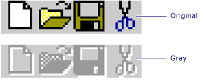

# AfxDrawGrayBitmap
Draws a gray version of a bitmap.  
  
## Syntax  
  
```  
  
      void AFXAPI AfxDrawGrayBitmap(  
   CDC *pDC,  
   int x,  
   int y,  
   const CBitmap &rSrc,  
   COLORREF crBackground  
);  
```  
  
#### Parameters  
 `pDC`  
 Points to the destination DC.  
  
 *x*  
 The destination x-coordinate.  
  
 *y*  
 The destination y-coordinate.  
  
 `rSrc`  
 The source bitmap.  
  
 `crBackground`  
 The new background color (typically gray, such as COLOR_MENU).  
  
## Remarks  
 A bitmap drawn with `AfxDrawGrayBitmap` will have the appearance of a disabled control.  
  
   
  
## Example  
 [!CODE [NVC_MFCDocView#191](../CodeSnippet/VS_Snippets_Cpp/NVC_MFCDocView#191)]  
  
## Requirements  
 **Header:** afxwin.h  
  
## See Also  
 [Macros and Globals](../vs140/MFC-Macros-and-Globals.md)   
 [Gray and Dithered Bitmap Functions](../vs140/Gray-and-Dithered-Bitmap-Functions.md)   
 [AfxGetGrayBitmap](../vs140/AfxGetGrayBitmap.md)   
 [AfxDrawDitheredBitmap](../vs140/AfxDrawDitheredBitmap.md)