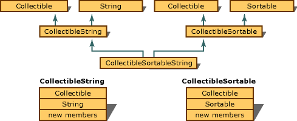

# Base Classes
The inheritance process creates a new derived class that is made up of the members of the base class(es) plus any new members added by the derived class. In a multiple-inheritance, it is possible to construct an inheritance graph where the same base class is part of more than one of the derived classes. The following figure shows such a graph.  
  
   
Multiple Instances of a Single Base Class  
  
 In the figure, pictorial representations of the components of `CollectibleString` and `CollectibleSortable` are shown. However, the base class, `Collectible`, is in `CollectibleSortableString` through the `CollectibleString` path and the `CollectibleSortable` path. To eliminate this redundancy, such classes can be declared as virtual base classes when they are inherited.  
  
 For information about declaring virtual base classes and how objects with virtual base classes are composed, see [Virtual Base Classes](../vs140/Virtual-Base-Classes.md).  
  
## See Also  
 [Overview of Derived Classes](../vs140/Overview-of-Derived-Classes.md)