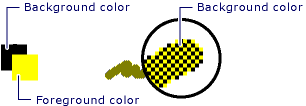

# CDC::GetHalftoneBrush
Call this member function to retrieve a halftone brush.  
  
## Syntax  
  
```  
  
static CBrush* PASCAL GetHalftoneBrush( );  
  
```  
  
## Return Value  
 A pointer to a `CBrush` object if successful; otherwise **NULL**.  
  
## Remarks  
 A halftone brush shows pixels that are alternately foreground and background colors to create a dithered pattern. The following is an example of a dithered pattern created by a halftone brush.  
  
   
  
## Requirements  
 **Header:** afxwin.h  
  
## See Also  
 [CDC Class](../vs140/CDC-Class.md)   
 [Hierarchy Chart](../vs140/Hierarchy-Chart.md)   
 [CBrush Class](../vs140/CBrush-Class.md)