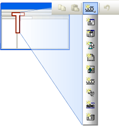

# CMFCDropDownToolBar Class
A toolbar that appears when the user presses and holds a top-level toolbar button.  
  
## Syntax  
  
```  
class CMFCDropDownToolBar : public CMFCToolBar  
```  
  
## Members  
  
### Public Methods  
  
|Name|Description|  
|----------|-----------------|  
|[CMFCDropDownToolBar::AllowShowOnPaneMenu](#cmfcdropdowntoolbar__allowshowonpanemenu)|(Overrides `CPane::AllowShowOnPaneMenu`.)|  
|[CMFCDropDownToolBar::LoadBitmap](#cmfcdropdowntoolbar__loadbitmap)|(Overrides [CMFCToolBar::LoadBitmap](../Topic/CMFCToolBar%20Class.md#cmfctoolbar__loadbitmap).)|  
|[CMFCDropDownToolBar::LoadToolBar](#cmfcdropdowntoolbar__loadtoolbar)|(Overrides [CMFCToolBar::LoadToolBar](../Topic/CMFCToolBar%20Class.md#cmfctoolbar__loadtoolbar).)|  
|[CMFCDropDownToolBar::OnLButtonUp](#cmfcdropdowntoolbar__onlbuttonup)||  
|[CMFCDropDownToolBar::OnMouseMove](#cmfcdropdowntoolbar__onmousemove)||  
|[CMFCDropDownToolBar::OnSendCommand](#cmfcdropdowntoolbar__onsendcommand)|(Overrides `CMFCToolBar::OnSendCommand`.)|  
|[CMFCDropDownToolBar::OnUpdateCmdUI](#cmfcdropdowntoolbar__onupdatecmdui)|(Overrides [CMFCToolBar::OnUpdateCmdUI](assetId:///571a38ab-2a56-4968-9796-273516126f80).)|  
  
### Remarks  
 A `CMFCDropDownToolBar` object combines the visual appearance of a toolbar with the behavior of a popup menu. When a user presses and holds a drop-down toolbar button (see [CMFCDropDownToolBarButton](../vs140/CMFCDropDownToolbarButton-Class.md)), a drop-down toolbar appears, and the user can select a button from the drop-down toolbar by scrolling to it and releasing the mouse button. After the user selects a button in the drop-down toolbar, that button is displayed as the current button on the top-level toolbar.  
  
 A drop-down toolbar cannot be customized or docked, and it does not have a tear-off state.  
  
 The following illustration shows a `CMFCDropDownToolBar` object:  
  
   
  
 You create a `CMFCDropDownToolBar` object the same way you create an ordinary toolbar (see [CMFCToolBar](../Topic/CMFCToolBar%20Class.md)).  
  
 To insert the drop-down toolbar into a parent toolbar:  
  
 1. Reserve a dummy resource ID for the button in the parent toolbar resource.  
  
 2. Create a `CMFCDropDownToolBarButton` object that contains the drop-down toolbar (for more information, see [CMFCDropDownToolBarButton::CMFCDropDownToolBarButton](../vs140/CMFCDropDownToolbarButton-Class.md#cmfcdropdowntoolbarbutton__cmfcdropdowntoolbarbutton)).  
  
 3. Replace the dummy button with the `CMFCDropDownToolBarButton` object by using [CMFCToolBar::ReplaceButton](../Topic/CMFCToolBar%20Class.md#cmfctoolbar__replacebutton).  
  
 For more information about toolbar buttons, see [How to Put Controls on Toolbars](../vs140/Walkthrough--Putting-Controls-On-Toolbars.md). For an example of a drop-down toolbar, see the sample project VisualStudioDemo.  
  
## Example  
 The following example demonstrates how to use the `Create` method in the `CMFCDropDownToolBar` class. This code snippet is part of the [Visual Studio Demo sample](../vs140/Visual-C---Samples.md).  
  
 [!CODE [NVC_MFC_VisualStudioDemo#29](../CodeSnippet/VS_Snippets_Misc/NVC_MFC_VisualStudioDemo#29)]  
[!CODE [NVC_MFC_VisualStudioDemo#30](../CodeSnippet/VS_Snippets_Misc/NVC_MFC_VisualStudioDemo#30)]  
  
## Inheritance Hierarchy  
 [CObject](../vs140/CObject-Class.md)  
  
 [CCmdTarget](../vs140/CCmdTarget-Class.md)  
  
 [CWnd](../vs140/CWnd-Class.md)  
  
 [CBasePane](../vs140/CBasePane-Class.md)  
  
 [CPane](../vs140/CPane-Class.md)  
  
 [CMFCBaseToolBar](../vs140/CMFCBaseToolBar-Class.md)  
  
 [CMFCToolBar](../Topic/CMFCToolBar%20Class.md)  
  
 [CMFCDropDownToolBar](../vs140/CMFCDropDownToolBar-Class.md)  
  
## Requirements  
 **Header:** afxdropdowntoolbar.h  
  
##  <a name="cmfcdropdowntoolbar__allowshowonpanemenu"></a>  CMFCDropDownToolBar::AllowShowOnPaneMenu  
 [!INCLUDE[cpp_fp_under_construction](../vs140/includes/cpp_fp_under_construction_md.md)]  
  
```  
virtual BOOL AllowShowOnPaneMenu() const;  
```  
  
### Return Value  
  
### Remarks  
  
##  <a name="cmfcdropdowntoolbar__loadbitmap"></a>  CMFCDropDownToolBar::LoadBitmap  
 Loads toolbar images from application resources.  
  
```  
virtual BOOL LoadBitmap(  
   UINT uiResID,  
   UINT uiColdResID=0,  
   UINT uiMenuResID=0,  
   BOOL bLocked=FALSE,  
   UINT uiDisabledResID=0,  
   UINT uiMenuDisabledResID=0   
);  
```  
  
### Parameters  
 [in] `uiResID`  
 The resource ID of the bitmap that refers to the hot toolbar images.  
  
 [in] `uiColdResID`  
 The resource ID of the bitmap that refers to the cold toolbar images.  
  
 [in] `uiMenuResID`  
 The resource ID of the bitmap that refers to the regular menu images.  
  
 [in] `bLocked`  
 `TRUE` to lock the toolbar; otherwise `FALSE`.  
  
 [in] `uiDisabledResID`  
 The resource ID of the bitmap that refers to the disabled toolbar images.  
  
 [in] `uiMenuDisabledResID`  
 The resource ID of the bitmap that refers to the disabled menu images.  
  
### Return Value  
 Nonzero if the method succeeds; otherwise 0.  
  
### Remarks  
 The [CMFCToolBar::LoadToolBarEx](../Topic/CMFCToolBar%20Class.md#cmfctoolbar__loadtoolbarex) method calls this method to load the images that are associated with the toolbar. Override this method to perform custom loading of image resources.  
  
 Call the `LoadBitmapEx` method to load additional images after you create the toolbar.  
  
##  <a name="cmfcdropdowntoolbar__loadtoolbar"></a>  CMFCDropDownToolBar::LoadToolBar  
 [!INCLUDE[cpp_fp_under_construction](../vs140/includes/cpp_fp_under_construction_md.md)]  
  
```  
virtual BOOL LoadToolBar(  
   UINT uiResID,  
   UINT uiColdResID = 0,  
   UINT uiMenuResID = 0, BOOL = FALSE,  
   UINT uiDisabledResID = 0,  
   UINT uiMenuDisabledResID = 0,  
   UINT uiHotResID = 0  
);  
```  
  
### Parameters  
 [in] `uiResID`  
  [in] `uiColdResID`  
  [in] `uiMenuResID`  
  [in] `BOOL`  
  [in] `uiDisabledResID`  
  [in] `uiMenuDisabledResID`  
  [in] `uiHotResID`  
  
### Return Value  
  
### Remarks  
  
##  <a name="cmfcdropdowntoolbar__onlbuttonup"></a>  CMFCDropDownToolBar::OnLButtonUp  
 [!INCLUDE[cpp_fp_under_construction](../vs140/includes/cpp_fp_under_construction_md.md)]  
  
```  
afx_msg void OnLButtonUp(  
   UINT nFlags,  
   CPoint point  
);  
```  
  
### Parameters  
 [in] `nFlags`  
  [in] `point`  
  
### Remarks  
  
##  <a name="cmfcdropdowntoolbar__onmousemove"></a>  CMFCDropDownToolBar::OnMouseMove  
 [!INCLUDE[cpp_fp_under_construction](../vs140/includes/cpp_fp_under_construction_md.md)]  
  
```  
afx_msg void OnMouseMove(  
   UINT nFlags,  
   CPoint point  
);  
```  
  
### Parameters  
 [in] `nFlags`  
  [in] `point`  
  
### Remarks  
  
##  <a name="cmfcdropdowntoolbar__onsendcommand"></a>  CMFCDropDownToolBar::OnSendCommand  
 [!INCLUDE[cpp_fp_under_construction](../vs140/includes/cpp_fp_under_construction_md.md)]  
  
```  
virtual BOOL OnSendCommand(  
   const CMFCToolBarButton* pButton  
);  
```  
  
### Parameters  
 [in] `pButton`  
  
### Return Value  
  
### Remarks  
  
##  <a name="cmfcdropdowntoolbar__onupdatecmdui"></a>  CMFCDropDownToolBar::OnUpdateCmdUI  
 [!INCLUDE[cpp_fp_under_construction](../vs140/includes/cpp_fp_under_construction_md.md)]  
  
```  
virtual void OnUpdateCmdUI(  
   CFrameWnd* pTarget,  
   BOOL bDisableIfNoHndler  
);  
```  
  
### Parameters  
 [in] `pTarget`  
  [in] `bDisableIfNoHndler`  
  
### Remarks  
  
## See Also  
 [Hierarchy Chart](../vs140/Hierarchy-Chart.md)   
 [Classes](../vs140/MFC-Classes.md)   
 [CMFCToolBar](../Topic/CMFCToolBar%20Class.md)   
 [CMFCToolBar::Create](../Topic/CMFCToolBar%20Class.md#cmfctoolbar__create)   
 [CMFCToolBar::ReplaceButton](../Topic/CMFCToolBar%20Class.md#cmfctoolbar__replacebutton)   
 [CMFCDropDownToolBarButton](../vs140/CMFCDropDownToolbarButton-Class.md)   
 [How to Put Controls on Toolbars](../vs140/Walkthrough--Putting-Controls-On-Toolbars.md)