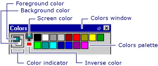

# Colors Window (Image Editor for Icons)
The Colors window has two parts:  
  
1.  The Colors Palette, which is an array of color samples that represent colors you can use. You can click the samples to select foreground and background colors when you are using the graphics tools.  
  
2.  The Color Indicator, which shows the foreground and background colors and selectors for screen and inverse color.  
  
       
Colors Window  
  
> [!NOTE]
>  The **Screen color** and **Inverse color** tools are only available for icons and cursors.  
  
 You can use the Colors window with the [Image Editor toolbar](../vs140/Toolbar--Image-Editor-for-Icons-.md).  
  
 For information on adding resources to managed projects, please see [Resources in Applications](assetId:///8ad495d4-2941-40cf-bf64-e82e85825890) in the *.NET Framework Developer's Guide.* For information on manually adding resource files to managed projects, accessing resources, displaying static resources, and assigning resources strings to properties, see [Walkthrough: Using Resources for Localization with ASP.NET](assetId:///bb4e5b44-e2b0-48ab-bbe9-609fb33900b6).  
  
## Requirements  
 None  
  
## See Also  
 [Displaying or Hiding the Colors Window](../vs140/Displaying-or-Hiding-the-Colors-Window--Image-Editor-for-Icons-.md)   
 [Creating Transparent or Inverse Regions in Device Images](../vs140/Creating-Transparent-or-Inverse-Regions-in-Device-Images--Image-Editor-for-Icons-.md)   
 [Accelerator Keys](../vs140/Accelerator-Keys--Image-Editor-for-Icons-.md)   
 [Custom Color Selector Dialog Box](../vs140/Custom-Color-Selector-Dialog-Box--Image-Editor-for-Icons-.md)   
 [Image Editor for Icons](../vs140/Image-Editor-for-Icons.md)