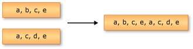

# Concatenation Operations (C#)
Concatenation refers to the operation of appending one sequence to another.  
  
 The following illustration depicts a concatenation operation on two sequences of characters.  
  
   
  
 The standard query operator methods that perform concatenation are listed in the following section.  
  
## Methods  
  
|Method Name|Description|C# Query Expression Syntax|More Information|  
|-----------------|-----------------|---------------------------------|----------------------|  
|Concat|Concatenates two sequences to form one sequence.|Not applicable.|<xref:System.Linq.Enumerable.Concat``1?qualifyHint=True>   <xref:System.Linq.Queryable.Concat``1?qualifyHint=True>|  
  
## See Also  
 <xref:System.Linq?qualifyHint=False>   
 [Standard Query Operators Overview (C#)](../Topic/Standard%20Query%20Operators%20Overview%20\(C%23\).md)   
 [How to: Combine and Compare String Collections (LINQ) (C#)](../vs140/How-to--Combine-and-Compare-String-Collections--LINQ---C#-.md)