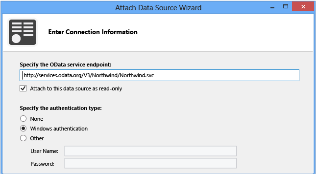
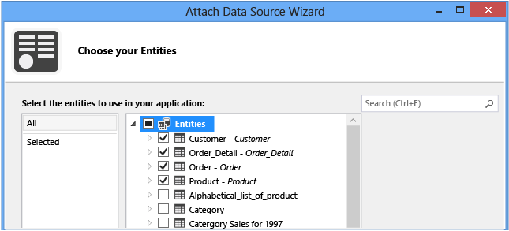

# Connecting to Data in a LightSwitch Application
In this lesson, you’ll learn how to connect to an external database to provide data for a LightSwitch application.  
  
## Connect to Data  
 Most business applications use a "forms over data" model. This means that forms, which are called *screens* in LightSwitch, display and update data that’s stored in a database. You already know how to display and update data from the local LightSwitch database, as shown in [Step 2: Define the Data in LightSwitch](../vs140/Step-2--Define-the-Data-in-LightSwitch.md). In real-world applications, you’ll often want to connect to data in an external database. As your first step, you'll specify a connection to a sample database called Northwind, which is available through an Open Data Protocol (OData) service.  
  
> [!NOTE]
>  The Northwind database in this example is read-only. You can view the data, but you can't update it.  
  
#### To connect to a database  
  
1.  In **Solution Explorer**, open the shortcut menu for the **Data Sources** node, and then choose **Add Data Source**.  
  
     The **Attach Data Source** wizard opens.  
  
2.  In the **Attach Data Source** wizard, choose **OData Service**, and then choose **Next**.  
  
3.  On the **Enter Connection Information** page, in the **OData Source Address** box, enter `http://services.odata.org/V3/Northwind/Northwind.svc`.  
  
4.  Under **Login Information**, choose the **Windows Authentication** option button, and then choose **Next**.  
  
       
  
5.  On the **Choose your Entities** page, expand the **Entities** node.  
  
6.  Choose the **Customer**, **Order**, **Order_Detail**, and **Product** tables, and then choose **Finish**.  
  
       
  
     The **NorthwindEntitiesData** data source is added to the project, and entities are created for **Customers**, **Orders**, **Order_Details**, and **Products**.  
  
## Closer Look  
 In this lesson, you connected to the Northwind sample database, which was exposed through an Open Data Protocol (OData) service. For your own applications, you’ll need to know the name of the database or service that you want to access and the address of the server where it’s hosted.  
  
 You also need permission to access and modify the database. Permissions are usually based on either Windows credentials (your Windows logon ID) or custom credentials that the database administrator assigns.  
  
 In the **Attach Data Source** wizard, you could have chosen **Database**, **SharePoint**, **SAP**, or **WCF RIA Service** as a data source. For a LightSwitch application, you can connect to data from a SQL Server database, from a SharePoint list, from a SAP NetWeaver Gateway, or from a Windows Communication Foundation Rich Internet Application (WCF RIA) service that’s designed for LightSwitch and hosted on a web server. See [How to: Connect to Data](../vs140/How-to--Connect-to-Data.md).  
  
## Next Steps  
 In the next lesson, you’ll learn how to work with the data entities that you just created.  
  
 Next lesson: [Working with Entities](../vs140/Customizing-Entity-Fields-in-LightSwitch.md)  
  
## See Also  
 [Working with Data in Kitty Hawk](../vs140/Working-with-Data-in-LightSwitch.md)   
 [How to: Attach to Data in an Existing Database](../vs140/How-to--Connect-to-Data.md)   
 [Connect to a SharePoint List](../vs140/How-to--Connect-to-Data.md#SharePoint)   
 [Guidelines for Creating WCF RIA Services for LightSwitch](../Topic/Guidelines%20for%20Creating%20WCF%20RIA%20Services%20for%20LightSwitch.md)   
 [Extensions: Adding New Capabilities to Kitty Hawk](../vs140/Extensions--Adding-New-Capabilities-to-LightSwitch.md)