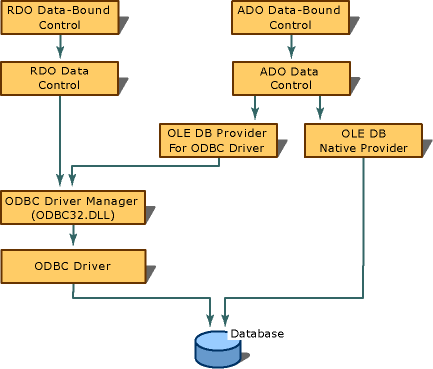

# Creating Database Connections
To use databinding, you must configure a data source. When using the ADO data control, you must configure an OLE DB connection. When using the RDO RemoteData control, you must create an Open Database Connectivity (ODBC) connection. Because Visual C++ ships with an OLE DB provider for ODBC data sources, the ADO data control can also make use of ODBC connections.  
  
   
  
## See Also  
 [Data-Bound Controls (ADO and RDO)](../vs140/Data-Bound-Controls--ADO-and-RDO-.md)   
 [ODBC Connections](../vs140/ODBC-Connections.md)   
 [Oracle Connections](../vs140/Oracle-Connections.md)