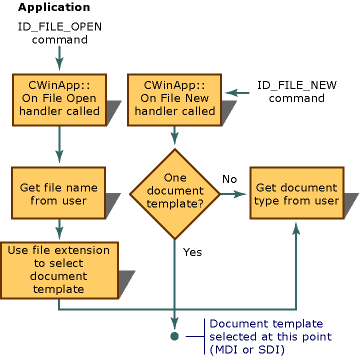
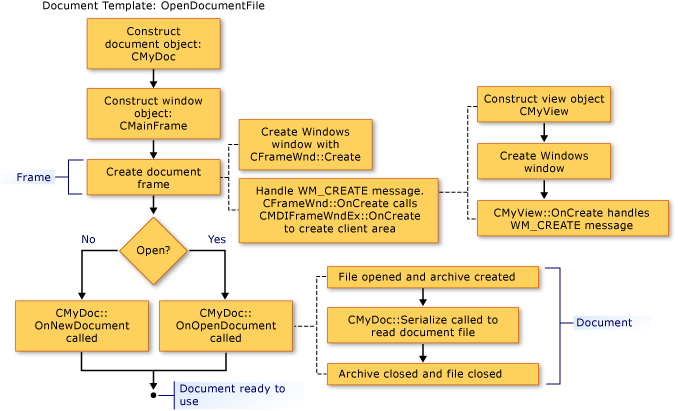
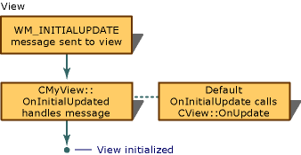

# Creating New Documents, Windows, and Views
The following figures give an overview of the creation process for documents, views, and frame windows. Other articles that focus on the participating objects provide further details.  
  
 Upon completion of this process, the cooperating objects exist and store pointers to each other. The following figures show the sequence in which objects are created. You can follow the sequence from figure to figure.  
  
   
Sequence in Creating a Document  
  
   
Sequence in Creating a Frame Window  
  
   
Sequence in Creating a View  
  
 For information about how the framework initializes the new document, view, and frame-window objects, see classes [CDocument](../vs140/CDocument-Class.md), [CView](../vs140/CView-Class.md), [CFrameWnd](../vs140/CFrameWnd-Class.md), [CMDIFrameWnd](../vs140/CMDIFrameWnd-Class.md), and [CMDIChildWnd](../vs140/CMDIChildWnd-Class.md) in the MFC Library Reference. Also see [Technical Note 22](../vs140/TN022--Standard-Commands-Implementation.md), which explains the creation and initialization processes further under its discussion of the framework's standard commands for the `New` and **Open** items on the **File** menu.  
  
##   Initializing Your Own Additions to These Classes  
 The preceding figures also suggest the points at which you can override member functions to initialize your application's objects. An override of `OnInitialUpdate` in your view class is the best place to initialize the view. The `OnInitialUpdate` call occurs immediately after the frame window is created and the view within the frame window is attached to its document. For example, if your view is a scroll view (derived from `CScrollView` rather than `CView`), you should set the view size based on the document size in your `OnInitialUpdate` override. (This process is described in the description of class [CScrollView](../vs140/CScrollView-Class.md).) You can override the **CDocument** member functions `OnNewDocument` and `OnOpenDocument` to provide application-specific initialization of the document. Typically, you must override both since a document can be created in two ways.  
  
 In most cases, your override should call the base class version. For more information, see the named member functions of classes [CDocument](../vs140/CDocument-Class.md), [CView](../vs140/CView-Class.md), [CFrameWnd](../vs140/CFrameWnd-Class.md), and [CWinApp](../vs140/CWinApp-Class.md) in the MFC Library Reference.  
  
## See Also  
 [Document Templates and the Document/View Creation Process](../vs140/Document-Templates-and-the-Document-View-Creation-Process.md)   
 [Document Template Creation](../vs140/Document-Template-Creation.md)   
 [Document/View Creation](../vs140/Document-View-Creation.md)   
 [Relationships Among MFC Objects](../vs140/Relationships-Among-MFC-Objects.md)