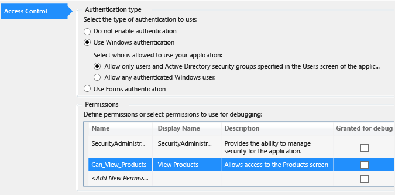

# Creating Permissions in LightSwitch
In this lesson, you’ll learn how to create permissions for your LightSwitch application.  
  
## Creating Permissions  
 You can use permissions to restrict access to certain parts of an application, such as a screen that allows users to modify data. For example, a payroll application might allow an employee to view, but not change, their payroll information. But it might give a payroll supervisor permission to view and change payroll information for any employee. You can define permissions that allow the supervisor to have more access.  
  
#### To create a permission  
  
1.  In **Solution Explorer**, open the shortcut menu for the **My First Application** node, and then choose **Properties**.  
  
2.  In the **My First Application Properties** window, choose the **Access Control** tab.  
  
3.  In the **Permissions** grid, choose the **<Add New Permission\>** placeholder, and then enter `Can_View_Products`.  
  
4.  In the **Display Name** column, enter `View Products`.  
  
5.  In the **Description** column, enter `Allows access to the Products screen`, and then choose the **Enter** key.  
  
       
  
## Closer Look  
 In this lesson, you learned how to define a permission for your application. You can assign the permission to a user or a group of users, and the permission can enable or disable screens when the application loads.  
  
 You can make permissions as granular as necessary. You can create a permission for each screen in the application, or you can apply a single permission to multiple screens. For example, you can create a Manager permission that allows managers to access several screens.  
  
## Next Steps  
 In the next lesson, you’ll learn how to apply the permission that you just created to restrict access to a screen.  
  
 Next lesson: [Restricting Access to Screens](../vs140/Restricting-Access-to-a-LightSwitch-Screen.md)  
  
## See Also  
 [Creating Roles and Permissions](../vs140/Enabling-Authorization-and-Creating-Permissions-in-LightSwitch.md)   
 [How to: Enable Authentication in an HTML Client App](../vs140/How-to--Enable-Authentication-in-an-HTML-Client-App.md)