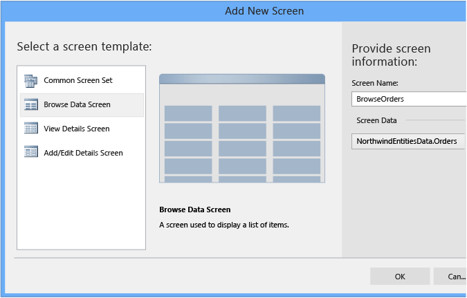
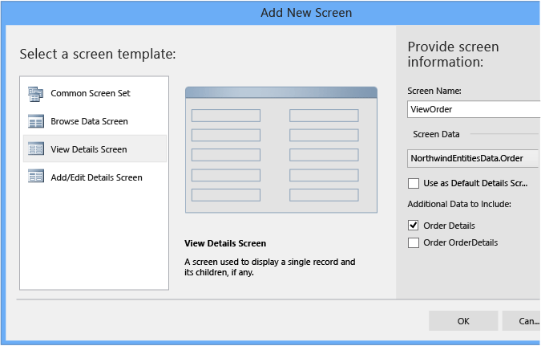
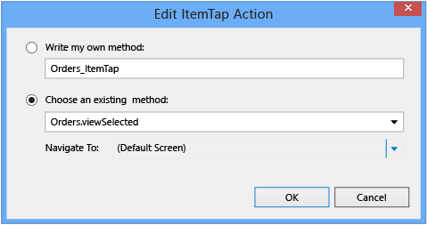

# Creating Screens to Display Data in a LightSwitch Application
This lesson shows how to create screens for browsing and viewing records in LightSwitch. In a previous lesson, [Step 3: Create Screens in LightSwitch](../vs140/Step-3--Create-Screens-in-LightSwitch.md), you created a common screen set for the **Contacts** entity. In this lesson, you’ll create a browse data screen to display a list of items, and a view details screen to display a single record. You’ll also learn how to define navigation between these screens.  
  
## Create Screens  
  
#### To create a browse data screen  
  
1.  In **Solution Explorer**, open the shortcut menu for the **Screens** node, and then choose **Add Screen**.  
  
2.  In the **Add New Screen** dialog box, in the **Select a screen template:** list, choose **Browse Data Screen**.  
  
3.  In the **Screen Name** text box, enter `BrowseOrders`.  
  
4.  In the **Screen Data** list, choose **NorthwindEntitiesData.Orders**, and then choose the **OK** button.  
  
       
  
#### To create a view details screen  
  
1.  In **Solution Explorer**, open the shortcut menu for the **Screens** node, and then choose **Add Screen**.  
  
2.  In the **Add New Screen** dialog box, in the **Select a screen template:** list, choose **View Details Screen**.  
  
3.  In the **Screen Name** text box, enter `ViewOrder`.  
  
4.  In the **Screen Data** list, choose **NorthwindEntitiesData.Orders**.  
  
5.  Clear the **Use as Default Details Screen** check box, and then choose the **OK** button.  
  
       
  
#### To define navigation between screens  
  
1.  In **Solution Explorer**, open the shortcut menu for the **BrowseOrders.lsml** node, and then choose **Open**.  
  
2.  In the Screen Designer, choose the **Tile List &#124; Orders** node.  
  
3.  In the `Properties` window, choose the **Item Tap: viewSelected** link.  
  
     The **Edit ItemTap Action** dialog box opens.  
  
       
  
4.  In the **Navigate To: (DefaultScreen)** list, choose **View Order**, and then choose the **OK** button.  
  
       
  
#### To view the changes  
  
1.  Run the application. On the **ContactLists** screen, choose the downward arrow next to the screen title, and then choose **Browse Orders**.  
  
       
  
2.  Choose an order tile to open the **ViewOrder** screen for the order, and then choose the **Close** button to close the application.  
  
## Closer Look  
 This lesson showed how to create browse and view screens that display a list of orders and the details for each order.  
  
 When creating the view screen, you were instructed to clear the **Use as Default Details Screen** check box. If you had left it checked, the view screen would have been defined as the default screen for viewing orders, and you wouldn’t have needed to define the navigation. Alternatively, if you had chosen the **Item Tap** link before creating the view screen, you could have chosen to create a default view screen directly from the **Edit ItemTap Action** dialog box.  
  
## Next Steps  
 In the next lesson, you’ll learn how change the layout and appearance of the screens that you just created.  
  
 Next lesson: [Customizing Screen Appearance](../vs140/Customizing-Screen-Appearance-in-a-LightSwitch-Application.md)  
  
## See Also  
 [Creating Screens](../vs140/Creating-Screens-in-LightSwitch.md)   
 [Choosing a Screen Type for an HTML Client of a LightSwitch App](../vs140/Choosing-a-Screen-Type-for-an-HTML-Client-of-a-LightSwitch-App.md)   
 [How to: Create an HTML Client Screen](../vs140/How-to--Create-an-HTML-Client-Screen.md)   
 [HTML Client Screens for LightSwitch Apps](../vs140/HTML-Client-Screens-for-LightSwitch-Apps.md)