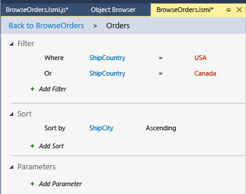

# Creating a Basic Query in LightSwitch
This lesson shows how to create a LightSwitch query to return a subset of customer names.  
  
## Create a Query  
 A query returns data that meets a set of criteria. For example, a query might return a list of orders for customers who are located in the United States or Canada. In this example, orders are the data, and customers located in United States or Canada is the criterion.  
  
> [!NOTE]
>  This lesson builds on the My First Application project that's developed in the [Working with Data in LightSwitch (Guided Tour)](../vs140/Working-with-Data-in-LightSwitch.md) lessons and modified in the [Creating Screens](../vs140/Creating-Screens-in-LightSwitch.md) lessons. If you've completed the earlier lessons, open the project now; otherwise, complete those prerequisite lessons, and then return to this lesson.  
  
#### To create a query  
  
1.  In **Solution Explorer**, open the shortcut menu for the **BrowseOrders.lsml** node, and then choose **Open**.  
  
2.  In the left pane of the **Screen Designer**, choose the **Orders** node, and then choose the **Edit Query** link.  
  
3.  In the **Query Designer**, choose the **Add Filter** link.  
  
     A filter condition is added to the **Filter** section. Several lists and a text box appear next to the filter condition.  
  
4.  In the first list, choose **Where**.  
  
5.  In the second list, choose **ShipCountry**.  
  
6.  In the third list, choose **= (equals)**.  
  
7.  In the fourth list, choose **Literal**.  
  
8.  In the text box, enter `USA`, and then choose the **Add Filter** link again.  
  
9. In the first list, choose **Or**.  
  
10. In the second list, choose **ShipCountry**.  
  
11. In the third list, choose **= (equals)**.  
  
12. In the fourth list, choose **Literal**.  
  
13. In the text box, enter `Canada`.  
  
     This query will return all records from **Orders** where the value of the **ShipCountry** field equals either the literal value "USA" or the literal value "Canada".  
  
14. Choose the **Add Sort** link.  
  
15. In the first list, choose **ShipCity**.  
  
     The results will be sorted by the city name in ascending (A-Z) order.  
  
       
  
16. On the toolbar, choose the **Back to BrowseOrders** link to return to the **Screen Designer**.  
  
17. In the center pane, choose the **Table Row &#124; rows** node, and then open the **Add** list and choose **ShipCountry**.  
  
18. Open the **Add** list, and then choose **ShipCity**.  
  
19. Run the application, and open the **BrowseOrders** screen.  
  
     Notice that only orders for customers in the USA or Canada appear and that the results are sorted by city name.  
  
## Closer Look  
 This lesson showed how to create a query that returns a subset of customers. The filter section of the query specified a condition, and the sort section specified how to order the results. Translated to natural language, the query says, "Give me a list of all orders that are being shipped to customers in the USA or Canada, sorted by city name."  
  
 In the first filter list, you could choose either **Where** or **WhereNot**. If you change the clause to **WhereNot**, the query would return orders for customers from everywhere except the USA or Canada.  
  
 The third filter list contains operators that you can apply to the query. For example, if you had chosen a numeric field in the second list, you could choose **> (is greater than)** to return only those records that exceeded a specified amount.  
  
 The fourth filter list contains three choices: **Literal**, **Property**, and **Parameter**. As demonstrated in this lesson, **Literal** means that the criterion is a value in the database. If you had chosen **Property**, a list of the fields in the **Orders** entity would have appeared so that you could filter results by property. For example, you could return all orders where the **ShipName** matches the **Customer**. The **Parameter** option is described in the [Creating a Parameterized Query](../vs140/Creating-a-Parameterized-Query-in-LightSwitch.md) lesson.  
  
 The sort section of a query determines the order in which the results appear on a screen in the running application.  
  
## Next Steps  
 In the next lesson, you’ll learn how to create a screen that's based on a query.  
  
 Next lesson: [Creating a Screen Based on a Query](../vs140/Creating-a-LightSwitch-Screen-Based-on-a-Query.md)  
  
## See Also  
 [Filtering Data with Queries](../vs140/Filtering-Data-with-Queries-in-LightSwitch.md)   
 [How to: Add, Remove, and Modify a Query](../vs140/How-to--Add--Remove--and-Modify-a-Query.md)   
 [How to: Extend a Query by Using Code](../Topic/How%20to:%20Extend%20a%20Query%20by%20Using%20Code.md)   
 [Queries: Retrieving Information From a Data Source](../Topic/Queries:%20Retrieving%20Information%20from%20a%20Data%20Source.md)