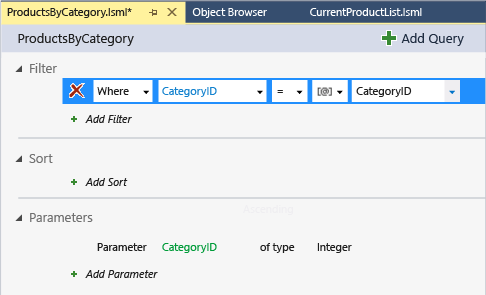

# Creating a Parameterized Query in LightSwitch
This lesson shows how to create a parameterized query in a LightSwitch application.  
  
## Create a Parameterized Query  
 A parameterized query determines what data to return by evaluating one or more values (parameters) when the application runs. For example, if you set the query parameter to a product category, your query would return a list of products in that category. You can set the parameter programmatically, but most applications use parameters that reflect values that a user sets.  
  
#### To create a parameterized query  
  
1.  In **Solution Explorer**, open the shortcut menu for the **Products.lsml** node, and then choose **Add Query**.  
  
     The **Query Editor** opens.  
  
2.  In the **Properties** window, name the query `ProductsByCategory`.  
  
3.  In the **Query Designer**, choose the **Add Filter** link.  
  
4.  In the first list, choose **Where**.  
  
5.  In the second list, choose **CategoryID**.  
  
6.  In the third list, choose **= (equals)**.  
  
7.  In the fourth list, choose **Parameter**.  
  
8.  In the final list, choose **Add New**.  
  
       
  
     A parameter that's named `CategoryID`, of type `Integer` is created and added to the **Parameters** section of the **Query Editor**.  
  
## Closer Look  
 This lesson showed how to create a parameterized query that returns a subset of products. At run time, a **CategoryID** box is provided on a screen based on this query so that a user can specify a numeric value for the `CategoryID` parameter. For example, if the user specifies `1` in the box, all products in the Beverages category will be returned. If the user specifies `2`, Condiments will be returned.  
  
 The user can type the parameter value into a text box or select it from a list. It can also be provided by another entity on a screen. For example, when a product is selected on a screen, you could use its **CategoryID** as a parameter to return all other products in the same category.  
  
## Next Steps  
 In the next lesson, you’ll learn how to use the parameterized query that you just created on a screen.  
  
 Next lesson: [Using a Parameterized Query on a Screen](../vs140/Using-a-Parameterized-Query-on-a-LightSwitch-Screen.md)  
  
## See Also  
 [Filtering Data with Queries](../vs140/Filtering-Data-with-Queries-in-LightSwitch.md)   
 [How to: Provide a Value to a Query Parameter](../vs140/How-to--Provide-a-Value-to-a-Query-Parameter.md)   
 [How to: Extend a Query by Using Code](../Topic/How%20to:%20Extend%20a%20Query%20by%20Using%20Code.md)   
 [Queries: Retrieving Information From a Data Source](../Topic/Queries:%20Retrieving%20Information%20from%20a%20Data%20Source.md)