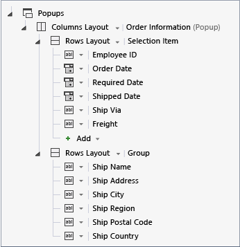
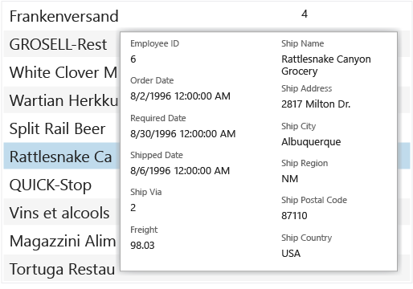

# Creating a Popup Screen in LightSwitch
In this lesson, you’ll learn how to how to create a Popup in a LightSwitch application.  
  
## Creating a Popup  
 You can use the **Screen Designer** to create a Popup, which is a floating window that appears on top of the active screen.  
  
#### To add a Popup  
  
1.  In **Solution Explorer**, open the shortcut menu for the **BrowseOrders.lsml** node, and then choose **Open**.  
  
2.  In the center pane of the **Screen Designer**, choose the **Popup** node, and then choose the **Add Popup** node.  
  
     A new Popup is added to the screen.  
  
3.  Choose the **Rows Layout &#124; Group (Popup)** node. In the **Properties** window, choose the **Name** property, and then enter `OrderInformation`.  
  
4.  Select the check box for the **Use Read-only Controls** property.  
  
5.  In the **Screen Designer**, choose the **Rows Layout &#124; Order Information (Popup)** node, open the **Rows Layout** list, and then choose **Columns Layout**.  
  
6.  Open the **Add** list, and then choose **– Selected Item**.  
  
7.  Choose the **Columns Layout &#124; Order Information (Popup)** node, open the **Add** list, and then choose **New Group**.  
  
     A **Rows Layout &#124; Group** node is added.  
  
8.  Choose the **Ship Name**, **Ship Address**, **Ship City**, **Ship Region**, **Ship Postal Code**, and **Ship Country** nodes and drag them to the **Rows Layout &#124; Group** node.  
  
       
  
9. Choose the **Table &#124; Orders** node. In the **Properties** window, choose the **Item Tap: viewSelected** link.  
  
10. In the **Edit ItemTap Action** dialog box, open the **Orders.viewSelected** list. Choose **showPopup**, and then choose the **OK** button.  
  
11. Run the application. Open the **Browse Orders** screen, and then choose an order to display the Popup.  
  
       
  
12. Choose the **Browse Orders** screen to dismiss the Popup, and then close the application.  
  
## Closer Look  
 In an earlier lesson you created an **Add/Edit Details** screen for the **Contacts** entity. That screen is a modal dialog box that blocks access to the underlying screen until the user taps the **Save** or **Cancel** button to dismiss the dialog box. In LightSwitch, a Popup is similar to a modal dialog box, but it’s dismissed by tapping anywhere outside of it. You can create multiple Popups for any screen, but you can’t share them between screens.  
  
 In this example you set the item tap action for the screen to show the Popup, replacing the previous action that launched the **ViewOrder** screen. Instead of replacing the existing action, you could have added a button on the toolbar to launch the Popup.  
  
## Next Steps  
 In the next lesson, you’ll learn how to use a screen property to display information on a screen.  
  
 Next lesson: [Displaying Static Information in a LightSwitch Application](../vs140/Displaying-Local-Information-in-a-LightSwitch-Application.md)  
  
## See Also  
 [Creating Screens](../vs140/Creating-Screens-in-LightSwitch.md)   
 [How to: Create a Dialog or Popup for a Mobile Client of a LightSwitch App](../vs140/How-to--Create-a-Dialog-or-Popup-for-a-Mobile-Client-of-a-LightSwitch-App.md)   
 [HTML Client Screens for LightSwitch Apps](../vs140/HTML-Client-Screens-for-LightSwitch-Apps.md)