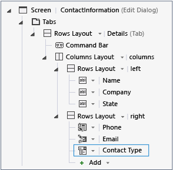
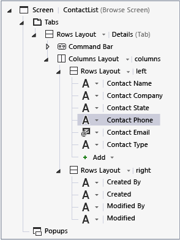
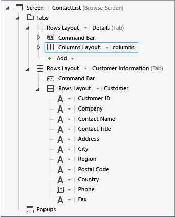

# Customizing Screen Appearance in a LightSwitch Application
In this lesson, you'll learn how to change the layout and appearance of screens in LightSwitch. Screens in LightSwitch differ from forms in traditional development tools, because their layout is predefined. You can get a screen up and running without any modifications or code. However, if you want to customize or enhance a screen, there are many ways to do so.  
  
## Customize the Screen  
 You can use the **Screen Designer** to customize a screen in many ways. For example, you can change display name, change the display order of fields, or change the kind of control that's used to present a field  
  
#### To change display names  
  
1.  In **Solution Explorer**, open the shortcut menu for the **BrowseContactLists.lsml** node, and then choose **Open**.  
  
2.  In the center pane of the **Screen Designer**, choose the topmost **Screen &#124; ContactLists** node.  
  
3.  In the **Properties** window, choose the **Display Name** property and enter `Northwind Contacts`.  
  
4.  In **Solution Explorer**, open the shortcut menu for the **AddEditContactList.lsml** node, and then choose **Open**.  
  
5.  In the center pane of the **Screen Designer**, choose the topmost **Screen &#124; ContactList** node.  
  
6.  In the **Properties** window, choose the **Display Name** property and enter `ContactInformation`.  
  
7.  In the **Screen Designer**, choose the **ContactName** node.  
  
8.  In the **Properties** window, choose the **Display Name** property and enter `Name`.  
  
9. Repeat the process for the **ContactCompany**, **ContactState**, **ContactPhone**, and **ContactEmail**, changing their display names to `Company`, `State`, `Phone`, and `Email`, respectively.  
  
       
  
#### To change controls and display order  
  
1.  In **Solution Explorer**, open the shortcut menu for the **BrowseOrders.lsml** node, and then choose **Open**.  
  
2.  In the center pane of the **Screen Designer**, choose the topmost **Tile List &#124; Orders** node.  
  
3.  Expand the **Tile List** control list, and then choose **Table**.  
  
     This will display the orders in a table format instead of the default tile list.  
  
4.  In **Solution Explorer**, open the shortcut menu for the **ViewContactList.lsml** node, and then choose **Open**.  
  
5.  In the center pane of the **Screen Designer**, choose the **ContactPhone** node, expand the control list, and then choose **Text**.  
  
     This will display the phone number as plain text rather than the hyperlink displayed by the default **Phone Number Viewer** control.  
  
6.  Choose the **ContactState** node, and then drag it below the **ContactCompany** node.  
  
       
  
#### To add a tab with related information  
  
1.  In **Solution Explorer**, open the shortcut menu for the **ViewContactList.lsml** node, and then choose **Open**.  
  
2.  In the center pane of the **Screen Designer**, choose the topmost **Tabs** node, and then choose the **Add Tab** node.  
  
     A new tab is added to the screen.  
  
3.  Choose the **Rows Layout &#124; Group (Tab)** node. In the properties window, choose the **Name** property, and then enter `CustomerInformation`.  
  
4.  Expand the **Add** list, and then choose **Other Screen Data**.  
  
     The **Add Screen Data** dialog box opens.  
  
5.  In the **Add Screen Data** dialog box, in the **Specify the screen data to add** box, enter `Contact.Customer`, and then choose the **OK** button.  
  
       
  
#### To view the changes  
  
1.  Run the application. Notice that the title on the home screen is now **Northwind Contacts**.  
  
2.  Open the **Browse Orders** screen and notice that the orders are now displayed in a table.  
  
3.  Return to the home screen, choose the tile for the contact **Elizabeth Lincoln**, and then on the **View** screen, choose the **Customer Information** tab.  
  
     Notice that the information from the Northwind Customers table is displayed.  
  
4.  Return to the home screen, choose the tile for **Howard Snyder**, and then choose the **Customer Information** tab.  
  
     Notice that no information is displayed. There is no matching record in the Northwind Customers table.  
  
5.  Choose the **Details** tab, and then choose the **Edit** button to open the Edit screen.  
  
     Notice that the title is now **Contact Information**, and the display names for the fields have been updated.  
  
6.  Close the dialog box, and then close the application.  
  
## Closer Look  
 This lesson showed how to modify screen appearance in several ways. The lesson also demonstrated how the **Screen Content Tree** in the **Screen Designer** relates to the user interface in the running screen.  
  
 When you changed the **Display Name** properties, you changed the user interface text that the user sees. You may remember that you changed the **Display Name** for another field in the **Entity Designer** in an earlier lesson. When you set the **Display Name** in the **Entity Designer**, the change is propagated to all screens; when you set it in the **Screen Designer**, only the screen that you are working with is changed.  
  
 When you changed the control type for the **ContactPhone** field from a **Phone Number Viewer** to a **Text** control, you may have noticed that the list of available controls for each field only includes controls that are appropriate for the underlying data type of that field. For example, for a field of the `Text` data type, you can choose a **Text Box**, **Text Area**, or a **Text** control. The list also contains an entry for **Custom Control**, which allows you to create your own JavaScript control. See [How to: Add a Custom Control to an HTML Screen for a LightSwitch App](../vs140/How-to--Add-a-Custom-Control-to-an-HTML-Screen-for-a-LightSwitch-App.md).  
  
 In addition to dragging a field (in this case, the **ContactState** field) to another place in a list, you can drag fields from the left pane of the **Screen Designer** to the center pane. For example, if you were to accidentally delete the **ContactState** field, you could drag it back from the **Contact** list in the left pane.  
  
 When you added the **Customer Information** tab, you used the relationship that you created in the lesson [Defining Relationships in a LightSwitch Application](../vs140/Defining-Relationships-in-a-LightSwitch-Application.md) to pull in related customer information. The ability to relate data from disparate sources is a powerful feature of LightSwitch.  
  
## Next Steps  
 In the next lesson, you’ll learn how to create a Popup screen.  
  
 Next lesson:  [Creating a Popup Screen in LightSwitch](../vs140/Creating-a-Popup-Screen-in-LightSwitch.md)  
  
## See Also  
 [Creating Screens](../vs140/Creating-Screens-in-LightSwitch.md)   
 [How to: Design an HTML Screen by Using the Screen Designer](../vs140/How-to--Design-an-HTML-Screen-by-Using-the-Screen-Designer.md)   
 [HTML Client Screens for LightSwitch Apps](../vs140/HTML-Client-Screens-for-LightSwitch-Apps.md)