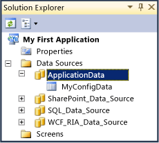

# Data: The Information Behind Your Application
In [!INCLUDE[smb_current_short](../vs140/includes/smb_current_short_md.md)], you can connect to existing data or to data tables that you create, and you can define relationships between data sources and specify how the data is handled.  
  
 To provide data to a [!INCLUDE[smb_current_short](../vs140/includes/smb_current_short_md.md)] application, you can connect to an existing data source such as a SQL Server database, or you can create tables in the SQL Server Express database that is included in [!INCLUDE[smb_current_short](../vs140/includes/smb_current_short_md.md)].  
  
 By using the *data designer*, you can adjust data settings or create relationships between data sources. [!INCLUDE[smb_current_short](../vs140/includes/smb_current_short_md.md)] handles many typical data management tasks such as field validation, transaction processing, and concurrency conflict resolution for you. You can customize these tasks by modifying properties in the **Properties** window, and you can write code to override or extend them.  
  
## Connecting to Data  
 You can connect to data from a SQL Server database, an OData service, a SharePoint list, a SAP NetWeaver Gateway, or a Windows Communication Foundation (WCF) Rich Internet Application (RIA) service. When you establish a connection, you can select specific tables, lists, or items. For every one of these, [!INCLUDE[smb_current_short](../vs140/includes/smb_current_short_md.md)] adds an *entity* to your solution. An entity is a basic unit of data that you can use in [!INCLUDE[smb_current_short](../vs140/includes/smb_current_short_md.md)] to assemble an application.  
  
 The following illustration shows the entities that [!INCLUDE[smb_current_short](../vs140/includes/smb_current_short_md.md)] has generated for a SQL Server database, a SharePoint list, and a WCF service.  
  
   
  
 For more information about how to connect to data, see [How to: Connect to Data](../vs140/How-to--Connect-to-Data.md).  
  
 For more information about data access and storage in [!INCLUDE[smb_current_short](../vs140/includes/smb_current_short_md.md)], see [The Anatomy of a LightSwitch Application Part 4 – Data Access and Storage](http://go.microsoft.com/fwlink/?LinkID=207535) on the MSDN website.  
  
## Using the [!INCLUDE[smb_current_short](../vs140/includes/smb_current_short_md.md)] Internal Database  
 [!INCLUDE[smb_current_short](../vs140/includes/smb_current_short_md.md)] uses an internal database to store configuration settings such as security-related settings. You can add tables to this database and use them in your application just as you use entities from other data sources. The internal database is a great location to store your custom configuration information.  
  
 The following illustration shows that [!INCLUDE[smb_current_short](../vs140/includes/smb_current_short_md.md)] internal database as it appears in **Solution Explorer**.  
  
   
  
 For more information, see [How to: Add a Table to the Light Switch Internal Database](../vs140/How-to--Add-a-Table-to-the-LightSwitch-Internal-Database.md).  
  
##   Modifying Entities and Tables  
 You can use the data designer to add new fields, or change field names, field types, and field properties. The kinds of changes that you can make depend on whether you open a table from the internal database or an entity from an external data source.  
  
 If you open a table from the [!INCLUDE[smb_current_short](../vs140/includes/smb_current_short_md.md)] internal database, you can modify all fields and their properties. However, you can modify entities from external data sources only in ways that do not affect the data definition on the server. For example, you cannot change the type of a field from string to integer. If you want to modify external entities, change field types on the server and then refresh the data connection in [!INCLUDE[smb_current_short](../vs140/includes/smb_current_short_md.md)].  
  
 For more information about how to refresh a connection to a data source, see [How to: Connect to Data](../vs140/How-to--Connect-to-Data.md).  
  
 For more information about how to modify the fields of an entity or table, see [How to: Define Data Fields](../vs140/How-to--Define-Data-Fields-in-a-LightSwitch-Database.md).  
  
## Defining Relationships  
 You can use the data designer to define relationships between entities or tables. Relationships help you create screens in which the related data work together.   You can also reference a relationship in your custom code because [!INCLUDE[smb_current_short](../vs140/includes/smb_current_short_md.md)] generates properties that represent the relationship. These properties appear in IntelliSense as you write code.  
  
 The following illustration shows a relationship between the Product entity and the Order_Detail entity.  
  
   
  
 The kind of relationship that you can define or modify depends on the entities or tables that you include in the relationship. You can define relationships between entities in the intrinsic database or between entities from different data sources. For example, you can create a relationship between an entity from a SQL Server database and an entity from a SharePoint list.  
  
 For more information about how to create or modify data relationships, see [How to: Create Relationships between Entities](../vs140/How-to--Define-Data-Relationships-in-LightSwitch.md).  
  
## Validating Fields  
 [!INCLUDE[smb_current_short](../vs140/includes/smb_current_short_md.md)] automatically validates the fields of an entity or table based on rules that you define. An update cannot be committed to the data source until it complies with the validation rules. If a user adds data that does not comply, an error message is displayed.  
  
 The following illustration shows a validation error message.  
  
   
  
 [!INCLUDE[smb_current_short](../vs140/includes/smb_current_short_md.md)] provides several built-in validation rules that you can configure and apply to an entity or table without writing any code. You can also define custom validation rules by writing code.  
  
 For more information, see [How to: Validate Data](../vs140/How-to--Validate-Data-in-a-LightSwitch-Application.md).  
  
## Performing Data-Related Tasks by Using Code  
 [!INCLUDE[smb_current_short](../vs140/includes/smb_current_short_md.md)] automatically handles data-related tasks such as transaction processing, concurrency events, and validation. However, you can override the default behavior or add code that extends it.  
  
 [!INCLUDE[smb_current_short](../vs140/includes/smb_current_short_md.md)] provides a strongly typed object model that you can use to perform data-management tasks. You can also add code to methods that are called when certain events occur, for example, when a user adds or deletes data.  
  
 For more information about tasks that you can perform by using code, see [Performing Data-Related Tasks by Using Code](../vs140/Performing-Data-Related-Tasks-by-Using-Code.md).  
  
 For more information about the methods that [!INCLUDE[smb_current_short](../vs140/includes/smb_current_short_md.md)] calls when certain events occur, see [How to: Handle Data Events](../vs140/How-to--Handle-Data-Events.md).  
  
## Related Topics  
  
|Title|Description|  
|-----------|-----------------|  
|[How to: Connect to Data](../vs140/How-to--Connect-to-Data.md)|Describes how to consume data from a SQL Server database, a SharePoint list, or a WCF RIA service to a [!INCLUDE[smb_current_short](../vs140/includes/smb_current_short_md.md)] application.|  
|[Exposing LightSwitch Application Data](../vs140/Exposing-LightSwitch-Application-Data.md)|Describes how to use [!INCLUDE[smb_current_short](../vs140/includes/smb_current_short_md.md)] as an OData data source.|  
|[Guidelines for Creating WCF RIA Services for LightSwitch](../Topic/Guidelines%20for%20Creating%20WCF%20RIA%20Services%20for%20LightSwitch.md)|Provides information about how to store and retrieve connection strings as well as the effect that domain service class attributes have in a [!INCLUDE[smb_current_short](../vs140/includes/smb_current_short_md.md)] application.|  
|[How to: Add a Table to the LightSwitch Internal Database](../vs140/How-to--Add-a-Table-to-the-LightSwitch-Internal-Database.md)|Describes how to add data the SQL Server Express database that is included with [!INCLUDE[smb_current_short](../vs140/includes/smb_current_short_md.md)]..|  
|[How to: Define the Fields of an Entity](../vs140/How-to--Define-Data-Fields-in-a-LightSwitch-Database.md)|Describes how to add new fields (also known as properties) to an existing entity, and how to modify existing fields.|  
|[How to: Add a Computed Field](../vs140/How-to--Add-a-Computed-Field-in-a-LightSwitch-Database.md)|Describes how to create a field whose value is derived from other fields or from calculations made in business logic.|  
|[How to: Create a Drop-Down List of Values for a Field](../vs140/How-to--Create-a-List-of-Values-for-a-Field-in-a-LightSwitch-Application.md)|Describes how to define a *choice list* for a field in an entity if that field can only contain certain values or if you want to make it easy to populate.|  
|[How to: Define Relationships between Entities](../vs140/How-to--Define-Data-Relationships-in-LightSwitch.md)|Describes how to create a relationship between entities or tables.|  
|[How to: Validate Data Entities](../vs140/How-to--Validate-Data-in-a-LightSwitch-Application.md)|Describes how to validate input by using custom or predefined validation rules.|  
|[How to: Handle Entity Events](../vs140/How-to--Handle-Data-Events.md)|Describes how to write code that is executed when a data-related event occurs.|  
|[How to: Execute a Stored Procedure in LightSwitch](../vs140/How-to--Execute-a-Stored-Procedure-in-LightSwitch.md)|Describes how to update data in an external database by calling a stored procedure.|  
|[Walkthrough: Updating Records Using Stored Procedures](../vs140/Walkthrough--Using-Stored-Procedures.md)|Describes how to insert, update, and delete customer records in a [!INCLUDE[smb_current_short](../vs140/includes/smb_current_short_md.md)] app by using stored procedures and a service.|  
|[Working with Data-Related Objects in Code](../vs140/Working-with-Data-Related-Objects-in-Code.md)|Describes the runtime object model that you can use to perform data-related tasks in code.|  
|[Performing Data-Related Tasks by Using Code](../vs140/Performing-Data-Related-Tasks-by-Using-Code.md)|Describes several data-related tasks that you can accomplish only by adding code to your application.|  
|[Reference: Entity Designer Properties](../vs140/Reference--Data-Designer-Properties.md)|Describes how you can modify the appearance and behavior of entities, tables, and fields by setting properties in the **Properties** window.|  
|[The Anatomy of a LightSwitch Application Part 4 – Data Access and Storage](http://go.microsoft.com/fwlink/?LinkID=207535)|Provides detailed information about data access and storage in a [!INCLUDE[smb_current_short](../vs140/includes/smb_current_short_md.md)] application.|