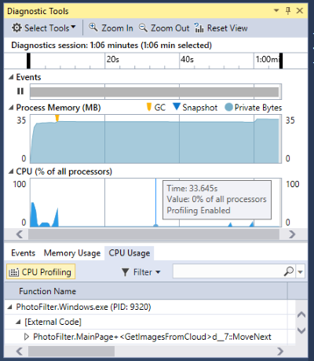
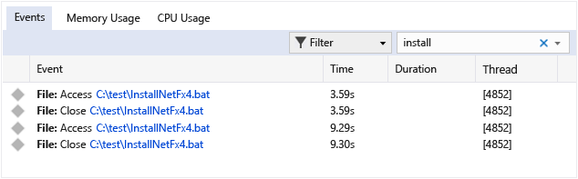
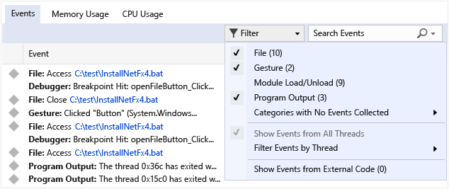

# Debugger-integrated profiling
The **Diagnostics Tools** window (on the **Debug** menu) allows you to monitor and analyze performance data at the same time you are debugging. It collects and displays real-time event, performance, and memory data, and correlates performance data with your debugging activity. This window is available in all editions of Visual Studio.  
  
 To enable or disable the Diagnostic Tools window, go to **Tools / Options / Debugging** and select **Enable Diagnostic Tools while debugging** (at the bottom of the page).  
  
 In Visual Studio Enterprise the tool window also displays IntelliTrace data, including the incorporation of **Output** window messages in the IntelliTrace details.  
  
 For information about diagnostic tools that do not run in the debugger, see [Run diagnostic tools](../vs140/Run-profiling-tools-without-debugging.md).  
  
##   Collect diagnostic data while debugging locally  
 The following section deals with debugging locally. You can find out about debugging on a device, or remote debugging, in later sections.  
  
1.  Open the project you want to debug, then click **Debug / Start Debugging** (or **Start** on the toolbar, or **F5**).  
  
2.  The **Diagnostic Tools** window appears automatically unless you have turned it off. To bring up the window again, click **Debug / Show Diagnostic Tools**.  
  
3.  Run the scenarios that you want to collect data for.  
  
     While you are running the session, you can see information about events, process memory, and CPU utilization.  
  
     The following graphic shows the **Diagnostic Tools** window in Visual Studio 2015 Update 1:  
  
       
  
4.  You can choose whether to see Memory Usage or CPU Usage (or both) with the **Select Tools** setting on the toolbar. If you are running Visual Studio Enterprise or Visual Studio Professional, you can enable or disable IntelliTrace in **Tools / Options / IntelliTrace**.  
  
5.  The diagnostic session ends when you stop debugging.  
  
## Event Searching and Filtering  
 In Visual Studio 2015 Update 1, the **Diagnostic Tools** window makes it easier for you focus on the events you are interested in.   The event names are now shown with category prefixes (**Gesture**, **Program Output**, **Breakpoint**, **File,** etc.) so you can quickly scan the list for a given category or skip the categories you don't care about.  
  
 The window now has a search box so that you can find a specific string anywhere in the event list. For example, the following graphic shows the results of a search for the string "install" that matched four events:  
  
   
  
 You can also filter events in and out of view in the window. In the **Filter** dropdown, you can check or uncheck specific categories of events:. The category names are the same as the prefix names.  
  
   
  
 For more information, see [Searching and filtering the Events tab of the Diagnostic Tools window](http://blogs.msdn.com/b/visualstudioalm/archive/2015/11/12/searching-and-filtering-the-events-tab-of-the-diagnostic-tools-window.aspx).  
  
## Remote Debugging  
 Running a diagnostic session on a remote PC or tablet requires that the Visual Studio Remote Tools be installed and running on the remote target. For store apps, see [Debug and test Windows Store apps on a remote machine from Visual Studio](../vs140/Run-Windows-Store-apps-on-a-remote-machine.md). For desktop apps, see [Remote Debugging and Diagnostics](../vs140/Remote-Debugging.md).  
  
## Blog posts and MSDN articles from the Diagnostics development team  
 MSDN Magazine: Analyze Performance While Debugging in Visual Studio 2015MSDN Magazine: Use IntelliTrace to Diagnose Issues FasterBlog post: Diagnosing Event Handler Leaks with the Memory Usage Tool in Visual Studio 2015Video: Historical Debugging with IntelliTrace in Microsoft Visual Studio Ultimate 2015Video: Debugging Performance Issues Using Visual Studio 2015  
  
 [MSDN Magazine: Analyze Performance While Debugging in Visual Studio 2015](https://msdn.microsoft.com/en-us/magazine/dn973013.aspx)  
  
 [MSDN Magazine: Use IntelliTrace to Diagnose Issues Faster](https://msdn.microsoft.com/en-us/magazine/dn973014.aspx)  
  
 [Blog post: Diagnosing Event Handler Leaks with the Memory Usage Tool in Visual Studio 2015](http://blogs.msdn.com/b/visualstudioalm/archive/2015/04/29/diagnosing-event-handler-leaks-with-the-memory-usage-tool-in-visual-studio-2015.aspx)  
  
 [Video: Historical Debugging with IntelliTrace in Microsoft Visual Studio Ultimate 2015](https://channel9.msdn.com/Events/Ignite/2015/BRK3716)  
  
 [Video: Debugging Performance Issues Using Visual Studio 2015](https://channel9.msdn.com/Events/Build/2015/3-731)  
  
 [PerfTips: Performance Information at-a-glance while Debugging with Visual Studio](http://blogs.msdn.com/b/visualstudioalm/archive/2014/08/18/perftips-performance-information-at-a-glance-while-debugging-with-visual-studio.aspx)  
  
 [Diagnostic Tools debugger window in Visual Studio 2015](http://blogs.msdn.com/b/visualstudioalm/archive/2015/01/16/diagnostic-tools-debugger-window-in-visual-studio-2015.aspx)  
  
 [IntelliTrace in Visual Studio Enterprise 2015](http://blogs.msdn.com/b/visualstudioalm/archive/2015/01/16/intellitrace-in-visual-studio-ultimate-2015.aspx)  
  
## See Also  
 [Diagnostic Tools in Visual Studio](../vs140/Profiling-Tools.md)   
 [Analyze memory use in the debugger](../vs140/Memory-Usage.md)   
 [Analyze performance in the debugger](../vs140/PerfTips.md)   
 [Debug your app by recording code execution with IntelliTrace](../vs140/IntelliTrace.md)   
 [Run diagnostic tools outside the debugger](../vs140/Run-profiling-tools-without-debugging.md)