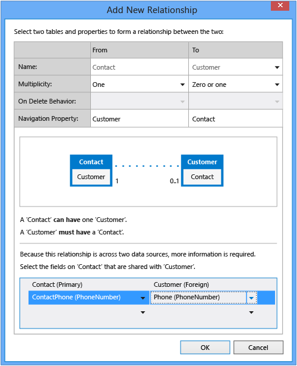
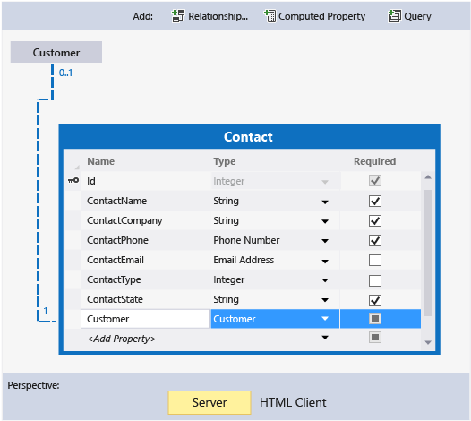

# Defining Relationships in a LightSwitch Application
This lesson shows how to define a relationship between data entities in a LightSwitch application. Relationships make it possible for you to show related data on a screen. For example, a relationship between contacts and customers lets you show customer information for a contact that matches an existing customer.  
  
## Define a Relationship  
 Many applications use information from more than one source of data. For example, an application for entering retail orders might pull product information directly from the manufacturer’s database. By using LightSwitch, you can define a relationship between entities in different data sources as long as data in a field in one source relates to data in a field in the other source.  
  
 In this case, you’ll relate the phone number fields for customers and contacts to pull in customer information.  
  
#### To define a relationship  
  
1.  In **Solution Explorer**, open the shortcut menu for the **Contacts.lsml** node, and then choose **Open**.  
  
2.  On the **Perspective** bar, choose **Server**.  
  
3.  On the toolbar, choose the **Relationship** button.  
  
     The **Add New Relationship** dialog box opens.  
  
4.  In the **Name:** row in the **To** column, choose **Customer**.  
  
5.  In the **Multiplicity** row, choose **One** in the **From** column and **Zero or one** in the **To** column.  
  
6.  In the **Select the fields on 'Contact' that are shared with 'Customer'.** section, in the **Contact (Primary)** column, choose **ContactPhone (PhoneNumber)**.  
  
7.  In the **Customer (Foreign)** column, choose **Phone (PhoneNumber)**, and then choose the **OK** button.  
  
       
  
     You’ve now defined a relationship between the Contacts entity and the Customers entity. If a value in the `Phone` field in the Customers table matches a value in the `ContactPhone` field in the Contacts table, information about the customer can appear.  
  
       
  
## Closer Look  
 This lesson showed how to define a relationship between entities from different data sources. You may have noticed that the designer shows the relationship with a dotted line. The dotted line signifies that the relationship is between different data sources. Relationships between entities in the same data source are shown with a solid line.  
  
 You can also define relationships between disparate types of data sources. For example, you can define a relationship between a data entity that you create in LightSwitch and a SharePoint list.  
  
## Next Steps  
 This lesson is the last one in the data section of the guided tour. The next set of lessons, [Creating Screens](../vs140/Creating-Screens-in-LightSwitch.md), teaches you how to create a user interface in which users can display and edit data.  
  
## See Also  
 [Working with Data in Kitty Hawk (Guided Tour)](../vs140/Working-with-Data-in-LightSwitch.md)   
 [How to: Define Data Relationships in LightSwitch](../vs140/How-to--Define-Data-Relationships-in-LightSwitch.md)