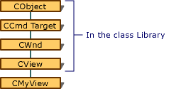

# Derived Message Maps
During message handling, checking a class's own message map is not the end of the message-map story. What happens if class `CMyView` (derived from `CView`) has no matching entry for a message?  
  
 Keep in mind that `CView`, the base class of `CMyView`, is derived in turn from `CWnd`. Thus `CMyView` *is* a `CView` and *is* a `CWnd`. Each of those classes has its own message map. The figure "A View Hierarchy" below shows the hierarchical relationship of the classes, but keep in mind that a `CMyView` object is a single object that has the characteristics of all three classes.  
  
   
A View Hierarchy  
  
 So if a message can't be matched in class `CMyView`'s message map, the framework also searches the message map of its immediate base class. The `BEGIN_MESSAGE_MAP` macro at the start of the message map specifies two class names as its arguments:  
  
 [!CODE [NVC_MFCMessageHandling#2](../CodeSnippet/VS_Snippets_Cpp/NVC_MFCMessageHandling#2)]  
  
 The first argument names the class to which the message map belongs. The second argument provides a connection with the immediate base class — `CView` here — so the framework can search its message map, too.  
  
 The message handlers provided in a base class are thus inherited by the derived class. This is very similar to normal virtual member functions without needing to make all handler member functions virtual.  
  
 If no handler is found in any of the base-class message maps, default processing of the message is performed. If the message is a command, the framework routes it to the next command target. If it is a standard Windows message, the message is passed to the appropriate default window procedure.  
  
 To speed message-map matching, the framework caches recent matches on the likelihood that it will receive the same message again. One consequence of this is that the framework processes unhandled messages quite efficiently. Message maps are also more space-efficient than implementations that use virtual functions.  
  
## See Also  
 [How the Framework Searches Message Maps](../vs140/How-the-Framework-Searches-Message-Maps.md)