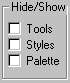

# Dialog Bars
A dialog bar is a toolbar, a kind of [control bar](../vs140/Control-Bars.md) that can contain any kind of control. Because it has the characteristics of a modeless dialog box, a [CDialogBar](../vs140/CDialogBar-Class.md) object provides a more powerful toolbar.  
  
 There are several key differences between a toolbar and a `CDialogBar` object. A `CDialogBar` object is created from a dialog-template resource, which you can create with the Visual C++ dialog editor and which can contain any kind of Windows control. The user can tab from control to control. And you can specify an alignment style to align the dialog bar with any part of the parent frame window or even to leave it in place if the parent is resized. The following figure shows a dialog bar with a variety of controls.  
  
   
A Dialog Bar  
  
 In other respects, working with a `CDialogBar` object is like working with a modeless dialog box. Use the dialog editor to design and create the dialog resource.  
  
 One of the virtues of dialog bars is that they can include controls other than buttons.  
  
 While it is normal to derive your own dialog classes from `CDialog`, you do not typically derive your own class for a dialog bar. Dialog bars are extensions to a main window and any dialog-bar control-notification messages, such as **BN_CLICKED** or **EN_CHANGE**, will be sent to the parent of the dialog bar, the main window.  
  
## See Also  
 [User Interface Elements](../vs140/User-Interface-Elements--MFC-.md)   
 [Sample](../vs140/Visual-C---Samples.md)