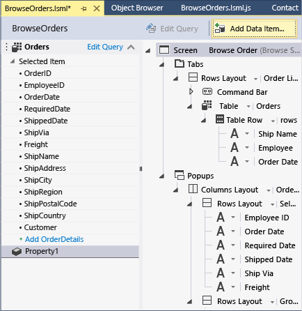

# Displaying Local Information in a LightSwitch Application
In this lesson, you’ll learn how to how to customize a screen in a LightSwitch application by adding a local property. A local property displays information that in’t in a data source.  
  
## Adding a Local Property  
 You can use the **Screen Designer** not only to customize the controls on a screen, but also to add data items. For example, you can add a local property that can display a calculated value.  
  
#### To add a local property  
  
1.  In **Solution Explorer**, open the shortcut menu for the **BrowseOrders.lsml** node, and then choose **Open**.  
  
2.  On the toolbar, choose the **Add Data Item** button.  
  
3.  In the **Add Data Item** dialog box, choose the **Local Property** option button. In the **Type** list, choose **Integer**, and then choose the **OK** button.  
  
     A new node named **Property1** is added to the left pane of the **Screen Designer**.  
  
       
  
4.  Choose the **Property1** node. In the Properties window, choose the **Name** property, and then enter `NumberOfOrders`.  
  
     The name also changes in the left pane of the designer.  
  
5.  In the Screen Designer, drag the **NumberOfOrders** node just below the **Command Bar** node in the center pane.  
  
6.  Run the application and open the **Browse Orders** screen.  
  
     Notice that a **Number of Orders** label is now displayed below the screen name, and that no value is displayed.  
  
7.  Close the application and return to design mode.  
  
#### To display a value for a local property  
  
1.  In the left pane of the **Screen Designer**, choose the **Orders** node.  
  
2.  On the **ToolBar Ribbon**, in the **Write Code** list, choose **created**.  
  
     The **Code Editor** opens and displays the `created` method.  
  
3.  In the `created` method, add the following code.  
  
    ```javascript  
    myapp.BrowseOrders.created = function (screen) {  
        screen.getOrders().then(function (results) {  
            screen.NumberOfOrders = screen.Orders.data.length;  
        })  
    };  
    ```  
  
     When the screen is created, this code calculates the number of orders in the **Orders** entity. That value is then displayed in the **Number of Orders** field.  
  
4.  Run the application and open the **Browse Orders** screen.  
  
     Notice that the number of orders appears in the **Number of Orders** field.  
  
5.  Close the application and return to design mode.  
  
## Closer Look  
 This lesson showed how to create a local property to display a calculated value on a screen. In this case, you used the `created` method of the orders collection to return the total number of orders in the **Orders** entity. The code uses a `Promise` object to make sure that the data is loaded before returning the value of the `screen.Orders.data.length` property.  
  
 In addition to using a local property to display a calculated value, you can also use a local property to collect an input value from the user. For example, you could create a local property that displays a list of cities when a user specifies a geographical region.  
  
## Next Steps  
 In the next set of lessons you’ll learn how to create and use queries to control what is displayed on a screen.  
  
 Next lesson: [Filtering Data with Queries](../vs140/Filtering-Data-with-Queries-in-LightSwitch.md)  
  
## See Also  
 [Creating Screens](../vs140/Creating-Screens-in-LightSwitch.md)   
 [How to: Add a Local Property to an HTML Screen](../vs140/How-to--Add-a-Local-Property-to-an-HTML-Screen.md)