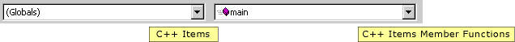

# Drop-down Bar
The drop-down bar is provided at the top of the code window and contains two drop-down lists.  
  
## Drop-Down Bar Interfaces  
 In [!INCLUDE[vcprvc](../vs140/includes/vcprvc_md.md)], for example, the drop-down bar contains lists for [!INCLUDE[vcprvc](../vs140/includes/vcprvc_md.md)] Items and [!INCLUDE[vcprvc](../vs140/includes/vcprvc_md.md)] Items Member Functions, as shown in the following picture.  
  
   
Drop-down bar  
  
 When implementing a drop-down bar, there are four interfaces of primary importance:  
  
-   <xref:Microsoft.VisualStudio.TextManager.Interop.IVsDropdownBarClient?qualifyHint=False>  
  
     Implement this interface to insert the content of the drop-down bar. Each drop-down combination can contain plain text or fancy text (bold, underline, or italic), can have window text font coloring or grayed out font coloring, and can optionally provide a small bitmap next to the drop-down item. Similar to the <xref:Microsoft.VisualStudio.TextManager.Interop.IVsCompletionSet?qualifyHint=False> interface, bitmap images are provided in image lists. Each drop-down combination can have a different image list; however, each image list must contain images of the same height. Additionally, using the <xref:Microsoft.VisualStudio.TextManager.Interop.IVsDropdownBarClient.GetComboTipText?qualifyHint=False> method, you can provide a tooltip for each combination.  
  
-   <xref:Microsoft.VisualStudio.TextManager.Interop.IVsDropdownBarManager?qualifyHint=False>  
  
     Call this interface to either create or destroy the drop-down bar for a code window. This interface can also be used to determine whether a drop-down bar is already attached to a code window by calling the <xref:Microsoft.VisualStudio.TextManager.Interop.IVsDropdownBarManager.GetDropdownBar?qualifyHint=False> method. Call <xref:System.Runtime.InteropServices.Marshal.QueryInterface?qualifyHint=False> for <xref:Microsoft.VisualStudio.TextManager.Interop.IVsDropdownBarManager?qualifyHint=False> from <xref:Microsoft.VisualStudio.TextManager.Interop.IVsCodeWindow?qualifyHint=False>.  
  
-   <xref:Microsoft.VisualStudio.TextManager.Interop.IVsDropdownBar?qualifyHint=False>  
  
     Call this interface to communicate directly with the drop-down bar. You can use this interface to force a refresh of the drop-down bar contents or to change the selection in one of the list boxes.  
  
-   <xref:Microsoft.VisualStudio.TextManager.Interop.IVsTextManagerEvents?qualifyHint=False>  
  
     If you have registered the `ShowDropdownBarOption` in your language service registry key, then your code window manager must monitor this event to synchronize with user preferences regarding whether the drop-down bar should be displayed. If you do not register this option in your language service key, then the option to show or hide the drop-down bar is disabled on the **Options** menu.  
  
## Attaching a Drop-Down Bar to a Code Window  
 To attach a drop-down bar to the code window when it is created, a language service should attach to the drop-down bar when the <xref:Microsoft.VisualStudio.TextManager.Interop.IVsCodeWindowManager.AddAdornments?qualifyHint=False> method is called. If a call to the <xref:Microsoft.VisualStudio.TextManager.Interop.IVsDropdownBarManager.GetDropdownBar?qualifyHint=False> method indicates that a drop-down bar does not already exist, then call <xref:Microsoft.VisualStudio.TextManager.Interop.IVsDropdownBarManager.AddDropdownBar?qualifyHint=False>. To access the <xref:Microsoft.VisualStudio.TextManager.Interop.IVsDropdownBarManager?qualifyHint=False> interface, call <xref:System.Runtime.InteropServices.Marshal.QueryInterface?qualifyHint=False> from the <xref:Microsoft.VisualStudio.TextManager.Interop.IVsCodeWindow?qualifyHint=False> pointer returned to you when your <xref:Microsoft.VisualStudio.TextManager.Interop.IVsCodeWindowManager?qualifyHint=False> implementation was attached.  
  
## See Also  
 [Customizing Code Windows by Using the Legacy API](../Topic/Customizing%20Code%20Windows%20by%20Using%20the%20Legacy%20API.md)   
 [Supporting the Navigation Bar (Managed Package Framework)](../vs140/Support-for-the-Navigation-Bar-in-a-Legacy-Language-Service.md)