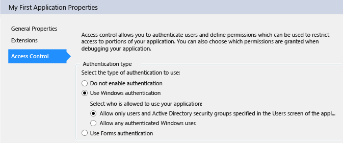

# Enabling Authentication in LightSwitch
This lesson shows how to enable authentication for a LightSwitch application.  
  
## Enabling Authentication  
 Most business applications have security features to prevent unauthorized users from reading, manipulating, or deleting data. In LightSwitch, you can make your application more secure by implementing authentication. This means that users must identify themselves, and the application must verify the user’s credentials, before the user can access the application. The first step in securing your application is to enable authentication.  
  
#### To enable authentication  
  
1.  In **Solution Explorer**, open the shortcut menu for the **My First Application** node, and then choose **Properties**.  
  
2.  In the **My First Application Properties** window, choose the **Access Control** tab.  
  
3.  In the **Select the type of authentication to use:** list, choose the **Use Windows authentication** option button.  
  
       
  
     The application will now require users to identify themselves to access the application.  
  
## Closer Look  
 This lesson showed how to enable Windows authentication for your application. With Windows authentication, the application authenticates a user based on the same credentials that the user provides to log on to the computer that's running the application. No additional user name or password is required.  
  
> [!NOTE]
>  While you develop your application, you won't be prompted for a user name and password; you'll automatically be logged on as a test user.  
  
 The other authentication option is **Use Forms authentication**, which the application itself manages. The application administrator maintains a list of authorized users and passwords, and a user must supply a user name and a password to access the application. Forms authentication is a good choice when many users share one computer under one account.  
  
 When you publish an application that uses authentication, you’ll need to define a default administrator who can add or remove users and roles. If authentication is enabled and you haven’t defined a default administrator, you won’t be able to access the published application. See [Administration](../vs140/How-to--Enable-Authentication-in-an-HTML-Client-App.md#admin).  
  
## Next Steps  
 In the next lesson, you’ll learn how to restrict access to parts of the application instead of the application as a whole.  
  
 Next lesson: [Creating Permissions](../vs140/Creating-Permissions-in-LightSwitch.md)  
  
## See Also  
 [Creating Roles and Permissions](../vs140/Enabling-Authorization-and-Creating-Permissions-in-LightSwitch.md)   
 [How to: Enable Authentication in an HTML Client App](../vs140/How-to--Enable-Authentication-in-an-HTML-Client-App.md)