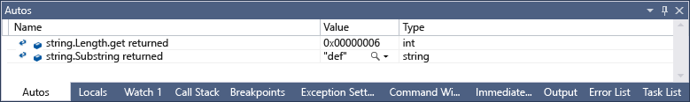
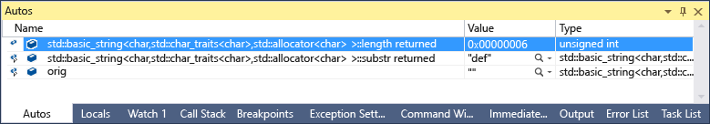

# Examine return values of method calls
,You can see the return values of methods in the **Autos** window when you step over or out of a method call. This is supported for the .NET Framework (version 4.0 and higher) and in C++.  This functionality is useful when the result of a method call is not stored in a local variable, for example with[method chaining](https://en.wikipedia.org/wiki/Method_chaining) (such as a method called on the object returned by another method).  
  
##  <a name="BKMK_View_method_return_values_in_the_Autos_window"></a> View method return values in the Autos window (C#)  
 Given the following code:  
  
```  
static void Main(string[] args)  
{  
    string str = "abcdef";  
    string start = getHalf(str).Insert(0, "ghij");  
}  
  
private static string getHalf(string orig)  
{  
    return orig.Substring(orig.Length / 2);  
}  
  
```  
  
 If you set a breakpoint on the line of code inside `getHalf()`, then press **F10**, execution stops at the end of `getHalf()`. At this point you should see two values in the **Autos** window, the string’s Length and the result of the Substring() method:  
  
   
  
> [!NOTE]
>  In some circumstances, if the return value is **null**, you may not be able to use this technique.  
  
 You can also examine the return value of a .NET Framework method call by typing **$ReturnValue** in the **Immediate** window or a **Watch** window after you have stepped over or out of the method call. To open the **Immediate** window, choose Debug / Windows / Immediate (**CTRL + ALT+ I**).  
  
> [!NOTE]
>  You must have the legacy expression evaluators turned on for **$ReturnValue** to be recognized **(Tools / Options / Debugging / Use the legacy C# and VB expression evaluators**). Otherwise, you can use **$ReturnValue1**.  
  
## View method return values in the Autos window (C++)  
 Given the following code:  
  
```  
using namespace std;  
  
string getHalf(string orig) {  
    return orig.substr(orig.length() / 2);  
};  
  
int main() {  
    string str1 = "abcdef";  
    string start = getHalf(str1).insert(3, "ghi");  
}  
```  
  
 1. If you set a breakpoint on the line of code inside `getHalf()`, then press **F10**, execution stops at the end of `getHalf()`. At this point you should see two values in the **Autos** window, the string’s Length and the result of the Substring() method:  
  
 