# Find code changes and other history with CodeLens
Stay focused on your work while you find out what happened to your code - without leaving the editor. Find references and changes to your code, linked bugs, work items, code reviews, and unit tests.  
  
> [!NOTE]
>  CodeLens is available only in Visual Studio Enterprise and Visual Studio Professional editions. It is not available in Visual Studio Community edition.  
  
 See where and how the individual parts of your code are used in your solution:  
  
 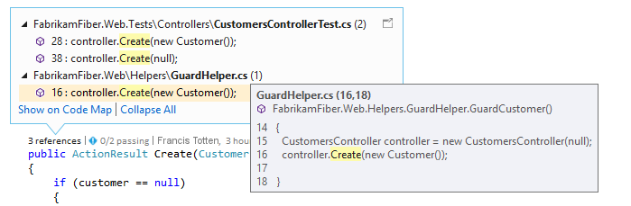  
  
 Contact your team about changes to your code without leaving the editor:  
  
 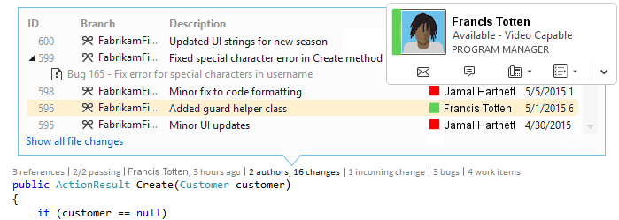  
  
 To choose the indicators that you want to see, or to turn CodeLens off and on, go to **Tools**, **Options**, **Text Editor**, **All Languages**, **CodeLens**.  
  
##   Find references to your code  
 You'll need:  
  
-   Visual Studio Enterprise or Visual Studio Professional  
  
-   Visual C# .NET or Visual Basic .NET code  
  
 Choose the **references** indicator (**Alt + 2**). If you see **0 references**, you have no references from Visual C# or Visual Basic code. This doesn't include references from other items such as XAML and ASPX files.  
  
 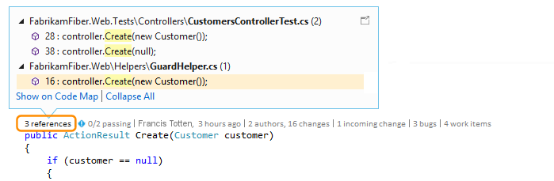  
  
 To view the referencing code, move your mouse on top of the reference.  
  
 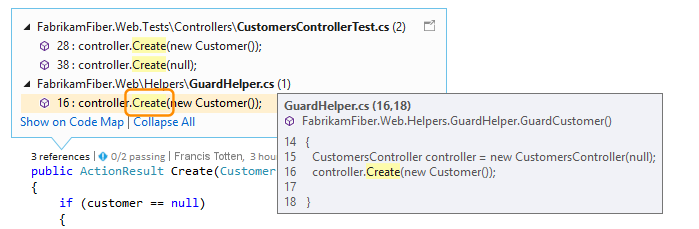  
  
 To open the file containing the reference, double-click the reference.  
  
 To see relationships between this code and its references, [create a code map](../vs140/Map-dependencies-across-your-solutions.md) and choose **Show All References** in the code map shortcut menu.  
  
 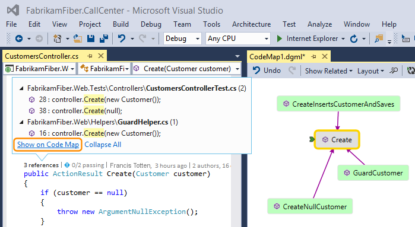  
  
##   Find your code's history and linked items  
 Review your code's history to find out what happened to your code. Or, review changes before they're merged into your code so you can better understand how changes in other branches might affect your code.  
  
 You'll need:  
  
-   Visual Studio Enterprise or Visual Studio Professional  
  
-   Team Foundation Server 2013 or later, Visual Studio Team Services, or Git  
  
-   [Lync 2010 or later, or Skype for Business](http://technet.microsoft.com/en-us/lync), to contact your team from the code editor  
  
 For Visual C# .NET or Visual Basic .NET code that's stored with Team Foundation version control (TFVC) or Git, you get CodeLens details at the class and method levels (*code-element-level* indicators). If your Git repository is hosted in TfGit, you also get links to TFS work items.  
  
 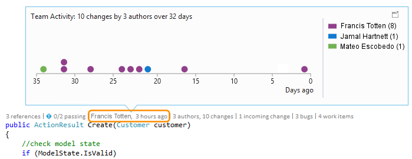  
  
 For all other types of files that you can open in the Visual Studio editor, you get CodeLens details for the entire file in one place at the bottom of the window (*file-level* indicators).  
  
 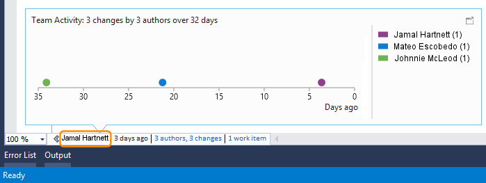  
  
 To use the keyboard to select indicators, press and hold the **ALT** key to display the related number keys.  
  
 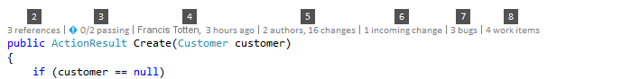  
  
### Find changes in your code  
 Find who changed your C# or Visual Basic code, and the changes they made, in code-element-level indicators. This is what you see when you use Team Foundation version control (TFVC) in Team Foundation Server or Visual Studio Team Services.  
  
 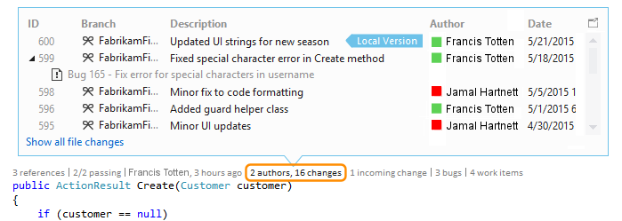  
  
 The default time period is the last 12 months. If your code is stored in Team Foundation Server, you can change this by running the [TFSConfig command](assetId:///94424190-3b6b-4f33-a6b6-5807f4225b62) with the [CodeIndex command](../vs140/CodeIndex-Command.md) and the **/indexHistoryPeriod** flag.  
  
 To see a detailed history of all the changes, including those from more than a year ago, choose **Show all file changes**.  
  
 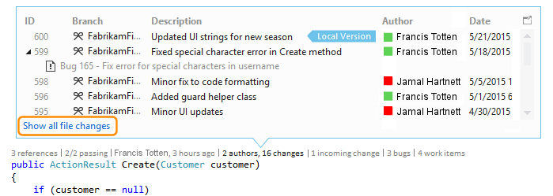  
  
 This opens the History window for the changesets.  
  
 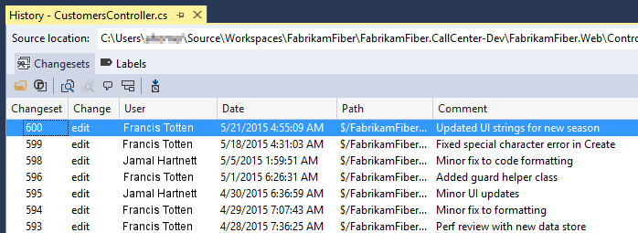  
  
 When your files are in a Git repository and you choose the code-element-level changes indicator, this is what you see.  
  
   
  
 Find changes for an entire file (except for C# and Visual Basic files) in the file-level indicators at the bottom of the window.  
  
 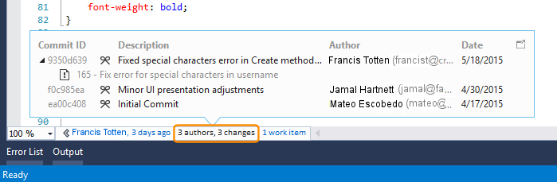  
  
 To get more details about a change, right-click that item. Depending on whether you are using TFVC or Git you get a series of options to compare the versions of the file, view details and track the changeset, get the selected version of the file, and email the author of that change. Some of these details appear in Team Explorer.  
  
 You can also see who changed your code over time. This can help you find patterns in your team's changes and assess their impact.  
  
 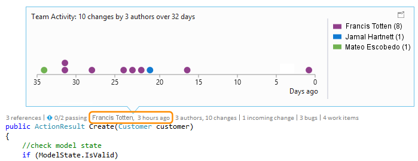  
  
#### Find changes in your current branch  
 Suppose your team has multiple branches - a main branch and a child development - to reduce the risk of breaking stable code:  
  
 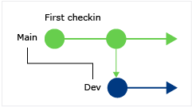  
  
 Find how many people changed your code and how many changes were made (**Alt + 6**) in your main branch:  
  
 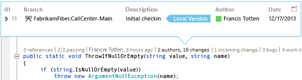  
  
#### Find when your code was branched  
 Go to your code in the child branch, for example, the Dev branch here. Choose the changes indicator (**Alt + 6**):  
  
 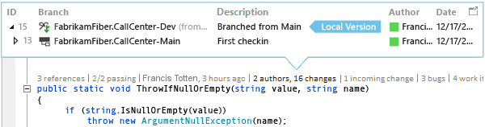  
  
#### Find incoming changes from other branches  
 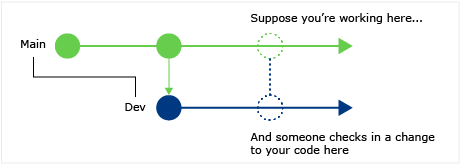  
  
 …like this bug fix in the Dev branch here:  
  
 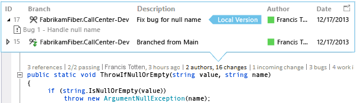  
  
 You can review this change without leaving your current branch (Main):  
  
 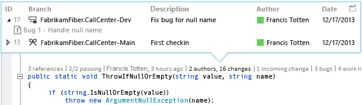  
  
#### Find when changes got merged  
 So you can see which changes are included in your branch:  
  
 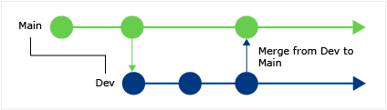  
  
 For example, your code in the Main branch now has the bug fix from the Dev branch:  
  
 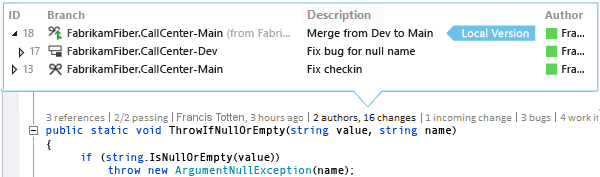  
  
#### Compare an incoming change with your local version (Shift + F10)  
 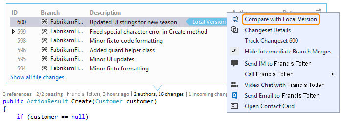  
  
 You can also double-click the changeset.  
  
#### What do the icons mean?  
  
|**Icon**|**Where did the change come from?**|  
|--------------|-----------------------------------------|  
||The current branch|  
||The parent branch|  
||A child branch|  
||A peer branch|  
||A branch further away than a parent, child, or peer|  
||A merge from the parent branch to a child branch|  
||A merge from a child branch to the parent branch|  
||A merge from an unrelated branch (baseless merge)|  
  
### Find linked work items  
 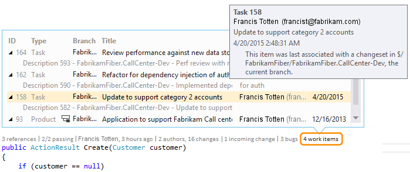  
  
### Find linked code reviews  
 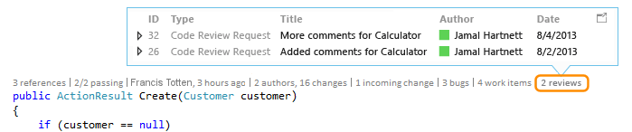  
  
### Find linked bugs  
 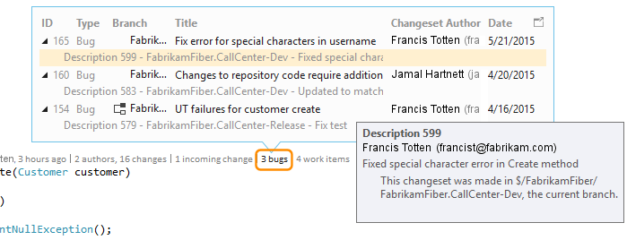  
  
### Contact the owner of an item  
 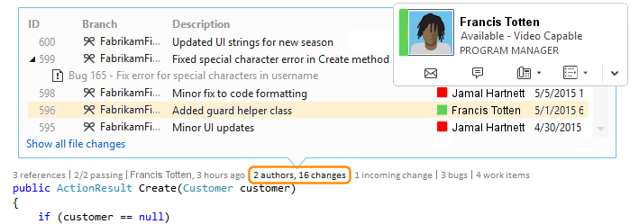  
  
 Open the shortcut menu for an item to see the contact options. If you have Lync or Skype for Business installed, you see these options:  
  
 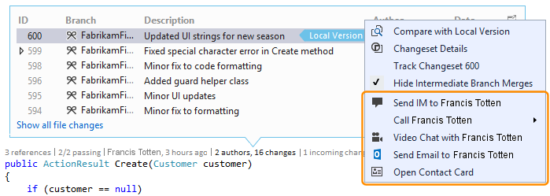  
  
##   Find unit tests for your code  
 Find out more about unit tests that exist for your code without opening Test Explorer. You'll need:  
  
-   Visual Studio Enterprise or Visual Studio Professional  
  
-   Visual C# .NET or Visual Basic .NET code  
  
-   A [unit test project](../Topic/Unit%20Test%20Your%20Code.md) that has unit tests for your application code  
  
1.  Go to application code that has unit tests.  
  
2.  Review the tests for that code (**Alt + 3**).  
  
     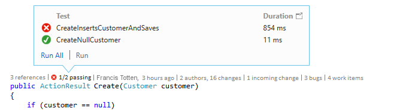  
  
3.  If you see a warning icon , run the tests.  
  
     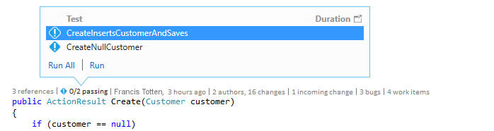  
  
4.  To review a test's definition, double-click the test item in the CodeLens indicator window to open the code file in the editor.  
  
     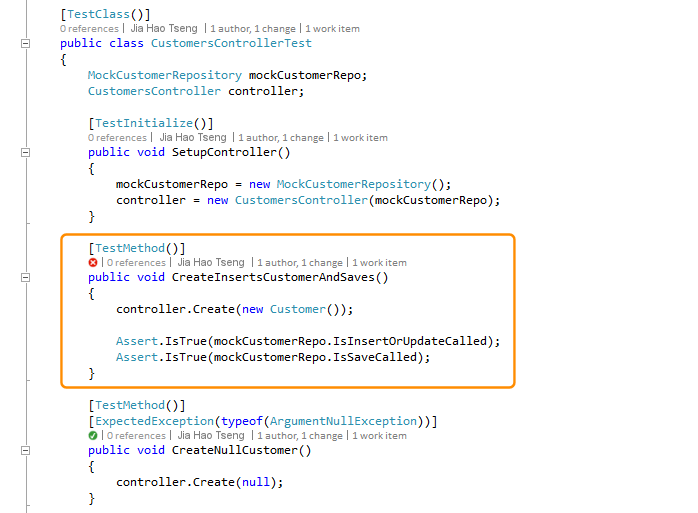  
  
5.  Review the test’s results. Choose the test status indicator ( or ), or press **Alt + 1**.  
  
     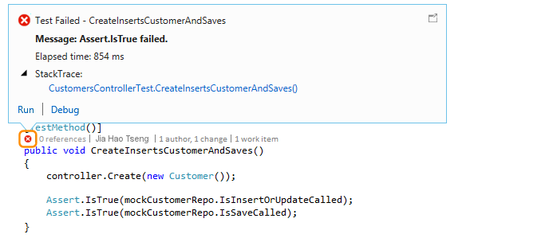  
  
6.  To see how many people changed this test, who changed this test, or how many changes were made to this test, [find the code's history](#FindCodeHistory).  
  
##   Q & A  
  
###   Q: How do I turn CodeLens off or on? Or choose which indicators to see?  
 **A:**  You can turn indicators off or on, except for the references indicator. Go to **Tools**, **Options**, **Text Editor**, **All Languages**, **CodeLens**.  
  
 When the indicators are turned on, you can also open the CodeLens options from the indicators.  
  
 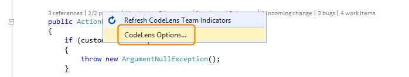  
  
 Turn CodeLens file-level indicators on and off using the chevron icons at the bottom of the editor window.  
  
 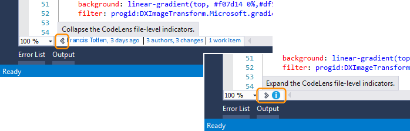  
  
###   Q: Where is CodeLens?  
 **A:** CodeLens appears in Visual C# .NET and Visual Basic .NET code at the method, class, indexer, and property level. CodeLens appears at the file level for all other types of files.  
  
-   Make sure CodeLens is turned on. Go to **Tools**, **Options**, **Text Editor**, **All Languages**, **CodeLens**.  
  
-   If your code is stored in TFS, make sure that code indexing is turned on by using the [CodeIndex command](../vs140/CodeIndex-Command.md) with the [TFS Config command](assetId:///94424190-3b6b-4f33-a6b6-5807f4225b62).  
  
-   TFS-related indicators appear only when work items are linked to the code and when you have permissions to open linked work items. [Confirm that you have team member permissions.](assetId:///f58805de-ba61-4d09-8f2d-d3ab9662ecfd)  
  
-   Unit test indicators don't appear when application code doesn't have unit tests. Test status indicators appear automatically in test projects. If you know that your application code has unit tests, but the test indicators don't appear, try building the solution (**Ctrl + Shift + B**).  
  
### Q: Why don't I see the work item details for a commit?  
 **A:** This might happen because CodeLens can't find the work items in TFS. Check that you're connected to the team project that has those work items and that you have permissions to see those work items. This might also happen if the commit description has incorrect information about the work item IDs in TFS.  
  
###   Q: Why don't I see the Lync or Skype indicators?  
 **A:** They don't appear if you're not signed into Lync or Skype for Business, don't have one of these installed, or don't have a supported configuration. But you can still send mail:  
  
 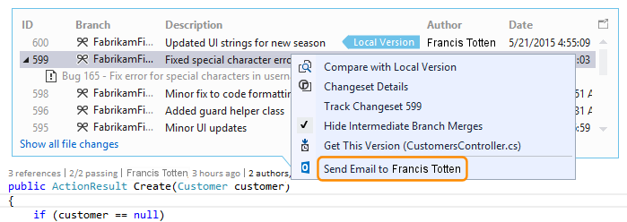  
  
 **Which Lync and Skype configurations are supported?**  
  
-   Skype for Business (32-bit or 64-bit)  
  
-   Lync 2010 or later alone (32-bit or 64-bit), but not Lync Basic 2013 with Windows 8.1  
  
 CodeLens doesn't support having different versions of Lync or Skype installed. They might not be localized for all localized versions of Visual Studio.  
  
### Q: How do I change the font and color for CodeLens?  
 **A:** Go to **Tools**, **Options**, **Environment**, **Fonts and Colors**.  
  
 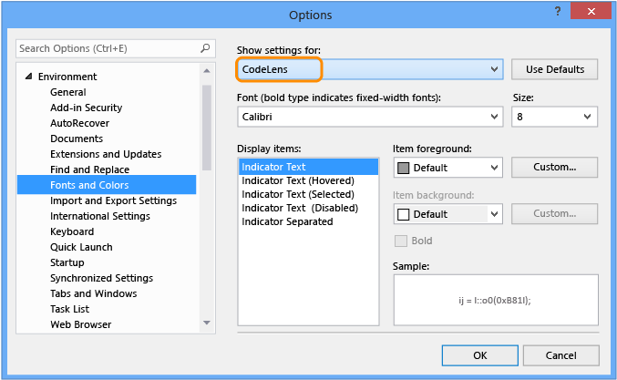  
  
 To use the keyboard:  
  
1.  Press **Alt + T + O** to open the **Options** box.  
  
2.  Press **Up Arrow** or **Down Arrow** to go to the **Environment** node, then press **Left Arrow** to expand the node.  
  
3.  Press **Down Arrow** to go to **Fonts and Colors**.  
  
4.  Press **TAB** to go to the **Show settings for** list, and then press **Down Arrow** to select **CodeLens**.  
  
### Q: Can I move the CodeLens heads-up display?  
 **A:** Yes, choose  to dock CodeLens as a window.  
  
 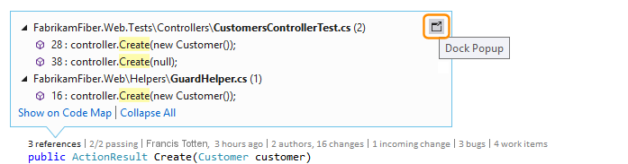  
  
 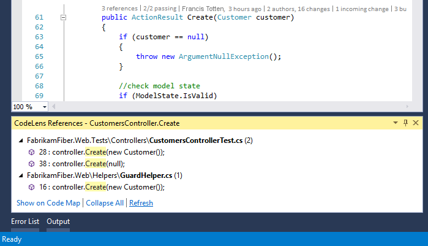  
  
### Q: How do I refresh the indicators?  
 **A:** This depends on the indicator:  
  
-   **References**: This indicator updates automatically when the code changes. If you have this indicator docked as a separate window, refresh the indicator manually here:  
  
     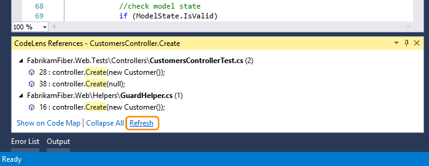  
  
-   **Team**: Refresh these indicators manually here:  
  
     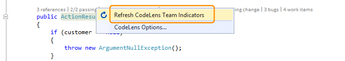  
  
-   **Test**: [Run all the tests or specific tests](#FindRunUnitTests) to refresh this indicator.  
  
###   Q: What's "Local Version"?  
 **A:** The **Local Version** arrow points at the most recent changeset in your local version of this file. When the server has more recent changesets, they appear above or below the **Local Version** arrow, depending on the order used to sort the changesets.  
  
### Q: Can I manage how CodeLens processes code to show history and linked items?  
 **A:** Yes, if your code is in TFS, use the [CodeIndex command](../vs140/CodeIndex-Command.md) with the [TFS Config command](assetId:///94424190-3b6b-4f33-a6b6-5807f4225b62).