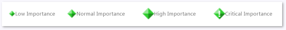
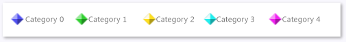
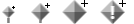

# Flag Markers
A flag marker represents something that occurred at an instant in time in an app. A flag can represent many kinds of application events. For example, a flag could show when a particular work item was scheduled or when an exception was thrown. Runtimes such as the Task Parallel Library can also generate flags.  
  
## Flag Importance  
 Flags are displayed in different sizes depending on their importance. Like any marker, the importance can be low, normal, high, or critical.  This illustration shows the appearance of markers by importance level:  
  
   
Markers showing flag importance  
  
## Flag Category  
 A flag is displayed in one of five different colors depending on its category. The colors are reused if there are more than five categories. You cannot choose the color. Like any marker, the category can be any integer. The next illustration shows the colors for the first five categories.  
  
   
Markers showing categories  
  
## Alerts  
 An alert is a red-colored flag that represents a critical application event, such as an exception.  Here's an alert:  
  
   
An alert marker  
  
## Aggregation Flags  
 Sometimes flags occur so close to one another in the Concurrency Visualizer that they can’t be drawn individually. When this occurs, a gray *aggregation flag* that represents the underlying flags is shown. When you rest the pointer on one of these icons, a tooltip displays the number of underlying flags that are represented. To view the flags, zoom in. If you zoom in all the way and still get an aggregation flag, you can view the underlying flags in the [Markers Report](../vs140/Markers-Report.md).  
  
 Aggregation flags are drawn in different sizes. The size depends on the importance level of the most important flag in the aggregation. The following illustration shows aggregation flags in increasing order of importance.  
  
   
Aggregation flags by level of importance  
  
## See Also  
 [Concurrency Visualizer Markers](../vs140/Concurrency-Visualizer-Markers.md)   
 [Concurrency Visualizer SDK](../Topic/Concurrency%20Visualizer%20SDK.md)