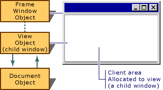

# Frame Windows
When an application runs under Windows, the user interacts with documents displayed in frame windows. A document frame window has two major components: the frame and the contents that it frames. A document frame window can be a [single document interface](../vs140/SDI-and-MDI.md) (SDI) frame window or a [multiple document interface](../vs140/SDI-and-MDI.md) (MDI) child window. Windows manages most of the user's interaction with the frame window: moving and resizing the window, closing it, and minimizing and maximizing it. You manage the contents inside the frame.  
  
## Frame Windows and Views  
 The MFC framework uses frame windows to contain views. The two components — frame and contents — are represented and managed by two different classes in MFC. A frame-window class manages the frame, and a view class manages the contents. The view window is a child of the frame window. Drawing and other user interaction with the document take place in the view's client area, not the frame window's client area. The frame window provides a visible frame around a view, complete with a caption bar and standard window controls such as a control menu, buttons to minimize and maximize the window, and controls for resizing the window. The "contents" consist of the window's client area, which is fully occupied by a child window — the view. The following figure shows the relationship between a frame window and a view.  
  
   
Frame Window and View  
  
## Frame Windows and Splitter Windows  
 Another common arrangement is for the frame window to frame multiple views, usually using a [splitter window](../vs140/Multiple-Document-Types--Views--and-Frame-Windows.md). In a splitter window, the frame window's client area is occupied by a splitter window, which in turn has multiple child windows, called panes, which are views.  
  
### What do you want to know more about?  
 **General Frame Window Topics**  
  
-   [Window objects](../vs140/Window-Objects.md)  
  
-   [Frame window classes](../vs140/Frame-Window-Classes.md)  
  
-   [The Frame-Window classes created by the Application Wizard](../vs140/Frame-Window-Classes-Created-by-the-Application-Wizard.md)  
  
-   [Frame window styles](../vs140/Frame-Window-Styles--C---.md)  
  
-   [What frame windows do](../vs140/What-Frame-Windows-Do.md)  
  
 **Topics on Using Frame Windows**  
  
-   [Using frame windows](../vs140/Using-Frame-Windows.md)  
  
-   [Creating document frame windows](../vs140/Creating-Document-Frame-Windows.md)  
  
-   [Destroying frame windows](../vs140/Destroying-Frame-Windows.md)  
  
-   [Managing MDI child windows](../vs140/Managing-MDI-Child-Windows.md)  
  
-   [Managing the current view](../vs140/Managing-the-Current-View.md) in a frame window that contains more than one view  
  
-   [Managing menus, control bars, and accelerators (other objects that share the frame window's space)](../vs140/Managing-Menus--Control-Bars--and-Accelerators.md)  
  
 **Topics on Special Frame Window Capabilities**  
  
-   [Dragging and dropping files](../vs140/Dragging-and-Dropping-Files-in-a-Frame-Window.md) from File Explorer or File Manager into a frame window  
  
-   [Responding to dynamic data exchange (DDE)](../vs140/Responding-to-Dynamic-Data-Exchange--DDE-.md)  
  
-   [Semimodal states: Context-sensitive Windows Help (Orchestrating other window actions)](../vs140/Orchestrating-Other-Window-Actions.md)  
  
-   [Semimodal states: printing and print preview (Orchestrating other window actions)](../vs140/Orchestrating-Other-Window-Actions.md)  
  
 **Topics on Other Kinds of Windows**  
  
-   [Using Views](../vs140/Using-Views.md)  
  
-   [Dialog boxes](../vs140/Dialog-Boxes.md)  
  
-   [Controls](../vs140/Controls--MFC-.md)  
  
## See Also  
 [Windows](../vs140/Windows.md)