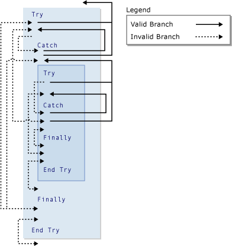

# GoTo Statement
Branches unconditionally to a specified line in a procedure.  
  
## Syntax  
  
```  
GoTo line  
```  
  
## Part  
 `line`  
 Required. Any line label.  
  
## Remarks  
 The `GoTo` statement can branch only to lines in the procedure in which it appears. The line must have a line label that `GoTo` can refer to. For more information, see [How to: Label Statements](../vs140/How-to--Label-Statements--Visual-Basic-.md).  
  
> [!NOTE]
>  `GoTo` statements can make code difficult to read and maintain. Whenever possible, use a control structure instead. For more information, see [Control Flow in Visual Basic](../vs140/Control-Flow-in-Visual-Basic.md).  
  
 You cannot use a `GoTo` statement to branch from outside a `For`...`Next`, `For Each`...`Next`, `SyncLock`...`End SyncLock`, `Try`...`Catch`...`Finally`, `With`...`End With`, or `Using`...`End Using` construction to a label inside.  
  
## Branching and Try Constructions  
 Within a `Try`...`Catch`...`Finally` construction, the following rules apply to branching with the `GoTo` statement.  
  
|Block or region|Branching in from outside|Branching out from inside|  
|---------------------|-------------------------------|-------------------------------|  
|`Try` block|Only from a `Catch` block of the same construction <sup>1</sup>|Only to outside the whole construction|  
|`Catch` block|Never allowed|Only to outside the whole construction, or to the `Try` block of the same construction <sup>1</sup>|  
|`Finally` block|Never allowed|Never allowed|  
  
 <sup>1</sup> If one `Try`...`Catch`...`Finally` construction is nested within another, a `Catch` block can branch into the `Try` block at its own nesting level, but not into any other `Try` block. A nested `Try`...`Catch`...`Finally` construction must be contained completely in a `Try` or `Catch` block of the construction within which it is nested.  
  
 The following illustration shows one `Try` construction nested within another. Various branches among the blocks of the two constructions are indicated as valid or invalid.  
  
   
Valid and invalid branches in Try constructions  
  
## Example  
 The following example uses the `GoTo` statement to branch to line labels in a procedure.  
  
 [!CODE [VbVbalrStatements#31](../CodeSnippet/VS_Snippets_VBCSharp/VbVbalrStatements#31)]  
  
## See Also  
 [Do...Loop Statement](../vs140/Do...Loop-Statement--Visual-Basic-.md)   
 [For...Next Statement](../Topic/For...Next%20Statement%20\(Visual%20Basic\).md)   
 [For Each...Next Statement (Visual Basic)](../Topic/For%20Each...Next%20Statement%20\(Visual%20Basic\).md)   
 [If...Then...Else Statement](../Topic/If...Then...Else%20Statement%20\(Visual%20Basic\).md)   
 [Select...Case Statement](../Topic/Select...Case%20Statement%20\(Visual%20Basic\).md)   
 [Try...Catch...Finally Statement](../vs140/Try...Catch...Finally-Statement--Visual-Basic-.md)   
 [While...End While Statement (Visual Basic)](../Topic/While...End%20While%20Statement%20\(Visual%20Basic\).md)   
 [With...End With Statement (Visual Basic)](../Topic/With...End%20With%20Statement%20\(Visual%20Basic\).md)