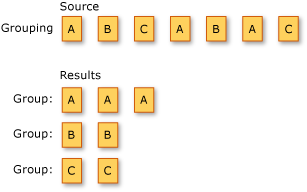

# Grouping Data (Visual Basic)
Grouping refers to the operation of putting data into groups so that the elements in each group share a common attribute.  
  
 The following illustration shows the results of grouping a sequence of characters. The key for each group is the character.  
  
   
  
 The standard query operator methods that group data elements are listed in the following section.  
  
## Methods  
  
|Method Name|Description|Visual Basic Query Expression Syntax|More Information|  
|-----------------|-----------------|------------------------------------------|----------------------|  
|GroupBy|Groups elements that share a common attribute. Each group is represented by an <xref:System.Linq.IGrouping`2?qualifyHint=False> object.|`Group … By … Into …`|<xref:System.Linq.Enumerable.GroupBy``2?qualifyHint=True><br /><br /> <xref:System.Linq.Queryable.GroupBy``2?qualifyHint=True>|  
|ToLookup|Inserts elements into a <xref:System.Linq.Lookup`2?qualifyHint=False> (a one-to-many dictionary) based on a key selector function.|Not applicable.|<xref:System.Linq.Enumerable.ToLookup``2?qualifyHint=True>|  
  
## Query Expression Syntax Example  
 The following code example uses the `Group By` clause to group integers in a list according to whether they are even or odd.  
  
```vb  
Dim numbers As New System.Collections.Generic.List(Of Integer)(  
     New Integer() {35, 44, 200, 84, 3987, 4, 199, 329, 446, 208})  
  
Dim query = From number In numbers   
            Group By Remainder = (number Mod 2) Into Group  
  
Dim sb As New System.Text.StringBuilder()  
For Each group In query  
    sb.AppendLine(If(group.Remainder = 0, vbCrLf & "Even numbers:", vbCrLf & "Odd numbers:"))  
    For Each num In group.Group  
        sb.AppendLine(num)  
    Next  
Next  
  
' Display the results.  
MsgBox(sb.ToString())  
  
' This code produces the following output:  
  
' Odd numbers:  
' 35  
' 3987  
' 199  
' 329  
  
' Even numbers:  
' 44  
' 200  
' 84  
' 4  
' 446  
' 208  
```  
  
## See Also  
 <xref:System.Linq?qualifyHint=False>   
 [Standard Query Operators Overview (Visual Basic)](../Topic/Standard%20Query%20Operators%20Overview%20\(Visual%20Basic\).md)   
 [Group By Clause (Visual Basic)](../vs140/Group-By-Clause--Visual-Basic-.md)   
 [How to: Group Files by Extension (LINQ) (Visual Basic)](../Topic/How%20to:%20Group%20Files%20by%20Extension%20\(LINQ\)%20\(Visual%20Basic\).md)   
 [How to: Split a File Into Many Files by Using Groups (LINQ) (Visual Basic)](../vs140/How-to--Split-a-File-Into-Many-Files-by-Using-Groups--LINQ---Visual-Basic-.md)