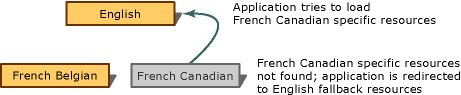
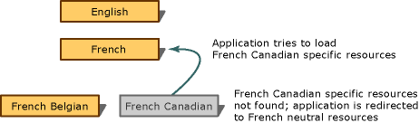

# Hierarchical Organization of Resources for Localization
In Visual Studio, localized resources (data such as strings and images appropriate to each culture) are stored in separate files and loaded according to the UI culture setting. To understand how localized resources are loaded, it is useful to think of them as organized in a hierarchical manner.  
  
## Kinds of Resources in the Hierarchy  
  
-   At the top of the hierarchy sit the fallback resources for your default culture, for example English ("en"). These are the only resources that do not have their own file; they are stored in the main assembly.  
  
-   Below the fallback resources are the resources for any neutral cultures. A neutral culture is associated with a language but not a country/region. For example, French ("fr") is a neutral culture. (Note that the fallback resources are also for a neutral culture, but a special one.)  
  
-   Below those are the resources for any specific cultures. A specific culture is associated with a language and a country/region. For example, French Canadian ("fr-CA") is a specific culture.  
  
 If an application tries to load any localized resource, such as a string, and does not find it, it will travel up the hierarchy until it finds a resource file containing the requested resource.  
  
 The best way to store your resources is to generalize them as much as possible. That means to store localized strings, images, and so forth in resource files for neutral cultures rather than specific cultures whenever possible. For instance, if you have resources for the French Belgian ("fr-BE") culture and the resources immediately above are the fallback resources in English, a problem may result when someone uses your application on a system configured for the French Canadian culture. The system will look for a satellite assembly for "fr-CA", not find it, and load the main assembly containing the fallback resource, which is English, instead of loading the French resources. The following picture shows this undesirable scenario.  
  
   
  
 If you follow the recommended practice of placing as many resources as possible in a neutral resource file for the "fr" culture, the French Canadian user would not see resources marked for the "fr-BE" culture, but he or she would be shown strings in French. The following situation shows this preferred scenario.  
  
   
  
## See Also  
 [Neutral Resources Languages for Localization](../vs140/Neutral-Resources-Languages-for-Localization.md)   
 [Security and Localized Satellite Assemblies](../vs140/Security-and-Localized-Satellite-Assemblies.md)   
 [Localizing Applications](../vs140/Localizing-Applications.md)   
 [Globalizing and Localizing Applications](../Topic/Globalizing%20and%20Localizing%20Applications.md)   
 [How to: Set the Culture and UI Culture for Windows Forms Globalization](assetId:///694e049f-0b91-474a-9789-d35124f248f0)   
 [How to: Set the Culture and UI Culture for ASP.NET Web Page Globalization](assetId:///76091f86-f967-4687-a40f-de87bd8cc9a0)