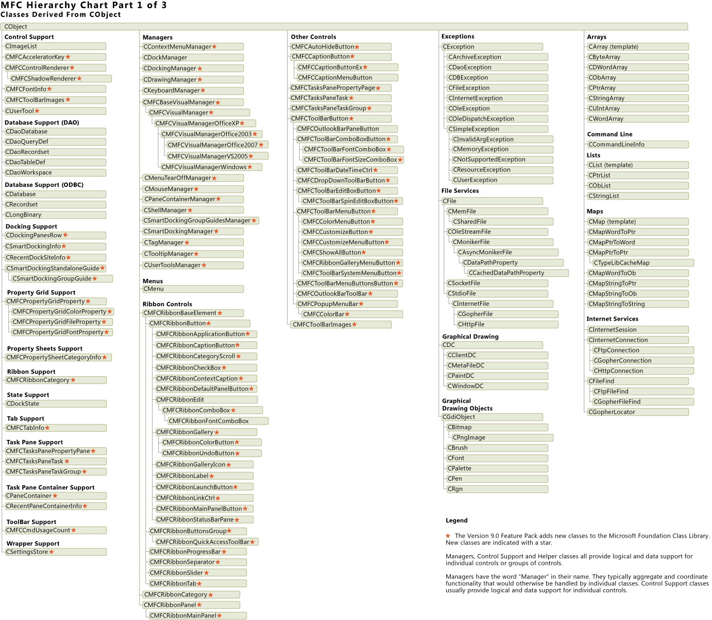
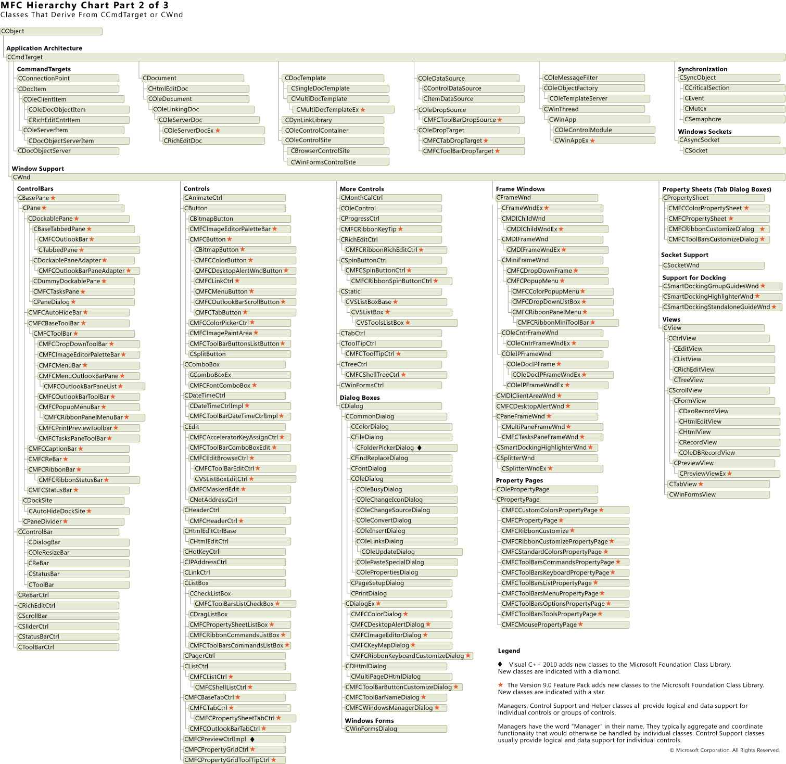
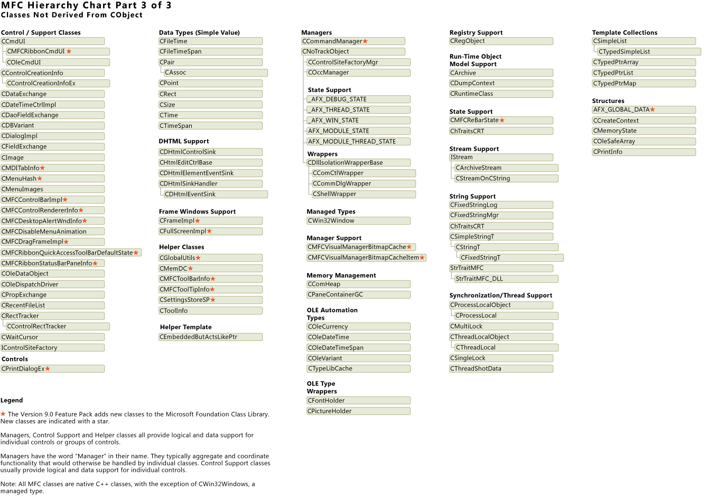

# Hierarchy Chart
The following illustration represents the MFC classes derived from `CObject`:  
  
   
  
 The following illustration represents the MFC classes derived from `CWnd` and `CCmdTarget`:  
  
   
  
 The following illustration represents the MFC classes not derived from `CObject`:  
  
   
  
 You can download the complete chart from the following location: [http://go.microsoft.com/fwlink/?LinkId=112301](http://go.microsoft.com/fwlink/?LinkId=112301).  
  
## See Also  
 [Hierarchy Chart Categories](../vs140/Hierarchy-Chart-Categories.md)   
 [Class Library Overview](../vs140/Class-Library-Overview.md)