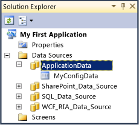

# How to: Add a Table to the LightSwitch Internal Database
You can add tables to the [!INCLUDE[smb_current_short](../vs140/includes/smb_current_short_md.md)] internal database. Conversely, you cannot add tables or other abstractions to external data sources such as a SQL Server database, SharePoint list, or WCF RIA Service by using [!INCLUDE[smb_current_short](../vs140/includes/smb_current_short_md.md)]. For those data sources, [!INCLUDE[smb_current_short](../vs140/includes/smb_current_short_md.md)] generates entities that match the structure of the data source.  
  
 For more information, see [Data and Entities: The Information Behind your Application](../vs140/Data--The-Information-Behind-Your-Application.md).  
  
  For a related video demonstration, see [How Do I: Define My Data in a LightSwitch Application?](http://go.microsoft.com/fwlink/?LinkID=205102).  
  
### To add a table to the LightSwitch Internal Database  
  
1.  In **Solution Explorer**, click the **Data Sources** node.  
  
2.  On the **Project** menu, click **Add Table**.  
  
     A new table is opened in the data designer.  
  
     In **Solution Explorer**, [!INCLUDE[smb_current_short](../vs140/includes/smb_current_short_md.md)] creates a node that represents the [!INCLUDE[smb_current_short](../vs140/includes/smb_current_short_md.md)] internal database. By default, the name of the node is **ApplicationData**. The following illustration shows the **ApplicationData** node in **Solution Explorer**.  
  
       
  
3.  In the **Data Designer**, at the top of the new table, double-click the name of the table, and then type a new name.  
  
4.  Define the fields of the table. For more information, [How to: Define the Fields of an Entity](../vs140/How-to--Define-Data-Fields-in-a-LightSwitch-Database.md).  
  
## See Also  
 [Data and Entities: The Information Behind Your Application](../vs140/Data--The-Information-Behind-Your-Application.md)   
 [How to: Define the Fields of an Entity](../vs140/How-to--Define-Data-Fields-in-a-LightSwitch-Database.md)   
 [How to: Connect to Data](../vs140/How-to--Connect-to-Data.md)   
 [How to: Add a Computed Field](../vs140/How-to--Add-a-Computed-Field-in-a-LightSwitch-Database.md)   
 [How to: Create a Choice List for an Entity Field](../vs140/How-to--Create-a-List-of-Values-for-a-Field-in-a-LightSwitch-Application.md)   
 [How to: Define Data Relationships in LightSwitch](../vs140/How-to--Define-Data-Relationships-in-LightSwitch.md)   
 [How to: Validate Entities](../vs140/How-to--Validate-Data-in-a-LightSwitch-Application.md)