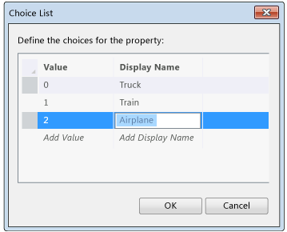

# How to: Create a List of Values for a Field in a LightSwitch Application
When you develop an application in Visual Studio LightSwitch, you can create a choice list so that users can choose a value from a specific set instead of entering a value into a text box.  
  
##   To create a choice list for a field  
  
1.  In **Solution Explorer**, open the shortcut menu for an entity or table, and then choose **Open**.  
  
     The entity or table opens in the **Data Designer**.  
  
    > [!NOTE]
    >  For applications that have been upgraded to [!INCLUDE[vs2012_upd02](../vs140/includes/vs2012_upd02_md.md)], on the **Perspective** bar, choose the **Server** tab.  
  
2.  In the **Data Designer**, choose a field (for example, **PostalCode**).  
  
3.  In the **Properties** window, choose the **Choice List** link.  
  
     The **Choice List** dialog box appears.  
  
4.  In the choice-list table, choose **Add Value**, and then enter any value (for example, **98052**).  
  
5.  In the same row, choose **Display Name**, and then enter the name that you want to appear for this item in the list.  
  
6.  To add more values to the list, repeat the previous two steps.  
  
     The following illustration shows values in the **Choice List** dialog box.  
  
       
  
7.  Choose the **OK** button to close the **Choice List** dialog box.  
  
##   To remove a choice list from a field  
  
1.  In **Solution Explorer**, open the shortcut menu for an entity or table, and then choose **Open**.  
  
     The entity or table opens in the **Data Designer**.  
  
    > [!NOTE]
    >  For applications that have been upgraded to [!INCLUDE[vs2012_upd02](../vs140/includes/vs2012_upd02_md.md)], on the **Perspective** bar, choose the **Server** tab.  
  
2.  In the **Data Designer**, choose the field that uses a choice list.  
  
3.  In the **Properties** window, choose the **X** that appears next to the **Choice List** link.  
  
## See Also  
 [Data and Entities: The Information Behind Your Application](../vs140/Data--The-Information-Behind-Your-Application.md)   
 [How to: Add a Computed Field](../vs140/How-to--Add-a-Computed-Field-in-a-LightSwitch-Database.md)   
 [How to: Define the Fields of an Entity](../vs140/How-to--Define-Data-Fields-in-a-LightSwitch-Database.md)