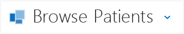

# How to: Create a Navigation Menu in a LightSwitch HTML Client App
In addition to the standard navigation in a LightSwitch HTML Client app, you can provide a navigation menu that allows users to jump directly to another screen. At run time the menu can be accessed by choosing the downward arrow that is added to the title bar.  
  
   
  
> [!NOTE]
>  If you create a **Common Screen Set**, the navigation menu is automatically created for you. See [Choosing a Screen Type for an HTML Client of a LightSwitch App](../vs140/Choosing-a-Screen-Type-for-an-HTML-Client-of-a-LightSwitch-App.md).  
  
### To create a navigation menu  
  
1.  In **Solution Explorer**, open the shortcut menu for the **HTMLClient** project node and choose **Edit Screen Navigation**.  
  
2.  In the **Navigation menu structure** list, open the **Include Screen** list, and then choose the screen that you wish to add.  
  
    > [!NOTE]
    >  Screens that require a parameter don’t appear in the list and can’t be added to the navigation menu.  
  
3.  To change the order of menu items, choose the **Move up** or **Move down** button in the right margin.  
  
## See Also  
 [How to: Control Navigation between HTML Screens in a LightSwitch App](../vs140/How-to--Control-Navigation-between-HTML-Screens-in-a-LightSwitch-App.md)   
 [HTML Client Screens for LightSwitch Apps](../vs140/HTML-Client-Screens-for-LightSwitch-Apps.md)