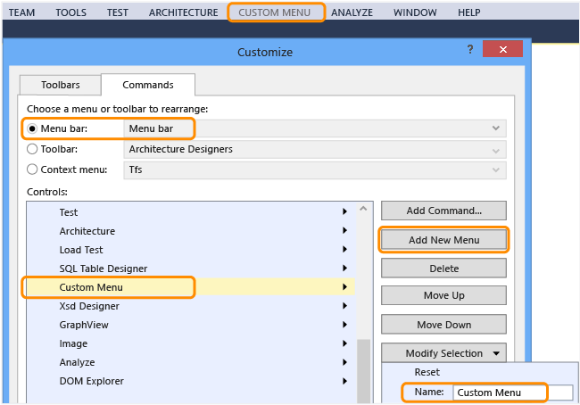
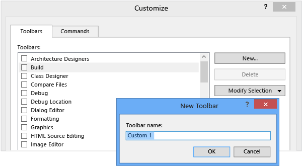
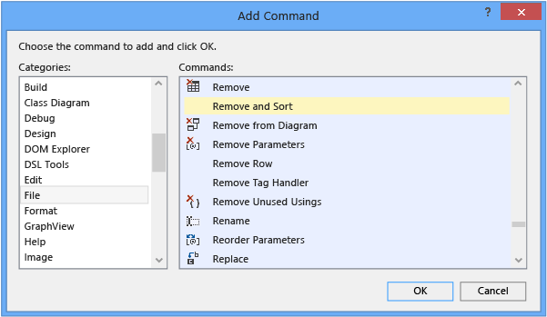

# How to: Customize Menus and Toolbars in Visual Studio
You can customize Visual Studio not only by adding and removing toolbars and menus on the menu bar but also by adding and removing commands on any given toolbar or menu.  
  
> [!WARNING]
>  After you customize a toolbar or menu, make sure that its check box remains selected in the **Customize** dialog box. Otherwise, your changes won't persist after you close and reopen Visual Studio.  
  
 **In this topic:**  
  
-   [Adding, removing, or moving a menu on the menu bar](../vs140/How-to--Customize-Menus-and-Toolbars-in-Visual-Studio.md#bkmk_addmenu)  
  
-   [Adding, removing, or moving a toolbar](../vs140/How-to--Customize-Menus-and-Toolbars-in-Visual-Studio.md#bkmk_addtoolbar)  
  
-   [Customizing a menu or a toolbar](../vs140/How-to--Customize-Menus-and-Toolbars-in-Visual-Studio.md#bkmk_customize)  
  
-   [Resetting a menu or a toolbar](../vs140/How-to--Customize-Menus-and-Toolbars-in-Visual-Studio.md#bkmk_reset)  
  
##   Adding, removing, or moving a menu on the menu bar  
  
1.  On the menu bar, choose **Tools**, **Customize**.  
  
     The **Customize** dialog box opens.  
  
2.  On the **Commands** tab, leave the **Menu bar** option button selected, leave **Menu Bar** selected in the list next to that option, and then perform one of the following sets of steps:  
  
    -   To add a menu, choose the **Add New Menu** button, choose the **Modify Selection** button, and then name the menu that you want to add.  
  
           
  
    -   To remove a menu, choose it in the **Controls** list, and then choose the **Delete** button.  
  
    -   To move a menu within the menu bar, choose the menu in the **Controls** list, and then choose the **Move Up** or **Move Down** button.  
  
##   Adding, removing, or moving a toolbar  
  
1.  On the menu bar, choose **Tools**, **Customize**.  
  
     The **Customize** dialog box opens.  
  
2.  On the **Toolbar** tab, perform one of the following sets of steps:  
  
    -   To add a toolbar, choose the **New** button, specify a name for the toolbar that you want to add, and then choose the **OK** button.  
  
           
  
    -   To remove a custom toolbar, choose it in the **Toolbars** list, and then choose the **Delete** button.  
  
        > [!IMPORTANT]
        >  You can delete toolbars that you create but not default toolbars.  
  
    -   To move a toolbar to a different docking location, choose it in the **Toolbars** list, choose the **Modify Selection** button, and then choose a location in the list that appears.  
  
         You can also drag a toolbar by its left edge to move it anywhere in the main docking area.  
  
        > [!NOTE]
        >  For more information about how to improve the usability and accessibility of toolbars, see [How to: Set Accessibility Options](../vs140/How-to--Set-IDE-Accessibility-Options.md).  
  
##   Customizing a menu or a toolbar  
  
1.  On the menu bar, choose **Tools**, **Customize**.  
  
     The **Customize** dialog box opens.  
  
2.  On the **Commands** tab, choose the option button for the type of element that you want to customize.  
  
3.  In the list for that type of element, choose the menu or toolbar that you want to customize, and then perform one of the following sets of steps:  
  
    -   To add a command, choose the **Add Command** button.  
  
         In the **Add Command** dialog box, choose an item in the **Categories** list, choose an item in the **Commands** list, and then choose the **OK** button.  
  
           
  
    -   To delete a command, choose it in the **Controls** list, and then choose the **Delete** button.  
  
    -   To reorder commands, choose a command in the **Controls** list, and then choose the **Move Up** or **Move Down** button.  
  
    -   To separate commands into groups, choose a command in the **Controls** list, choose the **Modify Selection** button, and then choose **Begin a Group** in the menu that appears.  
  
##   Resetting a menu or a toolbar  
  
1.  On the menu bar, choose **Tools**, **Customize**.  
  
     The **Customize** dialog box opens.  
  
2.  On the **Commands** tab, choose the option button for the type of element that you want to reset.  
  
3.  In the list for that type of element, choose the menu or toolbar that you want to reset.  
  
4.  Choose the **Modify Selection** button, and then choose **Reset** in the menu that appears.  
  
     You can also reset all menus and toolbars by choosing the **Reset All** button.