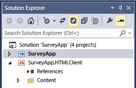

# How to: Host a LightSwitch HTML Client Application on Sharepoint
By using LightSwitch, you can create SharePoint apps that are hosted in the SharePoint Store or in your organization's private app catalog. By enabling SharePoint debugging, you can also host your app on SharePoint to test it during development.  
  
 You can publish your app as a provider-hosted SharePoint app. This gives you the flexibility of deploying your web app and database to an on-premises SharePoint site, to Microsoft Azure, or to a third-party hosting site. After you publish your app, others can run it from SharePoint on their computers and mobile devices.  
  
 You can publish your app directly to a site by using Web Deploy, or you can create a Web Deploy package for your app that can be deployed to multiple servers.  
  
### To enable SharePoint debugging  
  
1.  Create an app by using either the **LightSwitch HTML Application (Visual Basic)** or **LightSwitch HTML Application (Visual C#)** template.  
  
2.  In **Solution Explorer**, choose the top-level node for your app.  
  
       
  
3.  On the menu bar, choose **Project**, **Enable SharePoint**.  
  
     The **Enabling SharePoint** wizard opens.  
  
4.  In the **What SharePoint site do you want to use for debugging your app?** box, enter the URL for your SharePoint site, and then choose the **Finish** button.  
  
     If you’re prompted for credentials, enter your SharePoint credentials.  
  
     The next time you run your app, it will be hosted on SharePoint instead of in your browser.  
  
### To publish a SharePoint app  
  
1.  In **Solution Explorer**, open the shortcut menu for the top-level node for your app, and then choose **Publish**.  
  
       
  
2.  In the LightSwitch Publish Application Wizard, on the **SharePoint Options** page, choose the **Provider-hosted** option, and then choose **Next**.  
  
3.  On the **Application Server Configuration** page, choose the **IIS Server** option, and then choose **Next**.  
  
    > [!NOTE]
    >  If you have a publish settings (.publishsettings or .pubxml) file that was created for another app, you can use that file to provide the rest of the information that you need for publishing. If so, choose the **Import Settings** button in the wizard.  
  
4.  On the **Publish Output** page, choose the **Publish directly to a server now** option, and then choose **Next**.  
  
5.  On the **Publish Settings** page, in the **Service URL** text box, enter the URL for the server where you want to publish your app.  
  
     If you’re publishing to a hosting company, the company provides this value. It can be in any of the following formats:  
  
    -   *HostingCompanyURL* (for example, `contoso.com`)  
  
    -   `https://` *HostingCompanyURL* (for example, `https://contoso.com`)  
  
    -   `https://` *HostingCompanyURL* `:8172/msdeploy.axd` (for example, `https://contoso.com:8172/msdeploy.axd`)  
  
     If you’re publishing to Internet Information Services (IIS) on your own computer for testing, enter `localhost` or the name of your computer.  
  
     If you’re publishing to a server on your own network, enter one of these URLs:  
  
    -   `http://` *ServerName*  
  
    -   `http://` *ServerName* `/msdeployagentservice`  
  
    > [!NOTE]
    >  If you’re publishing through a firewall, you might have to open port 8172.  
  
6.  In the **Site/application** box, enter the names of the IIS website and your app.  
  
     If you’re publishing to a hosting company, the company provides this value. It's typically either a domain name (for example, `contoso.com`) or a domain and app name (for example, `contoso.com/MyApp`).  
  
     If you’re publishing to IIS on your own computer for testing, or you're publishing to a server on your internal network, enter the site and app name as they appear in IIS Manager. For example, if you’re publishing the app MyApp to the default website in IIS, enter `Default Web Site/MyApp`.  
  
    > [!NOTE]
    >  If you're publishing to an existing web folder and want to remove any existing content, select the **Remove additional files at destination** check box.  
  
7.  In the **User Name** and **Password** boxes, enter credentials for an account that has sufficient authority to perform deployment tasks on the destination web server, and then choose **Next**.  
  
     If you’re publishing to a hosting company, the company provides these values.  
  
8.  On the **Security Settings** page, choose the **Yes, users must connect using HTTPS** option, and then choose **Next**.  
  
9. On the **Data connections** page, on the **Database Connections** tab, enter the administrator and user connection strings for the database server where you want to publish your app's database.  
  
    > [!NOTE]
    >  The database doesn’t have to be located on the server where you are publishing the app.  
  
10. On the **Attached Data Sources** tab, update the connection strings for any additional connections as needed, and then choose **Next**.  
  
11. On the **Provider Hosting** page, in the **Where is your LightSwitch application hosted** box, enter the full URL for your app.  
  
     In most cases this URL will be the same as the **Service URL** and **Site/application** values that you entered earlier (for example, `https://contoso.com/MyApp`).  
  
12. Enter the **Client ID** and **Client Secret** values for your app.  
  
     You can get these values from the **appregnew** page of your SharePoint site or from the Seller dashboard. See [Guidelines for registering apps for SharePoint 2013](http://msdn.microsoft.com/library/office/jj687469\(v=office.15\).aspx).  
  
13. Choose **Publish** to publish your app.  
  
     When your app is published, **File Explorer** opens and displays the **Publish** directory for your project.  
  
### To package a SharePoint app for later deployment  
  
1.  In **Solution Explorer**, open the shortcut menu for the top-level node for your app, and then choose **Publish**.  
  
       
  
2.  In the LightSwitch Publish Application Wizard, on the **SharePoint Options** page, choose the **Provider-hosted** option, and then choose **Next**.  
  
3.  On the **Application Server Configuration** page, choose the **IIS Server** option, and then choose **Next**.  
  
    > [!NOTE]
    >  If you have a publish settings (.publishsettings or .pubxml) file that was created for another app, you can use that file to provide the rest of the information that you need for publishing. If so, choose the **Import Settings** button in the wizard.  
  
4.  On the **Publish Output** page, choose the **Create a package on disk** option, and then choose **Next**.  
  
5.  On the **Publish Settings** page, in the **What should the website be named?** box, enter a name for the website.  
  
     The default name is the app name.  
  
6.  In the **Where should the package be created?** box, enter the path for the location where you want to save the package, and then choose **Next**.  
  
     The default location is the Publish subdirectory under your project directory.  
  
7.  On the **Security Settings** page, choose the **Yes, users must connect using HTTPS** option, and then choose **Next**.  
  
8.  On the **Database Configuration** page, choose the **Generate a new database called** option and enter your app's name as the database name.  
  
9. On the **Attached Data Sources** tab, update the connection strings for any additional connections as needed, and then choose **Next**.  
  
10. On the **Provider Hosting** page, in the **Where is your LightSwitch application hosted** box, enter the full URL for your app.  
  
     In most cases, this URL will be the same as the **Service URL** and **Site/application** values that you entered earlier (for example, `https://contoso.com/MyApp`).  
  
11. Enter the **Client ID** and **Client Secret** for your app.  
  
     You can get these values from the **appregnew** page of your SharePoint site or from the Seller dashboard. See [Guidelines for registering apps for SharePoint 2013](http://msdn.microsoft.com/library/office/jj687469\(v=office.15\).aspx).  
  
12. Choose **Publish** to create the package.  
  
     When your app is published, a .zip file that contains the package is placed in the directory that you specified in step 6. After this package has been created, a server administrator can use the MSDeploy tool to deploy your app to servers that are running IIS and SQL Server.  
  
## See Also  
 [HTML Client Screens](../vs140/HTML-Client-Screens-for-LightSwitch-Apps.md)