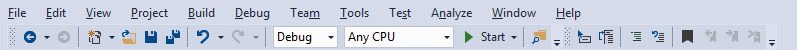

# How to: Set Debug and Release Configurations
Visual Studio projects have separate release and debug configurations for your program. As the names imply, you build the debug version for debugging and the release version for the final release distribution.  
  
 The debug configuration of your program is compiled with full symbolic debug information and no optimization. Optimization complicates debugging, because the relationship between source code and generated instructions is more complex.  
  
 The release configuration of your program contains no symbolic debug information and is fully optimized. Debug information can be generated in PDB Files, depending on the compiler options that are used. Creating PDB files can be very useful if you later have to debug your release version.  
  
 For more information about build configurations, see [Understanding Build Configurations](../vs140/Understanding-Build-Configurations.md).  
  
 You can change the build configuration from the **Build** menu, from the toolbar, or in the project’s property pages. Project property pages are language-specific. The procedure below shows how to change the build configuration from the menu and the toolbar. For more information about how to change the build configuration in projects in different languages, see the Related Topics section below.  
  
### To change the build configuration  
  
1.  From the Build menu: click **Build / Configuration Manager**, then select **Debug** or **Release**.  
  
2.  On the toolbar, choose either **Debug** or **Release** from the **Solution Configurations** list box.  
  
       
  
     This toolbar is not available in Express editions. You can use the **Build Solution F6** and **Start Debugging F5** menu items to choose the configuration.  
  
## See Also  
 [Debugger Settings and Preparation](../vs140/Debugger-Settings-and-Preparation.md)   
 [Project Settings for a C++ Debug Configuration](../Topic/Project%20Settings%20for%20a%20C++%20Debug%20Configuration.md)   
 [Project Settings for  C# Debug Configurations](../vs140/Project-Settings-for--C#-Debug-Configurations.md)   
 [Project Settings for a Visual Basic Debug Configuration](../vs140/Project-Settings-for-a-Visual-Basic-Debug-Configuration.md)   
 [How to: Create and Edit Configurations](../vs140/How-to--Create-and-Edit-Configurations.md)   
 [Debug and Release Project Configurations](assetId:///0440b300-0614-4511-901a-105b771b236e)