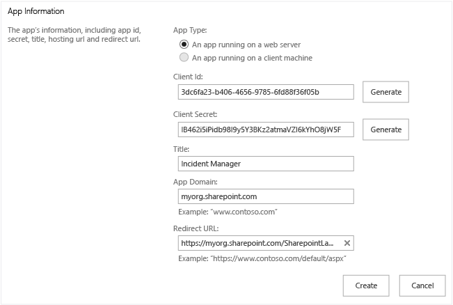
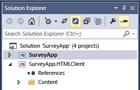
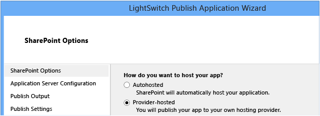
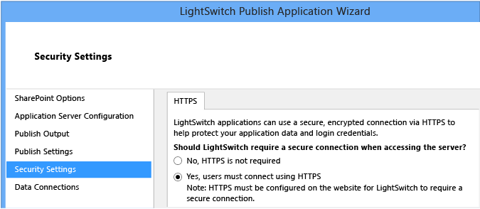
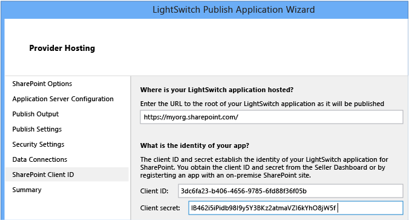

# How to: Upgrade a SharePoint-enabled LightSwitch App
In earlier versions of Office 365, SharePoint-enabled LightSwitch apps and cloud business apps could be published as autohosted apps. Autohosted apps were released as a preview program when SharePoint 2013 released, but in May, 2014 Microsoft announced that they would be closing the preview program and would no longer support creating autohosted apps. For the announcement, see [Update on Autohosted Apps Preview program](http://blogs.office.com/2014/05/16/update-on-autohosted-apps-preview-program/).  
  
 If you are currently using autohosted preview apps in a production environment, we recommend that you follow these steps to upgrade autohosted preview apps to provider-hosted apps.  
  
### Register the app  
  
1.  In your browser, open the application registration page for your SharePoint site by entering `http://`*yoursharepointservername*`/_layouts/15/appregnew.aspx`, where *yoursharepointservername* is the address of your SharePoint site.  
  
2.  On the **Register an App** page, choose the **Generate** button for the **Client Id** field.  
  
     A unique `Client Id` value is added to the **Client Id** text box.  
  
3.  Choose the **Generate** button for the **Client Secret** field.  
  
     A unique `Client Secret` value is added to the **Client Secret** text box.  
  
4.  In the **Title** text box, enter a name for your app.  
  
     This is the name that will be shown to users.  
  
5.  In the **App Domain** text box, enter the base address for the site where the app will be hosted. Don’t include `https://`.  
  
6.  In the **Redirect URI** text box, enter the full address for the site where the app will be hosted. This must include `https://` and must end with `SharepointLaunch.aspx`.  
  
       
  
    > [!IMPORTANT]
    >  Save the **Client Id** and **Client Secret** values. You’ll need them in a later step.  
  
### Change the hosting type  
  
1.  In **Solution Explorer**, open the shortcut menu for the top-level project node and choose **Publish**.  
  
       
  
2.  In the **LightSwitch Publish Application Wizard**, choose the **SharePoint Options** page, choose the **Provider-hosted** option button, and then choose the **Next** button.  
  
       
  
3.  To publish to a SharePoint site hosted on Microsoft Azure, on the **Application Services** page choose the **Windows Azure** option button and follow the configuration steps here: [How to: Publish a LightSwitch Application to Azure](http://msdn.microsoft.com/library/jj131261.aspx). To publish to an on-premise or third-party hosted SharePoint site, on the Application Services page choose the Windows Azure option button, and follow the configuration steps here: [How to: Host a LightSwitch HTML Client Application on Sharepoint](../vs140/How-to--Host-a-LightSwitch-HTML-Client-Application-on-Sharepoint.md).  
  
### Configure security settings  
  
1.  On the **Security Settings** page, in the **Should LightSwitch require a secure connection when accessing the server?** Field, choose the **Yes, users must connect using HTTPS** option button.  
  
       
  
    > [!NOTE]
    >  The site must have HTTPS enabled.  
  
2.  Choose the **Next** button.  
  
### Set the SharePoint Client Id  
  
1.  On the **Provider Hosting** page, choose the **Where is your LightSwitch application hosted?** text box, enter the URL for your hosting site. This should be the same URL that you entered for the **Redirect URI** field earlier, but without the `SharepointLaunch.aspx` portion.  
  
2.  In the **Client Id** text box, enter the `Client Id` value that you generated in an earlier step.  
  
3.  In the **Client Secret** text box, enter the `Client Secret` value that you generated in an earlier step.  
  
       
  
### Publish the app  
  
1.  In the **LightSwitch Publish Application Wizard**, choose the **Publish** button.  
  
     When your app is published, **File Explorer** opens and displays the **Publish** directory for your project.  
  
2.  Upload the .app file for your app to your SharePoint site. The steps for uploading an app differ depending on where you are hosting the app (Azure, on-premise SharePoint, third-party). Consult the documentation for your hosting environment.  
  
## See Also  
 [Update on Autohosted Apps Preview program](http://blogs.office.com/2014/05/16/update-on-autohosted-apps-preview-program/)   
 [Autohosted SharePoint App Deprecation Frequently Asked Questions](http://social.technet.microsoft.com/wiki/contents/articles/24958.autohosted-sharepoint-app-deprecation-frequently-asked-questions.aspx)   
 [How to: Convert an autohosted app for SharePoint to a provider-hosted app](http://msdn.microsoft.com/library/office/dn722449\(v=office.15\).aspx)