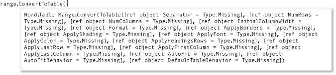

# How to: Use Named and Optional Arguments in Office Programming (C# Programming Guide)
Named arguments and optional arguments, introduced in [!INCLUDE[csharp_dev10_long](../vs140/includes/csharp_dev10_long_md.md)], enhance convenience, flexibility, and readability in C# programming. In addition, these features greatly facilitate access to COM interfaces such as the Microsoft Office automation APIs.  
  
 In the following example, method [ConvertToTable](http://go.microsoft.com/fwlink/?LinkId=145378) has sixteen parameters that represent characteristics of a table, such as number of columns and rows, formatting, borders, fonts, and colors. All sixteen parameters are optional, because most of the time you do not want to specify particular values for all of them. However, without named and optional arguments, a value or a placeholder value has to be provided for each parameter. With named and optional arguments, you specify values only for the parameters that are required for your project.  
  
 You must have Microsoft Office Word installed on your computer to complete these procedures.  
  
 [!INCLUDE[note_settings_general](../vs140/includes/note_settings_general_md.md)]  
  
### To create a new console application  
  
1.  Start Visual Studio.  
  
2.  On the **File** menu, point to **New**, and then click **Project**.  
  
3.  In the **Templates Categories** pane, expand **Visual C#**, and then click **Windows**.  
  
4.  Look in the top of the **Templates** pane to make sure that **.NET Framework 4** appears in the **Target Framework** box.  
  
5.  In the **Templates** pane, click **Console Application**.  
  
6.  Type a name for your project in the **Name** field.  
  
7.  Click **OK**.  
  
     The new project appears in **Solution Explorer**.  
  
### To add a reference  
  
1.  In **Solution Explorer**, right-click your project's name and then click **Add Reference**. The **Add Reference** dialog box appears.  
  
2.  On the **.NET** page, select **Microsoft.Office.Interop.Word** in the **Component Name** list.  
  
3.  Click **OK**.  
  
### To add necessary using directives  
  
1.  In **Solution Explorer**, right-click the **Program.cs** file and then click **View Code**.  
  
2.  Add the following `using` directives to the top of the code file.  
  
     [!CODE [csProgGuideNamedAndOptional#4](../CodeSnippet/VS_Snippets_VBCSharp/csprogguidenamedandoptional#4)]  
  
### To display text in a Word document  
  
1.  In the `Program` class in Program.cs, add the following method to create a Word application and a Word document. The [Add](http://go.microsoft.com/fwlink/?LinkId=145381) method has four optional parameters. This example uses their default values. Therefore, no arguments are necessary in the calling statement.  
  
     [!CODE [csProgGuideNamedAndOptional#6](../CodeSnippet/VS_Snippets_VBCSharp/csprogguidenamedandoptional#6)]  
  
2.  Add the following code at the end of the method to define where to display text in the document, and what text to display.  
  
     [!CODE [csProgGuideNamedAndOptional#7](../CodeSnippet/VS_Snippets_VBCSharp/csprogguidenamedandoptional#7)]  
  
### To run the application  
  
1.  Add the following statement to Main.  
  
     [!CODE [csProgGuideNamedAndOptional#8](../CodeSnippet/VS_Snippets_VBCSharp/csprogguidenamedandoptional#8)]  
  
2.  Press CTRL+F5 to run the project. A Word document appears that contains the specified text.  
  
### To change the text to a table  
  
1.  Use the `ConvertToTable` method to enclose the text in a table. The method has sixteen optional parameters. IntelliSense encloses optional parameters in brackets, as shown in the following illustration.  
  
       
ConvertToTable parameters  
  
     Named and optional arguments enable you to specify values for only the parameters that you want to change. Add the following code to the end of method `DisplayInWord` to create a simple table. The argument specifies that the commas in the text string in `range` separate the cells of the table.  
  
     [!CODE [csProgGuideNamedAndOptional#9](../CodeSnippet/VS_Snippets_VBCSharp/csprogguidenamedandoptional#9)]  
  
     In earlier versions of C#, the call to `ConvertToTable` requires a reference argument for each parameter, as shown in the following code.  
  
     [!CODE [csProgGuideNamedAndOptional#14](../CodeSnippet/VS_Snippets_VBCSharp/csprogguidenamedandoptional#14)]  
  
2.  Press CTRL+F5 to run the project.  
  
### To experiment with other parameters  
  
1.  To change the table so that it has one column and three rows, replace the last line in `DisplayInWord` with the following statement and then type CTRL+F5.  
  
     [!CODE [csProgGuideNamedAndOptional#10](../CodeSnippet/VS_Snippets_VBCSharp/csprogguidenamedandoptional#10)]  
  
2.  To specify a predefined format for the table, replace the last line in `DisplayInWord` with the following statement and then type CTRL+F5. The format can be any of the [WdTableFormat](http://go.microsoft.com/fwlink/?LinkId=145382) constants.  
  
     [!CODE [csProgGuideNamedAndOptional#11](../CodeSnippet/VS_Snippets_VBCSharp/csprogguidenamedandoptional#11)]  
  
## Example  
 The following code includes the full example.  
  
 [!CODE [csProgGuideNamedAndOptional#12](../CodeSnippet/VS_Snippets_VBCSharp/csprogguidenamedandoptional#12)]  
  
## See Also  
 [Named and Optional Arguments (C# Programming Guide)](../Topic/Named%20and%20Optional%20Arguments%20\(C%23%20Programming%20Guide\).md)