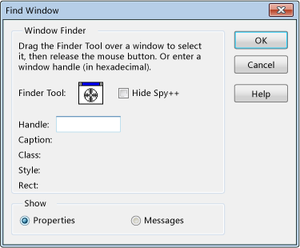

# How to: Use the Finder Tool
You can use the Finder Tool in the **Find Window** dialog box to display window properties or messages. The Finder Tool can also locate disabled child windows, and discern which window to highlight if disabled child windows overlap.  
  
   
Finder Tool in the Find Window dialog box  
  
 The figure above shows the Find Window dialog box after step 3 below.  
  
### To display window properties or messages  
  
1.  Arrange your windows so that both Spy++ and the target window are visible.  
  
2.  From the **Spy** menu, choose **Find Window**.  
  
     The [Find Window Dialog Box](../vs140/Find-Window-Dialog-Box.md) opens.  
  
3.  Drag the **Finder Tool** over the target window.  
  
     As you drag the tool, the **Find Window** dialog box displays details on the selected window.  
  
     – or –  
  
     If you have the handle of the window you want to examine (for example, copied from the debugger), type it into the **Handle** text box.  
  
    > [!TIP]
    >  To reduce screen clutter, select the **Hide Spy** option. This option conceals the main Spy++ window, leaving only the **Find Window** dialog box visible on top of your other applications. The Spy++ main window is restored when you click **OK** or **Cancel**, or when you clear the **Hide Spy++** option.  
  
4.  Under **Show**, select either **Properties** or **Messages**.  
  
5.  Press **OK**.  
  
     If you selected **Properties**, the [Window Properties Dialog Box](../vs140/Window-Properties-Dialog-Box.md) opens. If you selected **Messages**, a [Messages View](../vs140/Messages-View.md) window opens.  
  
## See Also  
 [Spy++ Views](../vs140/Spy---Views.md)   
 [Using Spy++](../vs140/Using-Spy--.md)   
 [Spy++ Reference](../vs140/Spy---Reference.md)