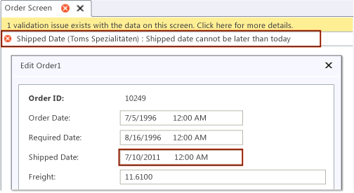

# How to: Validate Data in a LightSwitch Application
By applying validation rules to an entity or table, you can ensure that properly formatted data is written to the data source for a Visual Studio LightSwitch application. A validation rule is a condition or constraint that the data in your application must comply with. If you can add one or more validation rules to an entity or table, an error appears if a user adds or changes data in a way that doesn't comply. Before a user can commit the data, the validation error must be fixed.  
  
 The following illustration shows a validation error message.  
  
   
  
 LightSwitch includes several built-in validation rules. You can configure these rules and apply them to an entity or a table without writing any code. You can also use code to define custom validation rules.  
  
 This topic contains the following sections:  
  
-   [Applying Predefined Validation Rules to a Field](#Predefined)  
  
-   [Applying Custom Validation Rules to a Field](#Custom)  
  
-   [Applying Custom Validation Rules to Data in a Screen](#Screen)  
  
-   [Applying Validation Rules That Run When Data Is Saved](#Server)  
  
  For a related video demonstration, see [How Do I: Write business rules for validation and calculated fields in a LightSwitch Application?](http://go.microsoft.com/fwlink/?LinkID=205132).  
  
##   Applying Predefined Validation Rules to a Field  
 LightSwitch includes several built-in validation rules that you can use without writing any custom code. You can apply these rules to individual fields of data or to any kind of update that users make to data in a screen.  
  
#### To apply a predefined validation rule to a field  
  
1.  In **Solution Explorer**, open the shortcut menu for the entity or table to which you want to apply validation rules, and then choose **Open**.  
  
     The entity or table opens in the **Data Designer**.  
  
2.  In the **Data Designer**, choose the field that you want to validate.  
  
    > [!NOTE]
    >  For applications that have been upgraded to [!INCLUDE[vs2012_upd02](../vs140/includes/vs2012_upd02_md.md)], you can also choose the tier where you want the validation to occur from the buttons on the **Perspective** bar.  
  
3.  In the **Properties** window, in the **Validation** section, set the value of any the properties.  
  
     For information about the validation properties, see [Reference: Data Designer Properties](../vs140/Reference--Data-Designer-Properties.md).  
  
##   Applying Custom Validation Rules to a Field  
 You can define custom validation rules by writing code, and you can specify when LightSwitch enforces them. For example, you could specify that a rule is enforced immediately after a user enters a value in a field. As an alternative, you could specify that an entity or a table is evaluated only after all of its fields contain a value. This model makes sense when the validity of a value in one field relies on a valid value in another field in the same entity or table.  
  
#### To apply a custom validation rule to a field  
  
1.  In **Solution Explorer**, open the shortcut menu for the entity or table to which you want to apply validation rules, and then choose **Open**.  
  
     The entity or table opens in the **Data Designer**.  
  
2.  In the **Data Designer**, choose the field that you want to validate.  
  
3.  In the **Properties** window, choose the **Custom Validation** link.  
  
     The **Code Editor** opens and generates a method that's named *FieldName*`_Validate`.  
  
4.  Add validation code to the *FieldName*`_Validate` method.  
  
     To enforce a validation rule immediately after a user provides a field value, call the `AddPropertyError` method of the `results` parameter.  
  
     The following example displays a validation message after a user sets the `ShippedDate` field of the `Order` entity to a date that's later than today.  
  
     [!CODE [LS_Data#2](../CodeSnippet/VS_Snippets_Misc/ls_data#2)]  
  
     Notice that you can highlight other properties for validation. For example, you could write validation code that runs when a user changes the zip code of a customer. If you pass the `City` property as a parameter to the `AddPropertyError` method, LightSwitch will highlight the `City` field. The text of your error could prompt the user to type the name of a city that matches the new zip code.  
  
    > [!NOTE]
    >  By default, updates can't be committed to a data source until they conform to the validation rules. If you want to enable users to commit unevaluated updates, use the `AddPropertyResult` method instead of the `AddPropertyError` method. For the second parameter of the `AddPropertyResult` method, pass in either `ValidationSeverity.Informational` or `ValidationSeverity.Warning`.  
  
     To enforce a validation rule on an entity or a table, for example, when a user modifies a value in a field that relies on a valid value in another field, call the `AddEntityError` method of the `results` parameter. The following example compares the value of the `RequiredDate` field to the value of the `OrderDate` field. If the order date is later than the required date, this code displays a validation error message.  
  
     [!CODE [LS_Data#19](../CodeSnippet/VS_Snippets_Misc/ls_data#19)]  
  
##   Applying Custom Validation Rules to Data in a Screen  
 You can specify custom validation rules that apply to a whole screen by adding custom code to the *EntityOrTableName*`_Validate` method in the screen code file. Your custom code runs when a user modifies (for example, adds or deletes) any data in the screen. These rules run before the data can be saved.  
  
#### To apply a custom validation rule to data in a screen  
  
1.  In **Solution Explorer**, open the shortcut menu for the screen for which you want to specify a validation rule, and then choose **Open**.  
  
2.  At the top of the **Screen Designer**, choose the  **Write Code** button.  
  
     The **Code Editor** opens.  
  
3.  In the **Declarations** list, choose *EntityOrTableNameProperty* `_Validate`.  
  
     A code block that's named *EntityOrTableNameProperty*`_Validate` appears in the code file.  
  
4.  Add your custom validation code to the *EntityOrTableNameProperty*`_Validate` method.  
  
     To enforce a validation rule after a user adds, deletes, or updates a row of data, call the `AddScreenError` method of the `results` parameter.  
  
     The following example prevents the deletion of customers who are located in the United States.  
  
     [!CODE [LS_Data#3](../CodeSnippet/VS_Snippets_Misc/ls_data#3)]  
  
    > [!NOTE]
    >  By default, updates can't be committed to a data source until they conform to the validation rules. If you want to enable users to commit unevaluated updates, use the `AddScreenResult` method instead of the `AddScreenError` method. For the second parameter of the `AddScreenResult` method, pass in either `ValidationSeverity.Informational` or `ValidationSeverity.Warning`.  
  
##   Applying Validation Rules That Run When Data Is Saved  
 You can apply custom validation rules when a user saves data or when your code calls the `SaveChanges` method of a data source. This kind of validation runs exclusively on the server tier.  
  
#### To apply validation rules that run when data is saved  
  
1.  In **Solution Explorer**, open the shortcut menu for the entity or table to which you want to apply validation rules, and then choose **Open**.  
  
    > [!NOTE]
    >  For applications that have been upgraded to [!INCLUDE[vs2012_upd02](../vs140/includes/vs2012_upd02_md.md)], on the **Perspective** bar, choose the **Server** tab.  
  
2.  In the command bar of the **Data Designer**, in the **Write Code** list, choose *EntityOrTableName*`_Validate`.  
  
     The **Code Editor** opens and generates a method that's named *EntityOrTableName*`_Validate`.  
  
3.  Add your custom validation code to the *EntityOrTableName*`_Validate` method.  
  
     Call the `AddEntityError` method of the `results` parameter.  
  
     The following example checks the credit status of a customer when a user saves a sales order. If the customer’s credit hasn't been approved by the financing department, a `ValidationException` is thrown.  
  
     [!CODE [LS_Data#4](../CodeSnippet/VS_Snippets_Misc/ls_data#4)]  
  
    > [!NOTE]
    >  By default, when the exception is thrown, an error message appears, and the data remains in the current change set. If you want to change this behavior, you can handle the `ValidationException` in your code.  
  
## See Also  
 [Overview of Data Validation in LightSwitch Applications](http://go.microsoft.com/fwlink/?LinkID=204785)   
 [Data and Entities: The Information Behind Your Application](../vs140/Data--The-Information-Behind-Your-Application.md)   
 [Performing Data-Related Tasks by Using Code](../vs140/Performing-Data-Related-Tasks-by-Using-Code.md)   
 [Working with Data-Related Objects in Code](../vs140/Working-with-Data-Related-Objects-in-Code.md)   
 [How to: Handle Entity Events](../vs140/How-to--Handle-Data-Events.md)   
 [How to: Define the Fields of an Entity](../vs140/How-to--Define-Data-Fields-in-a-LightSwitch-Database.md)