# Images and Icons for Visual Studio
##   Image use in Visual Studio  
 Before creating artwork, consider making use of the 1,000+ images in the [Visual Studio Image Library](http://www.microsoft.com/en-my/download/details.aspx?id=35825).  
  
### Types of images  
  
-   **Icons**. Small images that appear in commands, hierarchies, templates, and so on. The default icon size used in Visual Studio is a 16x16 PNG. Icons produced by the image service automatically generate the XAML format for HDPI support.  
  
     **NOTE:** While images are used in the menu system, you should not create an icon for every command. Consult [Menus and Commands for Visual Studio](../vs140/Menus-and-Commands-for-Visual-Studio.md) to see whether your command should get an icon.  
  
-   **Thumbnails.** Images used in the preview area of a dialog, such as the New Project dialog.  
  
-   **Dialog images.** Images that appear in dialogs or wizards, either as descriptive graphics or message indicators. Use infrequently and only when necessary to illustrate a difficult concept or gain the user's attention (alert, warning).  
  
-   **Animated images.** Used in progress indicators, status bars, and operation dialogs.  
  
-   **Cursors.** Used to indicate whether an operation is allowed using the mouse, where an object may be dropped, and so on.  
  
##   Icon design  
  
### Overview  
 Visual Studio uses modern-style icons, which have clean geometry and a 50/50 balance of positive/negative (light/dark), and use direct, understandable metaphors. Crucial icon design points center around clarity, simplification, and context.  
  
-   **Clarity:** focus on the core metaphor that gives an icon its meaning and individuality.  
  
-   **Simplification:** reduce the icon to its core meaning – get the theme across with just the necessary element(s) and no frills.  
  
-   **Context:** consider all aspects of an icon's role during concept development, which is crucial when deciding which elements constitute the icon's core metaphor.  
  
 With icons, there are a number of design points to avoid:  
  
-   Don't use icons that signify UI elements except when appropriate. Choose a more abstract or symbolic approach when the UI element is neither common, evident, nor unique.  
  
-   Don't overuse common elements like documents, folders, arrows, and the magnifying glass. Use such elements only when essential to the icon's meaning. For example, the right-facing magnifying glass should indicate only Search, Browse, and Find.  
  
-   Although some legacy icon elements maintain the use of perspective, don't create new icons with perspective unless the element lacks clarity without it.  
  
-   Don't cram too much information into an icon. A simple image that can be easily recognized or learned as a recognizable symbol is much more useful than an overly complex image. An icon cannot tell the whole story.  
  
### Icon creation  
  
#### Concept development  
 Visual Studio has within its UI a wide variety of icon types. Carefully consider the icon type during development. Don't use unclear or uncommon UI objects for your icon elements. Opt for the symbolic in these cases, such as with the Smart Tag icon. Note that the meaning of the abstract tag on the left is more obvious than the vague, UI-based version on the right:  
  
|||  
|-|-|  
|**Correct use of symbolic imagery**|**Incorrect use of symbolic imagery**|  
|||  
  
 There are instances in which standard, easily recognizable UI elements do work well for icons. Add Window is one such example:  
  
|||  
|-|-|  
|**Correct UI element in an icon**|**Incorrect UI element in an icon**|  
|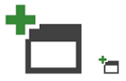|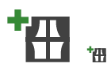|  
  
 Don't use a document as a base element unless it is essential to the icon's meaning. Without the document element on Add Document (below) the meaning is lost, whereas with Refresh the document element is unnecessary to communicate the meaning.  
  
|||  
|-|-|  
|**Correct use of document icon**|**Incorrect use of document icon**|  
|||  
  
 The concept of "show" should be represented by the icon which best illustrates what is being shown, such as with the Show All Files example. A lens metaphor may be used to indicate the concept of "view" if necessary, such as with the Resource View example.  
  
|||  
|-|-|  
|**“Show”**|**“View”**|  
|||  
  
 The right-facing magnifying glass icon should represent only Search, Find, and Browse. The left-facing variant with the plus sign or minus sign should represent only zoom in/zoom out.  
  
|||  
|-|-|  
|**“Search”**|**“Zoom”**|  
|||  
  
 In tree views, do not use both the folder icon and a modifier. When available, use only the modifier.  
  
|||  
|-|-|  
|**Correct tree view icons**|**Incorrect tree view icons**|  
| | |  
  
### Style details  
  
#### Layout  
 Stack elements as shown for standard 16x16 icons:  
  
 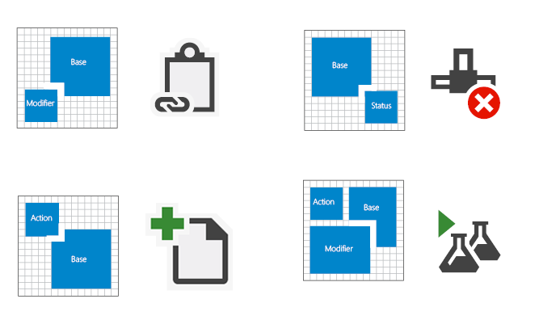  
  
 **Layout stack for 16x16 icons**  
  
 Status notification elements are better used as standalone icons. There are contexts, however, in which a notification should be stacked on the base element, such as with the Task Complete icon:  
  
   
  
 **Standalone notification icons**  
  
   
  
 **Task Complete icon**  
  
 Project icons are typically .ico files that contain multiple sizes. Most 16x16 icons contain the same elements. The 32x32 versions have more details, including the project type when applicable.  
  
 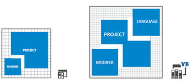  
  
 **VB Windows Control Library Project icons, 16x16 and 32x32**  
  
 Center an icon within its pixel frame. If that is not possible, align the icon to the top and/or right of the frame.  
  
   
  
 **Icon centered within the pixel frame**  
  
   
  
 **Icon aligned to the top right of the frame**  
  
   
  
 **Icon centered and aligned to the top of the frame**  
  
 To achieve ideal alignment and balance, avoid obstructing the icon's base element with action glyphs. Place the glyph near the top left of the base element. When adding an additional element, consider the alignment and balance of the icon.  
  
|||  
|-|-|  
|**Correct alignment and balance**|**Incorrect alignment and balance**|  
|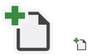|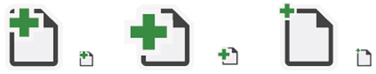|  
  
 Ensure size parity for icons that share elements and are used in sets. Note that in the incorrect pairing, the circle and arrow are oversized and don't match.  
  
|||  
|-|-|  
|**Correct size parity**|**Incorrect size parity**|  
|||  
  
 Use consistent line and visual weights. Evaluate how the icon you are building compares to other icons by using a side-by-side comparison. Never use the entire 16x16 frame, use 15x15 or smaller. The negative-to-positive (dark-to-light) ratio should be 50/50.  
  
|||  
|-|-|  
|**Correct negative-to-positive ratio**|**Incorrect negative-to-positive ratio**|  
|      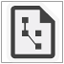||  
  
 Use simple, comparable shapes and complementary angles to build your elements without sacrificing element integrity. Use 45° or 90° angles where possible.  
  
 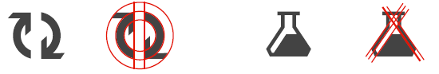  
  
#### Perspective  
 Keep the icon clear and understandable. Use perspective and a light source only when necessary. Although using perspective on icon elements should be avoided, some elements are unrecognizable without it. In such cases, a stylized perspective communicates the element's clarity.  
  
   
  
 **3-point perspective**  
  
   
  
 **1-point perspective**  
  
 Most elements should be facing or angled to the right.  
  
   
  
 Use light sources only when adding necessary clarity to an object.  
  
|||  
|-|-|  
|**Correct light source**|**Incorrect light source**|  
|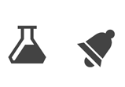|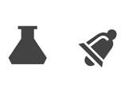|  
  
 Use outlines only to enhance legibility or to better communicate the metaphor. The negative-positive (dark-light) balance should be 50/50.  
  
|||  
|-|-|  
|**Correct use of outlines**|**Incorrect use of outlines**|  
|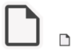||  
  
#### Icon types  
 **Shell and command bar** icons consist of no more than three of the following elements: one base, one modifier, one action, or one status.  
  
   
  
 **Examples of shell and command bar icons**  
  
 **Tool window command bar** icons consist of no more than three of the following elements: one base, one modifier, one action, or one status.  
  
   
  
 **Examples of tool window command bar icons**  
  
 **Tree view disambiguator** icons consist of no more than three of the following elements: one base, one modifier, one action, or one status.  
  
   
  
 **Examples of tree view disambiguator icons**  
  
 **State-based value taxonomy** icons exist in the following states: active, active disabled, and inactive disabled.  
  
   
  
 **Examples of state-based value taxonomy icons**  
  
 **IntelliSense** icons consist of no more than three of the following elements: one base, one modifier, and one status.  
  
   
  
 **Examples of IntelliSense icons**  
  
 **Small (16x16) project** icons should have no more than two elements: one base and one modifier.  
  
     
  
 **Examples of small (16x16) project icons**  
  
 **Large (32x32) project** icons consist of no more than four of the following elements: one base, one to two modifiers, and one language overlay.  
  
 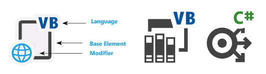  
  
 **Examples of large (32x32) project icons**  
  
### Production details  
 All new UI elements should be created using Windows Presentation Foundation (WPF) and all new icons for WPF should be in 32-bit PNG format. The 24-bit PNG is a legacy format that does not support transparency and is therefore not recommended for icons.  
  
 Save the resolution at 96 DPI.  
  
#### File types  
  
-   **32-bit PNG:** the preferred format for icons. A lossless data compression file format that can store a single raster (pixel) image. 32-bit PNG files support alpha-channel transparency, gamma correction, and interlacing.  
  
-   **32-bit BMP:** for non-WPF controls. Also called XP or high color, 32-bit BMP is an RGB/A image format, a true-color image with an alpha-channel transparency. The alpha channel is a layer of transparency designated in Adobe Photoshop that is then saved within the bitmap as an additional (fourth) color channel. A black background is added during artwork production to all 32-bit BMP files to provide a quick visual cue about the color depth. This black background represents the area to be masked out in the UI.  
  
-   **32-bit ICO:** for Project icons and Add Item. All ICO files are 32-bit true color with alpha-channel transparency (RGB/A). Because ICO files can store multiple sizes and color depths, Vista icons are often in an ICO format containing 16x16, 32x32, 48x48, and 256x256 image sizes. In order to display properly in Windows Explorer, ICO files must be saved-down to 24-bit and 8-bit color depths for each image size.  
  
-   **XAML:** for design surfaces and Windows adorners. XAML icons are vector-based image files that support scaling, rotating, filing, and transparency. They are not common in Visual Studio today but are becoming more popular because of their flexibility.  
  
-   **SVG**  
  
-   **24-bit BMP:** for the Visual Studio command bar. A true-color RGB image format, 24-bit BMP is an icon convention that creates a layer of transparency by using magenta (R=255, G=0, B=255) as a color key for a knock-out transparency layer. In a 24-bit BMP, all magenta surfaces are displayed using the background color.  
  
-   **24-bit GIF:** for the Visual Studio command bar. A true-color RGB image format that supports transparency. GIF files are often used in Wizard artwork and GIF animations.  
  
### Icon construction  
 The smallest icon size in Visual Studio is 16x16. The largest in common use is 32x32. Keep in mind not to fill up the entire 16x16, 24x24, or 32x32 frame when designing an icon. Legible, uniform icon construction is essential to user recognition. Adhere to the following points when building icons.  
  
-   Icons should be clear, understandable, and consistent.  
  
-   It is better to use the status notification elements as single icons and not to stack them on top of an icon base element. In certain contexts, the UI might require the status element to be paired with a base element.  
  
-   Project icons are usually .ico files that contain several sizes. Only the 16x16, 24x24, and 32x32 icons are being updated. Most 16x16 and 24x24 icons will contain the same elements. The 32x32 icons contain more details, including the project language type when applicable.  
  
-   For 32x32 icons, the base elements generally have a 2-pixel line weight. A 1- or 2-pixel line weight can be used for detail elements. Use your best judgment to determine which is more suitable.  
  
-   Have at least a 1-pixel spacing between elements for 16x16 and 24x24 icons. For 32x32 icons, use 2-pixel spacing between elements and between the modifier and base element.  
  
 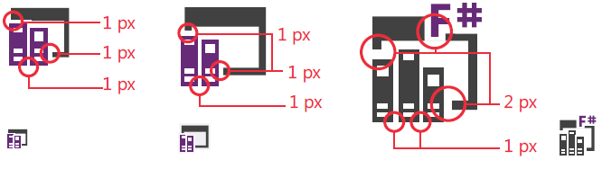  
  
 **Element spacing for icons sized 16x16, 24x24, and 32x32**  
  
#### Color and accessibility  
 Visual Studio compliance guidelines require that all icons in the product pass the accessibility requirements for color and contrast. This is achieved through icon inversion, and when you are designing, you should be aware they will be inverted programmatically in the product.  
  
 For more information on using color in Visual Studio icons, see [Using color in images](../vs140/Images-and-Icons-for-Visual-Studio.md#BKMK_UsingColorInImages).  
  
##   Using color in images  
  
### Overview  
 Icons in Visual Studio are primarily monochromatic. Color is reserved to convey specific information and never for decoration. Color is used:  
  
-   to indicate an action  
  
-   to alert the user to a status notification  
  
-   to designate language affiliation  
  
-   to differentiate items within IntelliSense  
  
### Accessibility  
 Visual Studio compliance guidelines require that all icons checked into the product pass the accessibility requirements for color and contrast. Colors in the visual language palette have been tested and meet these requirements.  
  
#### Color inversion for dark themes  
 In order to make icons appear with the correct contrast ratio in the Visual Studio dark theme, an inversion is applied programmatically. The colors in this guide have been chosen in part so that they invert correctly. Restrict your use of color to this palette, or you will get unpredictable results when the inversion is applied.  
  
 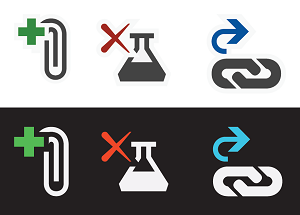  
  
 **Examples of icons that have had their colors inverted**  
  
### Base palette  
 All standard icons contain three base colors. Icons contain no gradients or drop shadows, with one or two exceptions for 3D-tool icons.  
  
|Usage|Name|Value (Light theme)|Swatch|Example|  
|-----------|----------|---------------------------|------------|-------------|  
|Background/Dark|VS BG|424242 / 66,66,66||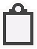|  
|Foreground/Light|VS FG|F0EFF1 / 240,239,241||  
|Outline|VS Out|F6F6F6 / 246,246,246||  
  
 In addition to the base colors, each icon may contain one additional color from the extended palette.  
  
### Extended palette  
  
#### Action modifiers  
 The four colors below indicate the types of actions required by action modifiers:  
  
|Usage|Name|Value (all themes)|Swatch|  
|-----------|----------|--------------------------|------------|  
|Positive|VS Action Green|388A34 / 56,138,52||  
|Negative|VS Action Red|A1260D / 161,38,13||  
|Neutral|VS Action Blue|00539C / 0,83,156||  
|Create/New|VS Action Orange|C27D1A / 194,156,26||  
  
##### Examples  
 Green is used for positive action modifiers such as “Add,” “Run,” “Play,” and “Validate.”  
  
|||||  
|-|-|-|-|  
| **Run**| **Execute Query**| **Play All Steps**| **Add Control**|  
  
 Red is used for negative action modifiers such as “Delete,” “Stop,” “Cancel,” and “Close.”  
  
|||||  
|-|-|-|-|  
| **Delete Relationship**| **Delete Column**| **Stop Query**| **Connection Offline**|  
  
 Blue is applied to neutral action modifiers most commonly represented as arrows, such as “Open,” “Next,” “Previous,” “Import,” and “Export.”  
  
|||||  
|-|-|-|-|  
| **Go to Field**| **Batched Check-In**| **Address Editor**| **Association Editor**|  
  
 Dark gold is primarily used for the “New” modifier.  
  
|||||  
|-|-|-|-|  
| **New Project**|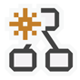 **Create New Graph**| **New Unit Test**| **New List Item**|  
  
#### Special cases  
 In special cases, a colored action modifier may be used independently as a standalone icon. The color used for the icon reflects the actions that the icon is associated with. This use is limited to a small subset of icons, including:  
  
||||||  
|-|-|-|-|-|  
| **Run**|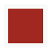 **Stop**| **Delete**| **Save**| **Navigate Back**|  
  
### Code hierarchy palette  
  
#### Folder  
  
|Usage|Name|Value (all themes)|Swatch|Example|  
|-----------|----------|--------------------------|------------|-------------|  
|Folders|Folder|DCB67A / 220,182,122|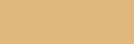||  
  
#### Visual Studio languages  
 Each of the common languages or platforms available in Visual Studio has an associated color. These colors are used on the base icon, or on language modifiers that appear in the upper right corner of compound icons.  
  
|Usage|Name|Value (all themes)|Swatch|  
|-----------|----------|--------------------------|------------|  
|ASP, HTML, WPF|ASP HTML WPF Blue|0095D7 / 0,149,215||  
|C++|CPP Purple|9B4F96 / 155,79,150|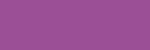|  
|C#|CS Green (VS Action Green)|388A34 / 56,138,52||  
|CSS|CSS Red|BD1E2D / 189,30,45||  
|F#|FS Purple|672878 / 103,40,120||  
|JavaScript|JS Orange|F16421 / 241,100,33||  
|VB|VB Blue (VS Action Blue)|00539C / 0,83,156||  
|TypeScript|TS Orange|E04C06 / 224,76,6||  
|Python|PY Green|879636 / 135,150,54||  
  
##### Examples of icons with language modifiers  
  
|||||||  
|-|-|-|-|-|-|  
| **VB**| **C#**| **C++**|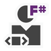 **F#**| **JavaScript**| **Python**|  
| **HTML**| **WPF**| **ASP**| **CSS**| **TypeScript**||  
  
#### IntelliSense  
 IntelliSense icons use an exclusive color palette. These colors are used to help users quickly distinguish between the different items in the IntelliSense popup list.  
  
|Usage|Name|Value (all themes)|Swatch|  
|-----------|----------|--------------------------|------------|  
|Class, Event|VS Action Orange|C27D1A / 194,125,26||  
|Extension Method, Method, Module, Delegate|VS Action Purple|652D90 / 101,45,144||  
|Field, Enum Item, Macro, Structure, Union Value Type, Operator, Interface|VS Action Blue|00539C / 0,83,156||  
|Object|VS Action Green|388A34 / 56,138,52||  
|Constant, Exception, Enum Item, Map, Map Item, Namespace, Template, Type Definition|Background (VS BG)|424242 / 66,66,66||  
  
##### Examples of IntelliSense icons  
  
||||||  
|-|-|-|-|-|  
| **Class**| **Private Event**| **Delegate**| **Method Friend**| **Field**|  
| **Protected Enum Item**| **Object**| **Template**|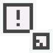 **Exception Shortcut**||  
  
### Notifications  
 Notifications in Visual Studio are used to indicate status. The notification palette uses the following four colors, as well as black or white foreground fill options, to define notifications with the following status levels.  
  
|Usage|Name|Value (all themes)|Swatch|  
|-----------|----------|--------------------------|------------|  
|Status: neutral|Notification Blue (VS Blue)|1BA1E2 / 27,161,226||  
|Status: positive|Notification Green (VS Green)|339933 / 51,153,51||  
|Status: negative|Notification Red (VS Red)|E51400 / 229,20,0||  
|Status: warning|Notification Yellow (VS Orange)|FFCC00 / 255,204,0||  
|Foreground fill|Notification Black (Black)|000000 / 0,0,0||  
|Foreground fill|Notification White (White)|FFFFFF / 255,255,255||  
  
#### Examples of notification icons  
  
|||||  
|-|-|-|-|  
| **Alert**| **Warning**| **Complete**| **Stop**|  
  
### Visual Studio Online  
 In general, Visual Studio Online consists of features hosted in a browser. The color varies in different environments, but the style remains the same.  
  
|Group|Usage|Name|Value (all themes)|Swatch|  
|-----------|-----------|----------|--------------------------|------------|  
|TFS|Background|TFSO BG|656565/ 101, 101, 101||  
|TFS|Outline|TFSO OUT|FFFFFF / 255, 255, 255||  
|Napa|Background|White|FFFFFF / 255, 255, 255||  
|Monaco|Background|White|FFFFFF / 255, 255, 255||  
|F12|Background|White|FFFFFF / 255, 255, 255||  
|F12|Normal|F12 Grey_Primary|555555 / 85, 85, 85||  
|F12|Hover|F12 Blue_Hover|2279BF / 34,121,191||  
|F12|Disabled|F12 LtGrey_Disabled|ABABAC / 171,171,172||  
|F12|Hover background|Hover bg|D9EBF7 / 217,235,247||  
|F12|Pressed background|Pressed bg|B2D7F0 / 178,215,240||  
|F12|Outline|VS OUT|F6F6F6 / 246,246,246||  
|F12|Information|Information|00BCF2 / 0,188,242||  
|F12|Warning|Warning|F28300 / 242,131,0||  
|F12|Error / Negative|Error_Negative|E81123 / 232,17,35||  
|F12|Start / Positive|Start_Positive|009E49 / 0,158,73||  
|F12|Break type|Break type|9B4F96 / 155,79,150||  
|F12|Event Mark|Event Mark|A51F00 / 165,31,0||  
|F12|User Mark|User Mark|F16220 / 241,98,32||  
  
#### Examples of Visual Studio Online icons  
  
|TFS Online||||  
|----------------|-|-|-|  
| **Online Team**| **Information**| **History**| **Branch**|  
  
|Napa||||  
|----------|-|-|-|  
| **Content**| **Office Mail**| **SharePoint**| **Task Pane**|  
  
|Monaco||||  
|------------|-|-|-|  
| **Files**| **Git**| **Search**| **Text**|  
  
|F12||||  
|---------|-|-|-|  
| **Pretty Code**| **Warning**|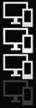 **Emulate**|