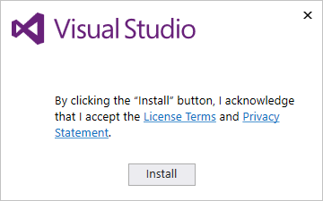
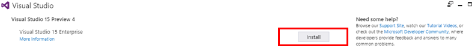
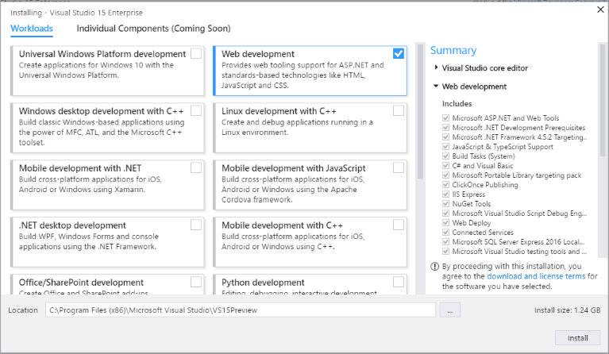
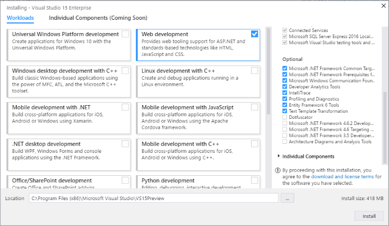
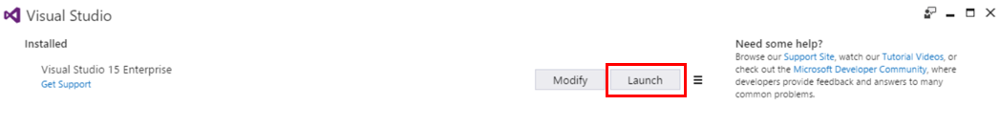
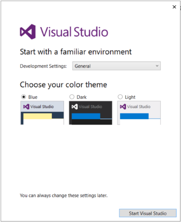

# Installing Visual Studio &#39;15&#39; Preview 4
Welcome to a new way to install Visual Studio! In our newest version, we’ve made it easier for you to select and install just the features you need—and we’ve reduced the minimum footprint of Visual Studio so that it installs more quickly and with less system impact than ever before.  
  
 Want to know more about what else is new in Preview 4? See our [release notes](https://www.visualstudio.com/news/releasenotes/vs15-relnotes). And for more in-depth info about how we’ve redesigned the installation experience, see our blog posts, “[Faster and leaner Visual Studio installer](https://blogs.msdn.microsoft.com/visualstudio/2016/04/01/faster-leaner-visual-studio-installer/)” and “[Anatomy of a low-impact Visual Studio installation](https://blogs.msdn.microsoft.com/visualstudio/2016/04/25/anatomy-of-a-low-impact-visual-studio-install/).”  
  
 Ready to install? Let's get started!  
  
> [!CAUTION]
>  This is an unsupported prerelease version of Visual Studio. We do not advise that you use it in a production environment.  
  
## Install the installer  
 When you [download Visual Studio](https://www.visualstudio.com/downloads/visual-studio-next-downloads-vs), you'll get a bootstrapper file that in turn installs our new lightweight installer. This new installer includes everything you need to customize your installation.  
  
1.  Uninstall all previous versions of Visual Studio '15' before you try Preview 4. For more information about how to do this, see the Installation section of the [Preview 4 FAQ](https://www.visualstudio.com/productinfo/visual-studio-15-FAQ) page.  
  
2.  [Download Enterprise "15"](https://www.visualstudio.com/downloads/visual-studio-next-downloads-vs) and click **Save File**.  Then, from your **Downloads** folder, run the `vs_bootstrapper.exe` file.  
  
     If you receive a User Account Control notice, click **Yes**.  
  
3.  We’ll ask you to acknowledge the Microsoft [License Terms](https://www.visualstudio.com/support/legal/mt591984) and the Microsoft [Privacy Statement](https://www.visualstudio.com/dn948229). Click **Install** to continue.  
  
       
  
4.  You’ll see several status screens that show the progress of the installation. After the installer is finished installing, it’s time to pick the feature sets—or workloads—that you want. To get started, click **Install**.  
  
       
  
## Install workloads  
 Now, you can customize your installation by using workloads. Select one or more of the workloads you want; each workload contains the features you need for the programming language or platform you prefer.  
  
 Here’s how to get them.  
  
1.  Find the workload you want in the **Installing Visual Studio** screen.  
  
     We’ve included a few examples to show you how this works.  
  
     In the following example, we haven’t selected a workload yet, but notice that the **Summary** section shows the **Visual Studio core editor**. With the default core editor, you get basic code editing support for over 20 languages, the ability to open and edit code from any folder without requiring a project, and integrated source code control.  
  
       
  
     In the following example, we’ve added the **Web development** workload. Notice that the **Summary** section changes to include the components for this workload:  
  
       
  
     If you scroll down into the **Summary** section, you’ll see some of the **Optional** components that are included in the **Web development** workload:  
  
       
  
    > [!NOTE]
    >  You can make any changes you want to what’s preselected for you in the **Optional** section.  
  
2.  After you select the workloads and optional components you want, click **Install**.  
  
3.  Next, status screens will appear that show the progress of your Visual Studio installation. After everything’s installed, you can click either **Modify** to change your workloads, or click **Launch** to start Visual Studio.  
  
       
  
     When you click **Launch**, you’ll see a status screen as Visual Studio prepares itself. Then, we'll ask you for some final instructions to personalize your viewing experience. For example, you can choose to sign in (or not). You can also choose to change your development settings and your color scheme.  
  
       
  
4.  After you make your selections, click **Start Visual Studio**, and you’re ready to go!  
  
## See Also  
 [Modifying Visual Studio '15' Preview 4](../vs140/Modifying-Visual-Studio--15--Preview-4.md)