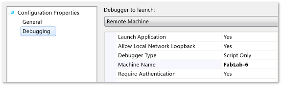
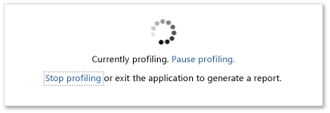

# JavaScript Function Timing on a Remote Device
  
  
 The **JavaScript Function Timing** tool in the [Visual Studio Performance and Diagnostic hub](../vs140/Run-analysis-tools-from-the-Performance-and-Diagnostic-page.md) lets you measure, evaluate, and target performance-related issues in your code. The profiler collects timing information at the entrance and exit of each function in your app. Profiling report views display graphical and tabular representations of detailed, context-rich information about the performance of your app and help you navigate through the execution paths of your code and the execution cost of your functions to find the best opportunities for optimization. You can profile the entire execution run of your app, or you can suspend and resume profiling to collect data only for specific scenarios.  
  
> [!NOTE]
>  You can use the CPU Usage tool to collect much the same data as the JavaScript Function Timing tool. See [Analyze CPU Usage in Windows Store apps](../vs140/Analyze-CPU-Usage-in-a-Windows-Universal-App.md). Here are the main differences in the tools:  
>   
>  -   The JavaScript Function Timing tool collects the number of calls to the functions in your app. But it doesn't run on Windows phone apps, you can't use other tools with it in a profiling session.  
> -   The CPU Usage tool runs on all Windows Runtime apps. You can also collect data from other diagnostic tools, such as the [Energy Consumption](../Topic/Analyze%20energy%20use%20in%20Store%20apps.md) tool to diagnose specific problems.  
  
 This topic describes how to profile JavaScript code in Windows Store apps on a remote machine by using the Visual Studio IDE.  
  
-   To collect profiling data from an app that is deployed on the Visual Studio machine, see [How to collect JavaScript performance data for Windows Metro style apps on a local machine](../vs140/JavaScript-Function-Timing.md).  
  
-   We do not recommend profiling in the simulator because the simulator can distort the performance of your app.  
  
 Visual Studio is usually installed on a desktop computer. Windows Store apps run on a wide variety of devices, form factors, and processor types. Remote profiling lets you collect performance data on any device that is connected to your Visual Studio computer over a network or that is connected directly through an Ethernet cable. When you profile remotely, Visual Studio deploys the latest build of your app.  
  
> [!NOTE]
>  -   To profile on a remote device, you must be an administrator on the device.  
> -   We recommend that you perform user interaction directly on the remote device and that you do not use Remote Desktop Connection. Remote Desktop Connection can significantly alter the performance of your app and the performance data that you collect.  
  
##   In this topic  
 [Configure remote profiling on the remote device](#BKMK_Configure_remote_profiling_on_the_remote_device)  
  
 [Configure remote profiling in Visual Studio](#BKMK_Configure_remote_profiling_in_Visual_Studio)  
  
-   [Other debugging properties](#BKMK_Other_debugging_properties)  
  
 [Profile the app](#BKMK_Profile_the_app)  
  
-   [Collect performance data for the entire profiling run](#BKMK_Collect_performance_data_for_the_entire_profiling_run)  
  
-   [Collect performance data for specific scenarios](#BKMK_Collect_performance_data_for_specific_scenarios)  
  
##   Configure remote profiling on the remote device  
 You must have a developer license installed on the remote device; you must have the Visual Studio Remote Tools installed on the remote device; and the Remote Debugging Monitor must be running on the remote device.  
  
-   To install a developer license installed on the remote device, see [Getting a developer license for Windows 8](assetId:///8bde67fc-4090-41af-ab0b-633aed50a723).  
  
-   To install the Visual Studio remote tools, see [Installing the remote tools](http://msdn.microsoft.com/library/windows/apps/hh441469.aspx#BKMK_Installing_the_Remote_Tools).  
  
-   To start the remote debugging Monitor, choose **Remote Debugging Monitor** on the Start screen.  
  
##   Configure remote profiling in Visual Studio  
 To profile an app on a remote device, specify the name or IP address of the device in the debugging properties of your Visual Studio project. You just specify local machine deployment target, then start profiling, collecting data for all or part of the execution run, and then stop. Visual Studio then displays the results in a document window of the IDE.  
  
 To profile your app on a remote device:  
  
1.  In Visual Studio, open the project that you want to profile.  
  
2.  On the **Debug** menu, choose **Project Properties**.  
  
3.  Choose **Debugging** in the **Configuration Properties** node.  
  
       
  
4.  From the **Debugger to launch** list, choose **Remote Machine**.  
  
5.  In the **Machine Name** row, type the name or IP address of the remote device.  
  
     If the remote device is on the same subnet as the Visual Studio computer, or if the device is directly connected to the Visual Studio computer, you can choose the down arrow in the row, choose the **<Locate...>** item, and then select the device on the **Remote Debugger connections** dialog box.  
  
6.  From the **Debugger Type** list, choose whether to profile JavaScript or Visual C++, Visual C#, or Visual Basic code in app compenents:  
  
    -   Choose **Script only** to profile JavaScript.  
  
    -   Choose any other value to profile C#/VB/C++ components of the JavaScript app.  
  
###   Other debugging properties  
  
1.  **Allow Network Local Loopback** has no effect on profiling.  
  
2.  **Require Authentication** should always be set to **Yes**. Not requiring network authentication puts your network at significant risk of attacks by malicious users.  
  
##   Profile the app  
 You can collect profiling data for the entire run, or you can collect data only for specific scenarios.  
  
   
  
###   Collect performance data for the entire profiling run  
 To profile your app from the start to the end, do this:  
  
1.  **Start the profiler.** Choose **Start Performance Analysis** (Keyboard: ALT + F2) to start your app and start profiling immediately. You will need to accept an elevation of the Remote Debugger Monitor privileges.  
  
2.  **Exercise the app.** Run those parts of the application that you want to profile. Repeat key scenarios to get more accurate results.  
  
3.  **Stop profiling.** In the profiling document window, choose **Stop profiling** (Keyboard: CTRL + ALT + F2). The profiler analyzes the data and displays the Summary view of the profiling data.  
  
###   Collect performance data for specific scenarios  
 To profile a specific scenario in your app, do this:  
  
1.  **Start the profiler.** Choose **Start Performance Analysis Paused** (Keyboard: CTRL + ALT + F2) to start your app with profiling suspended. You will need to accept an elevation of the Remote Debugger Monitor privileges.  
  
2.  **Resume and suspend profiling.** Just before you begin the scenario that you are interested in, choose **Resume profiling** in the profiling document window. Exercise the scenario, and then choose **Pause profiling** to suspend data collection. You can suspend and resume profiling as often as you choose.  
  
3.  Repeat key scenarios to get more accurate results.  
  
4.  **Stop profiling.** In the profiling document window, choose **Stop profiling** (Keyboard: CTL + ALT + F2).  
  
 When you stop the profiling run, the profiler analyzes the data and displays the Summary view of the profiling data in a document window of the IDE. See [Analyzing JavaScript performance data](../vs140/Analyze-JavaScript-Function-Timing-data.md).  
  
## See Also  
 [Analyzing the performance of Windows Metro style apps](../vs140/Analyze-the-performance-of-Windows-Store-apps-using-Visual-Studio-diagnostic-tools.md)   
 [How to profile JavaScript code in Windows Metro style apps on a local machine](../vs140/JavaScript-Function-Timing.md)   
 [Analyzing JavaScript performance data](../vs140/Analyze-JavaScript-Function-Timing-data.md)