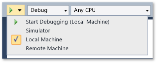
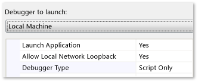

# JavaScript Function Timing
  
  
 The **JavaScript Function Timing** tool in the [Visual Studio Performance and Diagnostic hub](../vs140/Run-analysis-tools-from-the-Performance-and-Diagnostic-page.md) lets you measure, evaluate, and target performance-related issues in your code. The profiler collects timing information at the entrance and exit of each function in your app. Profiling report views display graphical and tabular representations of detailed, context-rich information about the performance of your app and help you navigate through the execution paths of your code and the execution cost of your functions to find the best opportunities for optimization. You can profile the entire execution run of your app, or you can suspend and resume profiling to collect data only for specific scenarios.  
  
> [!NOTE]
>  You can use the CPU Usage tool to collect much the same data as the JavaScript Function Timing tool. See [Analyze CPU Usage in Windows Store apps](../vs140/Analyze-CPU-Usage-in-a-Windows-Universal-App.md). Here are the main differences in the tools:  
>   
>  -   The JavaScript Function Timing tool collects the number of calls to the functions in your app. But it doesn't run on Windows phone apps, you can't use other tools with it in a profiling session.  
> -   The CPU Usage tool runs on all Windows Runtime apps. You can also collect data from other diagnostic tools, such as the [Energy Consumption](../Topic/Analyze%20energy%20use%20in%20Store%20apps.md) tool to diagnose specific problems.  
  
 This topic describes how to profile JavaScript code in Windows apps on a local machine by using the Visual Studio IDE.  
  
-   To collect profiling data from an application that is deployed on a device that does not have Visual Studio installed, see [How to profile JavaScript code in Windows Metro style apps on a remote device](../vs140/JavaScript-Function-Timing-on-a-Remote-Device.md).  
  
-   We do not recommend profiling in the simulator because the simulator can distort the performance of your app.  
  
##   In this topic  
 Here’s what you can learn:  
  
 [Quick start: the easy way to profile](#BKMK_Quick_start__the_easy_way_to_profile)  
  
 [Configure the project debug properties settings](#BKMK_Configure_the_project_debug_properties_settings)  
  
 [Profile the app](#BKMK_Profile_the_app)  
  
-   [Collect performance data for the entire profiling run](#BKMK_Collect_performance_data_for_the_entire_profiling_run)  
  
-   [Collect performance data for specific scenarios](#BKMK_Collect_performance_data_for_specific_scenarios)  
  
##   Quick start: the easy way to profile  
 In many cases, you can collect profiling data for an app in four steps.  
  
 However, the Visual Studio profiler does use the debug settings of the project to configure deployment of the app on the local machine. If you have changed any of the standard debug settings of your project, you should first make sure that the settings are compatible with profiling. See [Configure the project debug properties settings](../vs140/JavaScript-Function-Timing.md#BKMK_Configure_the_project_debug_properties_settings) in this topic for more information.  
  
 **Four-step profiling**  
  
1.  **Select the local machine as your deployment target.** Choose **Local Machine** from the drop-down list next to the **Start Debugging** button on the Visual Studio Standard toolbar.  
  
       
  
2.  **Start the profiler.** Choose **Start Performance Analysis** (Keyboard: ALT + F2 to start your app and start profiling immediately.  
  
3.  **Exercise the app.** Run those parts of the application that you want to profile. Repeat key scenarios to get more accurate results.  
  
4.  **Stop profiling.** In the profiling document window, choose **Stop profiling** (Keyboard: CTRL + ALT + F2). The profiler analyzes the data and displays the Summary view of the profiling data.  
  
 When you stop the profiling run, the profiler analyzes the data and displays the Summary view of the profiling data in a document window of the IDE. See [Analyzing JavaScript performance data](../vs140/Analyze-JavaScript-Function-Timing-data.md).  
  
##   Configure the project debug properties settings  
  
1.  On the **Debug** menu, choose **Project Properties**.  
  
2.  Choose **Debugging** in the **Configuration Properties** node.  
  
       
  
3.  Use the following table to configure the settings to appropriate values:  
  
    |Option|Value|  
    |------------|-----------|  
    |**Debugger to launch**|Set to **Local Machine**.|  
    |**Launch Application**|Set to **Yes**|  
    |**Allow Local Network Loopback**|This setting has no affect on profiling.|  
    |**Debugger Type**|-   Set to **Script only** to profile JavaScript. -   Set to any other value to profile C#/VB/C++ components of the JavaScript app.|  
  
##   Profile the app  
 You can collect profiling data for the entire run, or you can collect data only for specific scenarios. You can also collect profiling data for C#/VB/C++ components of the JavaScript app.  
  
   
  
###   Collect performance data for the entire profiling run  
  
> [!NOTE]
>  This procedure is basically the same as [Quick start: the easy way to profile](../vs140/JavaScript-Function-Timing.md#BKMK_Quick_start__the_easy_way_to_profile).  
  
 To profile your app from the start to the end, do this:  
  
1.  **Start the profiler.** Choose **Start Performance Analysis** (Keyboard: ALT + F2) to start your app and start profiling immediately.  
  
2.  **Exercise the app.** Run those parts of the application that you want to profile. Repeat key scenarios to get more accurate results.  
  
3.  **Stop profiling.** In the profiling document window, choose **Stop profiling** (Keyboard: CTRL + ALT + F2). The profiler analyzes the data and displays the Summary view of the profiling data.  
  
###   Collect performance data for specific scenarios  
 To profile a specific scenario in your app, do this:  
  
1.  **Start the profiler.** Choose **Start Performance Analysis Paused** (Keyboard: CTRL + ALT + F2) to start your app with profiling suspended.  
  
2.  **Resume and suspend profiling.** Just before you begin the scenario that you are interested in, choose **Resume profiling** in the profiling document window. Exercise the scenario, and then choose **Pause profiling** to suspend data collection. You can suspend and resume profiling as often as you choose.  
  
3.  Repeat key scenarios to get more accurate results.  
  
4.  **Stop profiling.** In the profiling document window, choose **Stop profiling** (Keyboard: CTRL + ALT + F2).  
  
 When you stop the profiling run, the profiler analyzes the data and displays the Summary view of the profiling data in a document window of the IDE. See [Analyzing JavaScript performance data](../vs140/Analyze-JavaScript-Function-Timing-data.md).  
  
## See Also  
 [Analyze CPU Usage in Windows Store apps](../vs140/Analyze-CPU-Usage-in-a-Windows-Universal-App.md)   
 [Analyzing JavaScript performance data](../vs140/Analyze-JavaScript-Function-Timing-data.md)