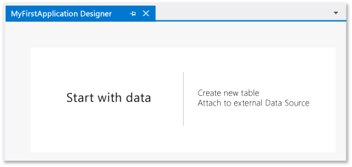
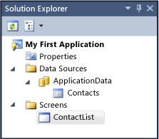
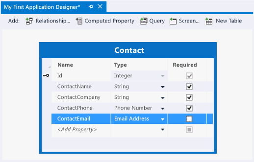
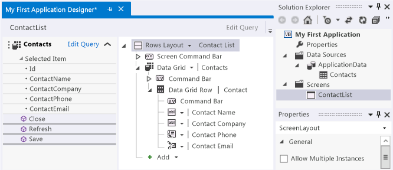
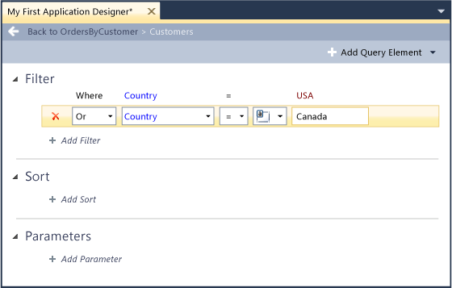
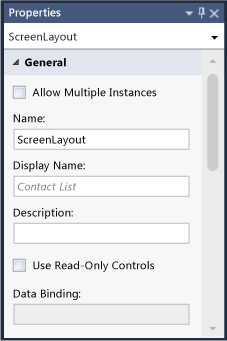
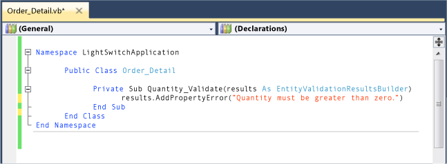
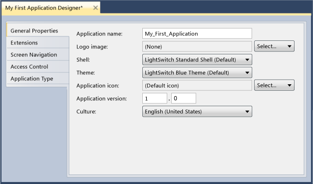

# LightSwitch Development Environment
You create a [!INCLUDE[smb_current_short](../vs140/includes/smb_current_short_md.md)] application by using the [!INCLUDE[smb_current_long](../vs140/includes/smb_current_long_md.md)] IDE (Integrated Development Environment). If you are familiar with Visual Studio, you will recognize some parts of the IDE, but other parts might seem unfamiliar. This topic provides an introduction to the [!INCLUDE[smb_current_short](../vs140/includes/smb_current_short_md.md)] IDE.  
  
## Getting to Know the Development Environment  
 The main part of the IDE consists of designers or windows that correspond to various development tasks; they appear or disappear as you switch among tasks. By using tool windows that appear to the right of the main window, you can navigate among designers, set properties for designers, and more. Following are some of the designers and windows that you will use the most:  
  
-   **[!INCLUDE[smb_current_short](../vs140/includes/smb_current_short_md.md)] Designer**  
  
     The [!INCLUDE[smb_current_short](../vs140/includes/smb_current_short_md.md)] designer appears when you create a project. It contains links that you can use to connect to an existing database or to create new tables in the application database.  
  
       
  
-   **Solution Explorer**  
  
     **Solution Explorer** contains a list of all items in your project. It is used to navigate among the designer windows, and is divided into sections that correspond to data items, screens, and application properties. By default, **Solution Explorer** is always visible.  
  
       
  
-   **Data Designer**  
  
     The **Data Designer**, also known as the Table Designer, is where you work with the data for your application. The **Data Designer** can be opened by double-clicking a data sources node in **Solution Explorer**.  
  
       
  
-   **Screen Designer**  
  
     The **Screen Designer** is where you create the user interface for your application. The **Screen Designer** can be opened by double-clicking a screen node in **Solution Explorer**.  
  
       
  
-   **Query Designer**  
  
     The **Query Designer** is where you create queries to filter and sort application data. Queries can be used as the basis for new screens, or to modify the contents of an existing screen. The **Query Designer** can be opened from the **Project** menu when a data sources node is selected in **Solution Explorer**.  
  
       
  
-   **Properties Window**  
  
     The **Properties** window is where you set properties for items in the active designer. The properties that are available vary depending on the current context. By default, the **Properties** window is always visible.  
  
       
  
-   **Code Editor**  
  
     The Code Editor is where you write code for your application. A separate Code Editor instance is opened for each item in the application that contains user code. Unlike the designer windows, these windows remain open until you choose to close them. The Code Editor can be opened from the **Project** menu when a screen or entity is selected in **Solution Explorer**. It can also be opened from many of the designers.  
  
       
  
-   **Application Designer**  
  
     The **Application Designer** is where you manage the settings and properties that define the appearance and behavior of your application. It includes tabs for **General Properties**, **Extensions**, **Screen Navigation**, **Access Control**, and **Application Type**. The **Application Designer** can be opened from the **Properties** node in **Solution Explorer**.  
  
       
  
## Related Topics  
  
|Title|Description|  
|-----------|-----------------|  
|[LightSwitch Guided Tour](../vs140/LightSwitch-Guided-Tour.md)|Provides lessons that cover many capabilities of [!INCLUDE[smb_current_short](../vs140/includes/smb_current_short_md.md)].|  
|[Debugging Tools in LightSwitch](../vs140/Debugging-Tools-in-LightSwitch.md)|Provides an introduction to various IDE elements that are related to debugging applications.|  
  
## See Also  
 [Getting Started with LightSwitch](../vs140/Getting-Started-with-LightSwitch.md)