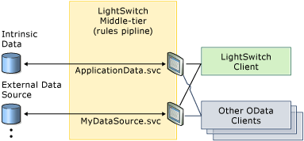

# LightSwitch as a Data Source
In addition to using [!INCLUDE[smb_current_short](../vs140/includes/smb_current_short_md.md)] to create applications, you can also use it as the middle tier to provide data to other applications. When you publish application data from [!INCLUDE[smb_current_short](../vs140/includes/smb_current_short_md.md)] to a web server or to Microsoft Azure, that data is exposed as an Open Data Protocol (OData) service. OData provides a standard for communicating with data services over the web. Many enterprises today use OData to exchange data between systems and partners, in addition to providing access into their data stores. Because OData is a standard protocol, other client applications on almost any platform or device can access the data that you create or expose through [!INCLUDE[smb_current_short](../vs140/includes/smb_current_short_md.md)].  
  
##  <a name="CREATE"></a> Creating OData Services  
 An OData service is automatically created for each data source in your application, with a separate endpoint for each data source. This capability applies not only to the tables that you define in the intrinsic database but also to any attached data source, such as a SQL Server database, a SharePoint list, or even another OData service.  
  
   
  
 Any business logic and user permissions that you’ve defined for your entities will execute when the endpoint is accessed, no matter what client is accessing the services. Rather than writing business logic and defining user permissions for each client application, you can use the [!INCLUDE[smb_current_short](../vs140/includes/smb_current_short_md.md)] middle tier as a place to centralize your code.  
  
##  <a name="access"></a> Accessing LightSwitch OData Services  
 When you deploy a [!INCLUDE[smb_current_short](../vs140/includes/smb_current_short_md.md)] application in a three-tier configuration (hosting the middle tier in either Internet Information Services or Azure), the service endpoints are exposed. The names of the services correspond to the names of your data sources. For example, the sample application in [Walkthrough: Creating the Vision Clinic Application](../vs140/Walkthrough--Creating-the-Vision-Clinic-Application-in-LightSwitch.md) exposes two service endpoints because it has two data sources: the ApplicationData database, which is intrinsic, and the PrescriptionContoso SQL database, which is attached. If the application were deployed to a website that’s named “www.contoso.com,” the service endpoints would be `http://www.contoso.com/ApplicationData.svc` and `http://www.contoso.com/PrescriptionContoso.svc`.  
  
 Within each service, you can navigate to all entity sets that are modeled in the data designer. OData defines a set of query operations that you can perform on the data by using a set of URI conventions. You can query a service with an `HTTP-GET` request, and the service will return a feed with the results in the response. For example, you can query the Vision Clinic’s PrescriptionContoso service with the URI `http://www.contoso.com/PrescriptionContoso.svc/Products` to return a result set that contains all records from the Products entity.  
  
> [!NOTE]
>  To view the raw feed data in Internet Explorer, you must disable the **Turn on feed reading view** check box.  
  
 OData queries are case sensitive; if you specify `products` instead of `Products`, the query will return no results. You can further refine your OData queries in several ways. For example, you can use the  `http://www.contoso.com/PrescriptionContoso.svc/Products(1)` query to return only the product that has a ProductID of 1. To return all products in the Lens Care category, you can use the `http://www.contoso.com/PrescriptionContoso.svc/Products?Category='Lens Care’` query. Any business rules or permissions that you defined in [!INCLUDE[smb_current_short](../vs140/includes/smb_current_short_md.md)] still apply. Therefore, users who want to run the previous queries need permission to view Products.  
  
 Similarly, the OData protocol defines a standard way of navigating relationships through navigation properties. For example, you can use the `http://www.contoso.com/PrescriptionContoso/Products(1)/ProductRebates` query to find rebates for a product that has a ProductID of 1 in the related ProductRebates table. OData supports many other query operations such as `OrderBy`, `Top`, `Skip`, and `Sort`.  
  
##  <a name="secure"></a> Securing LightSwitch OData Services  
 In most cases, you will want to control who can access and update the data in your OData service. You can control access for a [!INCLUDE[smb_current_short](../vs140/includes/smb_current_short_md.md)] application by using its settings. [!INCLUDE[smb_current_short](../vs140/includes/smb_current_short_md.md)] supports three authentication settings: None, Forms, and Windows.  
  
 If you choose Forms authentication, [!INCLUDE[smb_current_short](../vs140/includes/smb_current_short_md.md)] enables two modes of authentication. One mode is a custom protocol that the Login dialog box uses and that uses a custom API for a web service to pass credentials and obtain a forms-authentication cookie. If a request for data doesn’t have a valid forms-authentication cookie, [!INCLUDE[smb_current_short](../vs140/includes/smb_current_short_md.md)] responds with an HTTP Basic challenge. This response allows clients that weren't developed in [!INCLUDE[smb_current_short](../vs140/includes/smb_current_short_md.md)] to pass credentials over a standard HTTP protocol. If you choose Windows authentication, [!INCLUDE[smb_current_short](../vs140/includes/smb_current_short_md.md)] requires an authenticated Windows user to provide credentials. For more information, see [How to: Create a Role-based Application](../vs140/How-to--Enable-Authentication-in-a-Silverlight-Client-App.md).  
  
 Whatever authentication mechanism you use, you should consider using transport-level security over HTTPS to secure credentials, tokens, and data. Without HTTPS, forms, basic credentials, and forms-authentication tokens are transported as plain text. Windows authentication is more secure, but, without HTTPS, any data that's passed between client and server will still be plain text. To mitigate this, [!INCLUDE[smb_current_short](../vs140/includes/smb_current_short_md.md)] has an HTTPS setting in the Publish Wizard that causes the application to require a secure connection. With this setting enabled, requests will be redirected from HTTP to HTTPS, but you still must obtain and configure a HTTPS certificate on your website. For more information, see [Security Considerations for LightSwitch](../vs140/Security-Considerations-for-LightSwitch.md).  
  
 In addition to securing access to the application, you can also use the role-based security in [!INCLUDE[smb_current_short](../vs140/includes/smb_current_short_md.md)] to restrict access to specific entities. For example, you might allow all authenticated users to display order data, but only supervisors can display payroll data. For more information, see [How to: Create a Role-based Application](../vs140/How-to--Enable-Authentication-in-a-Silverlight-Client-App.md).  
  
 [!INCLUDE[smb_current_short](../vs140/includes/smb_current_short_md.md)] doesn’t provide a direct mechanism for hiding or excluding entity sets or entity properties from the OData endpoint. Whatever you connect to on the data tier will be visible on the endpoint of your service. You can control access to those resources by using the built-in access control methods in your data service code. For more information, see [Performing Data-Related Tasks by Using Code](../vs140/Performing-Data-Related-Tasks-by-Using-Code.md).  
  
 The following example shows code that prevents a user from updating or deleting data in a Products entity:  
  
```vb  
Namespace LightSwitchApplication  
   Public Class PrescriptionContosoService  
      Private Sub Product_CanUpdate(ByRef result As Boolean)  
         result = False  
      End Sub  
      Private Sub Product_CanDelete(ByRef result As Boolean)  
         result = False  
      End Sub  
      Private Sub Product_CanInsert(ByRef result As Boolean)  
         result = False  
      End Sub  
   End Class  
End Namespace  
```  
  
```c#  
namespace LightSwitchApplication  
{  
   public partial class PrescriptionContosoService  
   {  
      partial void Product_CanUpdate(ref bool result)  
      {  
         result = false;  
      }  
      partial void Product_CanDelete(ref bool result)  
      {  
         result = false;  
      }  
      partial void Product_CanInsert(ref bool result)  
      {  
         result = false;  
      }  
   }  
}  
```  
  
 [!INCLUDE[smb_current_short](../vs140/includes/smb_current_short_md.md)] also provides row-level filtering with the `EntitySet_Filter` method. By using this method, you can return a smaller set of records from an entity. The following example returns only Customer records that have a TerritoryID of 5:  
  
```vb  
Private Sub Customers_Filter(ByRef filter As Expression(Of Func(Of Customer, Boolean)))  
    filter = Function(e) e.TerritoryId = 5  
End Sub  
```  
  
```c#  
private void Customers_Filter(ref Expression<Func<Customer, bool>> filter)  
{  
filter = e => e.TerritoryId == 5;  
}  
  
```  
  
##  <a name="consume"></a> Consuming LightSwitch OData Services  
 Any application that supports OData on any platform can consume OData feeds from [!INCLUDE[smb_current_short](../vs140/includes/smb_current_short_md.md)]. The methods for connecting to an OData feed vary by application, but you typically supply only the [!INCLUDE[smb_current_short](../vs140/includes/smb_current_short_md.md)] service endpoint.  
  
 The [!INCLUDE[smb_current_short](../vs140/includes/smb_current_short_md.md)] documentation contains several examples of applications that consume OData.  
  
-   For information about how to consume OData from another [!INCLUDE[smb_current_short](../vs140/includes/smb_current_short_md.md)] application, see [Walkthrough: Exposing and Consuming an OData Service in LightSwitch](../vs140/Walkthrough--Exposing-and-Consuming-an-OData-Service-in-LightSwitch.md).  
  
-   For information about how to consume OData from a [!INCLUDE[win8_appname_long](../vs140/includes/win8_appname_long_md.md)] app, see [Walkthrough: Using LightSwitch OData in a Windows Store App](../vs140/Walkthrough--Using-LightSwitch-Data-in-a-Windows-Store-App.md).  
  
-   For information about how to consume OData from [!INCLUDE[ofprexcel](../vs140/includes/ofprexcel_md.md)], see [Walkthrough: Consuming LightSwitch Services in Excel Using PowerPivot](../vs140/Walkthrough--Consuming-LightSwitch-Services-in-Excel-Using-PowerPivot.md).  
  
## See Also  
 [Exposing LightSwitch Application Data](../vs140/Exposing-LightSwitch-Application-Data.md)   
 [How to: Create a Role-based Application](../vs140/How-to--Enable-Authentication-in-a-Silverlight-Client-App.md)   
 [Security Considerations for LightSwitch](../vs140/Security-Considerations-for-LightSwitch.md)   
 [Performing Data-Related Tasks by Using Code](../vs140/Performing-Data-Related-Tasks-by-Using-Code.md)   
 [Walkthrough: Exposing and Consuming an OData Service in LightSwitch](../vs140/Walkthrough--Exposing-and-Consuming-an-OData-Service-in-LightSwitch.md)   
 [Walkthrough: Using LightSwitch OData in a Windows Store Application](../vs140/Walkthrough--Using-LightSwitch-Data-in-a-Windows-Store-App.md)   
 [Walkthrough: Consuming LightSwitch Services in Excel Using PowerPivot](../vs140/Walkthrough--Consuming-LightSwitch-Services-in-Excel-Using-PowerPivot.md)