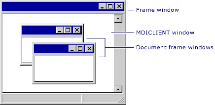

# Managing MDI Child Windows
MDI main frame windows (one per application) contain a special child window called the **MDICLIENT** window. The **MDICLIENT** window manages the client area of the main frame window, and itself has child windows: the document windows, derived from `CMDIChildWnd`. Because the document windows are frame windows themselves (MDI child windows), they can also have their own children. In all of these cases, the parent window manages its child windows and forwards some commands to them.  
  
 In an MDI frame window, the frame window manages the **MDICLIENT** window, repositioning it in conjunction with control bars. The **MDICLIENT** window, in turn, manages all MDI child frame windows. The following figure shows the relationship between an MDI frame window, its **MDICLIENT** window, and its child document frame windows.  
  
   
MDI Frame Windows and Children  
  
 An MDI frame window also works in conjunction with the current MDI child window, if there is one. The MDI frame window delegates command messages to the MDI child before it tries to handle them itself.  
  
## What do you want to know more about?  
  
-   [Creating document frame windows](../vs140/Creating-Document-Frame-Windows.md)  
  
-   [Frame-window styles](../vs140/Frame-Window-Styles--C---.md)  
  
## See Also  
 [Using Frame Windows](../vs140/Using-Frame-Windows.md)